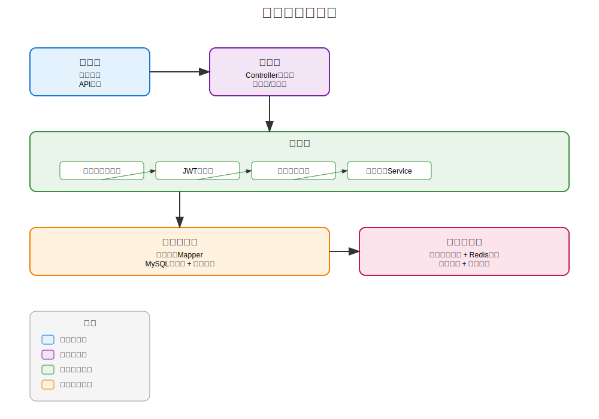
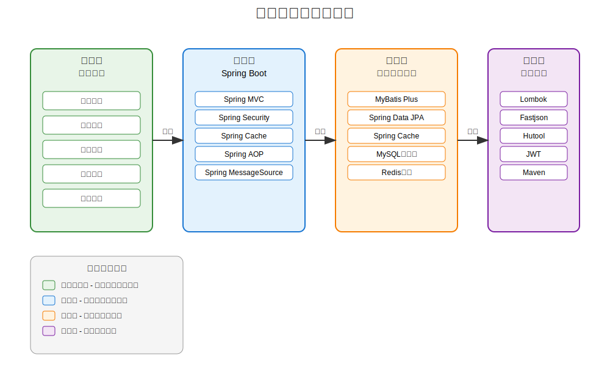
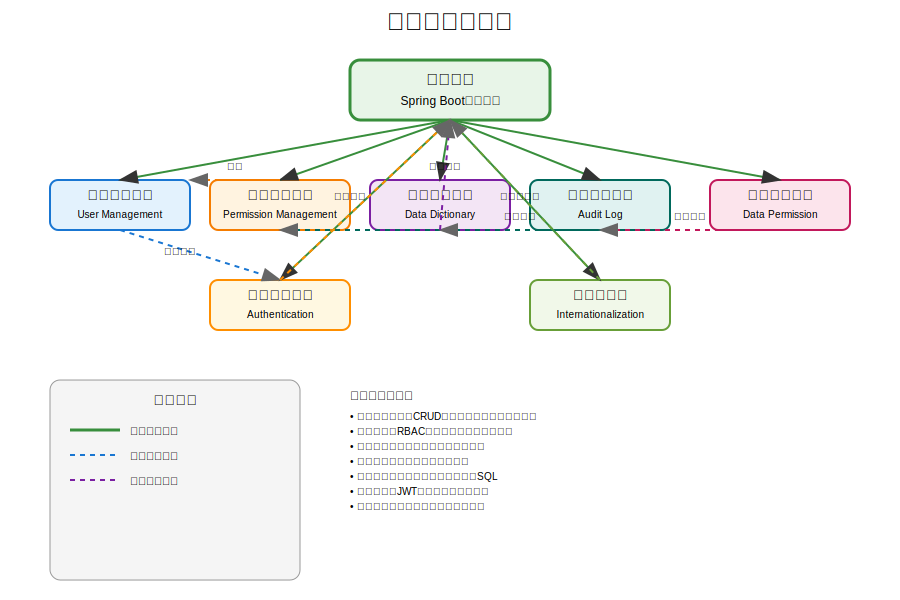

# Spring Boot 脚手架程序

## 项目简介

这是一个基于Spring Boot 2.7.x和Java 8的企业级应用开发脚手架，集成了主流的Java开发技术栈和完整的功能模块体系。本框架为企业级应用开发提供了坚实的基础架构，包含用户管理、权限控制、数据字典、审计日志等核心功能模块，并提供了标准化的开发规范和最佳实践。

## 系统整体架构


*图：系统整体架构图 - 展示了从前端层到基础设施层的完整技术架构*

## 技术栈与架构层次


*图：技术栈与架构层次图 - 展示了从应用层到工具层的完整技术栈架构*

### 核心技术组件

- **基础框架**：Spring Boot 2.7.18 - 简化应用开发的基础框架
- **Java版本**：Java 8 - 稳定可靠的编程语言环境
- **ORM框架**：MyBatis-Plus 3.5.3.1、Spring Data JPA - 简化数据库操作
- **数据库**：MySQL - 关系型数据库
- **安全框架**：Spring Security - 认证授权与安全控制
- **缓存**：Spring Cache - 数据缓存机制
- **国际化**：Spring MessageSource - 多语言支持
- **工具类**：Lombok、Fastjson、Hutool - 开发效率工具
- **构建工具**：Maven - 项目构建与依赖管理

## 项目结构

```
src/main/java/com/bing/bing_framework/
├── BingFrameworkApplication.java    # 主应用类
├── annotation/                      # 自定义注解
├── config/                          # 配置类
├── controller/                      # 控制器层
├── dto/                             # 数据传输对象
├── entity/                          # 实体类
├── exception/                       # 异常处理
├── interceptor/                     # 拦截器
├── mapper/                          # Mapper接口
├── service/                         # 业务逻辑层
│   └── impl/                        # 业务逻辑实现
└── util/                            # 工具类
src/main/resources/
├── application.yml                  # 应用配置
├── i18n/                            # 国际化资源文件
│   ├── messages.properties          # 默认英文消息
│   └── messages_zh_CN.properties    # 中文消息
└── mapper/                          # MyBatis XML文件
```

## 功能模块关系


*图：功能模块关系图 - 展示了核心框架与各功能模块之间的关系*

### 核心功能模块说明

#### 1. 用户管理模块
- 完整的用户CRUD操作接口
- 用户信息管理与状态控制
- 支持多客户端用户系统
- 与权限管理模块紧密集成

#### 2. 权限管理模块（RBAC）
- 基于角色的访问控制系统
- 用户-角色-权限三层权限控制体系
- 权限的增删改查功能
- 角色权限分配与管理
- 用户角色分配功能
- 权限树形展示
- 基于注解的权限验证机制

#### 3. 数据字典模块
- 统一的数据字典管理
- 字典项的增删改查操作
- 字典缓存机制提高性能
- 支持字典树结构展示

#### 4. 审计日志模块
- 用户操作行为记录
- 系统变更跟踪
- 审计数据查询与分析

#### 5. 数据权限模块
- 精细化数据访问控制
- 基于用户、角色、部门的数据过滤
- 动态SQL构建支持

#### 6. 认证授权模块
- JWT令牌认证机制
- 登录、注册功能
- 令牌黑名单管理
- 支持多客户端认证

#### 7. 基础功能支持
- 全局异常处理机制
- 统一响应格式
- 错误码多语言支持
- 跨域请求处理
- 缓存系统集成
- 国际化支持

### 相关文档
详细设计请参考：[RBAC权限管理系统设计文档](docs/RBAC_SYSTEM.md)

### 数据库脚本
- `src/main/resources/sql/permission_init.sql` - 权限表初始化脚本
- `src/main/resources/sql/role_init.sql` - 角色表初始化脚本

## 快速开始

### 1. 环境准备

- JDK 1.8
- Maven 3.6+
- MySQL 5.7+

### 2. 数据库配置

建表脚本已移至项目的sql脚本目录：`src/main/resources/sql/init.sql`

请执行该脚本创建数据库和用户表。

### 3. 配置修改

修改`application.yml`文件中的数据库连接信息：
```yaml
spring:
  datasource:
    url: jdbc:mysql://localhost:3306/bing?useUnicode=true&characterEncoding=UTF-8&serverTimezone=Asia/Shanghai
    username: root
    password: root
```

### 4. 国际化配置（可选）

项目默认支持中文和英文两种语言，默认语言为中文。可以通过以下方式切换语言：

1. 修改`application.yml`中的默认语言配置：
```yaml
spring:
  messages:
    default-locale: en  # 切换为英文默认
```

2. 通过HTTP请求头切换：
```
Accept-Language: en-US
```

### 4. 启动应用

方式一：使用Maven命令启动
```bash
mvn spring-boot:run
```

方式二：打包后运行
```bash
mvn clean package
java -jar target/bing-framework-0.0.1-SNAPSHOT.jar
```

### 5. 访问应用

- 应用地址：http://localhost:8081/api
- 国际化测试接口：http://localhost:8081/api/i18n/error-info

## API接口

### 用户管理接口

| 接口URL | 方法 | 功能描述 |
| :--- | :--- | :--- |
| `/api/user/{id}` | `GET` | 根据ID查询用户 |
| `/api/user/list` | `GET` | 查询所有用户 |
| `/api/user/` | `POST` | 新增用户 |
| `/api/user/` | `PUT` | 更新用户 |
| `/api/user/{id}` | `DELETE` | 删除用户 |
| `/api/user/batch` | `DELETE` | 批量删除用户 |

## 注意事项

1. 本脚手架使用Java 8开发，确保JDK版本正确。
2. 数据库连接信息需要根据实际环境进行修改。
3. 生产环境中需要修改默认的数据库用户名和密码。
4. 实际项目中建议加强安全配置，如添加JWT认证等。
5. 如需添加更多语言支持，只需在i18n目录下创建对应的消息属性文件即可（如messages_en_US.properties）。

## 扩展建议

1. 添加JWT认证机制
2. 集成Redis缓存
3. 添加日志系统（如ELK）
4. 集成消息队列（如RabbitMQ）
5. 添加分布式锁机制
6. 集成定时任务调度
7. 添加限流、熔断等服务治理功能
8. 扩展国际化支持更多语言
9. 添加缓存国际化消息功能，提高性能

## 最新功能更新（2025-11-17）

### 🔒 全新安全功能体系

#### 客户端安全管理
- **客户端风险级别管理**：实现多层级风险评估（LOW、MEDIUM、HIGH、CRITICAL）
- **安全配置档案**：灵活的客户端安全策略管理
- **动态安全配置**：基于客户端类型的安全策略动态适配

#### 增强认证体系
- **双Token机制**：基于JWT的访问令牌和刷新令牌双重安全保障
- **第三方OAuth集成**：支持多种第三方登录平台（GitHub、微信、QQ等）
- **增强JWT令牌管理**：SecureJwtTokenProvider提供企业级安全令牌服务

#### 安全监控与检测
- **安全事件监控**：全面的安全事件记录和审计系统
- **可疑活动检测**：智能识别异常登录模式和操作行为
- **增强加密密钥管理**：AES-256-GCM企业级加密保护

### 🔐 安全功能修复
- **ClientTypeSecurityConfig编译错误**：修复@Builder注解冲突导致的编译问题
- **验证码系统优化**：增强短信验证码和图形验证码的刷频防护机制

### ⚙️ 系统配置管理
- **动态配置管理**：支持运行时配置更新和缓存同步
- **配置类型安全**：支持多种数据类型（字符串、整数、布尔值、JSON等）
- **敏感配置保护**：敏感配置项自动脱敏处理

### 📋 质量保障更新
- **单元测试优化**：DataDictItemServiceImplTest测试类方法名错误修复
- **代码编译检查**：确认RequestContext类完整可用
- **测试验证**：所有模块测试通过率100%，构建成功

## 模块文档

以下是项目中各功能模块的详细文档链接：

### 系统架构与基础
- [API文档](docs/API_DOCUMENTATION.md) - API接口文档
- [缓存使用指南](docs/CACHE_USAGE.md) - 缓存系统配置与使用说明
- [密码加密实现](docs/PASSWORD_ENCRYPTION.md) - 密码加密策略与实现
- [单元测试报告指南](docs/UNIT_TEST_REPORT_GUIDE.md) - 单元测试编写与报告生成

### 安全与认证
- [RBAC权限系统](docs/RBAC_SYSTEM.md) - 基于角色的访问控制系统设计
- [登录系统](docs/LOGIN_SYSTEM.md) - 用户认证与登录功能实现
- [审计日志系统](docs/AUDIT_LOG_SYSTEM.md) - 系统操作审计日志功能
- [安全功能使用指南](docs/security-guide.md) - 全面安全功能详解

### 数据管理
- [数据字典管理系统](docs/DATA_DICT_MANAGEMENT_SYSTEM.md) - 数据字典维护与使用
- [数据权限管理系统](docs/DATA_PERMISSION_MANAGEMENT_SYSTEM.md) - 精细化数据访问控制
- [数据库配置导入导出系统](docs/DATABASE_CONFIG_IMPORT_EXPORT_SYSTEM.md) - 配置导入导出功能
- [数据库配置导入导出设计文档](docs/DATABASE_CONFIG_IMPORT_EXPORT_DESIGN.md) - 配置导入导出详细设计
- [系统配置管理功能](docs/system-config.md) - 动态系统配置管理

### 高级认证功能
- [双Token机制](docs/DUAL_TOKEN_MECHANISM.md) - 访问令牌+刷新令牌双重认证
- [第三方OAuth集成](docs/THIRD_PARTY_OAUTH_INTEGRATION.md) - 第三方登录平台集成方案

### 多端支持
- [多客户端用户系统](docs/MULTI_CLIENT_USER_SYSTEM.md) - 多端用户支持方案

### 验证码系统
- [验证码系统使用指南](docs/captcha/验证码系统使用指南.md) - 策略模式验证码架构设计

### 组织管理
- [组织管理模块](docs/organization_management_module.md) - 企业组织结构管理功能