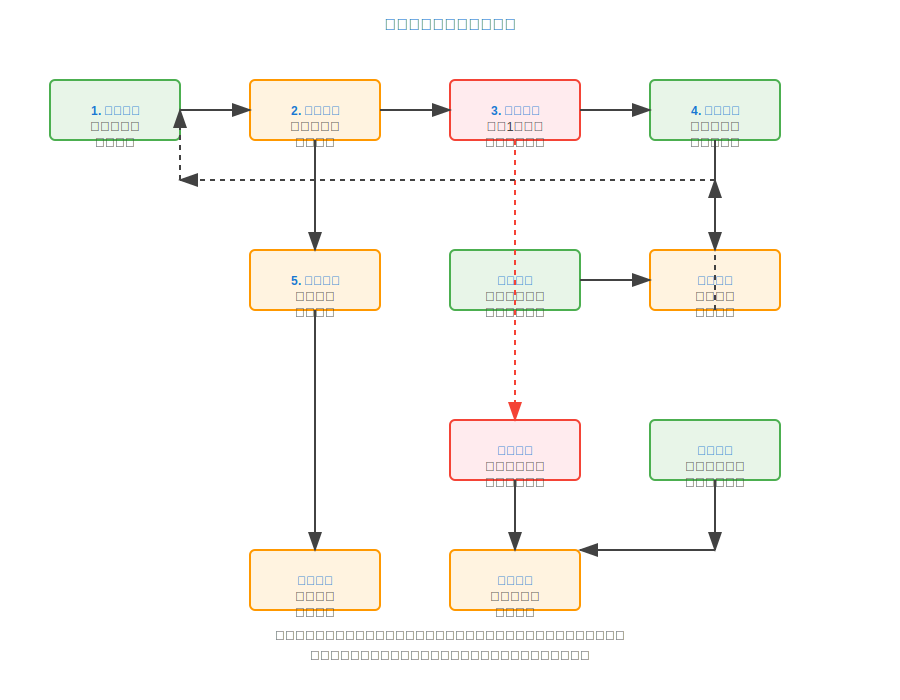
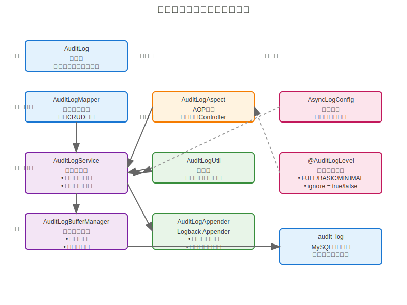

# 审计日志系统设计与使用指南

## 1. 系统概述

本项目实现了一套完整的高性能审计日志系统，支持将重要的业务操作和API访问记录自动或手动记录到数据库中，便于后续审计和查询。

主要特点：
- 支持自动拦截Controller方法并记录API访问日志
- 支持手动记录关键业务操作日志
- 高性能异步处理，专用线程池管理，不影响主业务流程
- 缓冲池和批量写入策略，大幅减少数据库I/O操作
- 支持多级审计日志级别控制，可以针对不同接口灵活配置
- 双重保障机制（直接写入数据库 + Logback Appender）
- 包含完整的审计信息（用户、IP、操作类型、时间、结果等）

## 2. 系统架构


### 2.1 核心组件

1. **AuditLog实体类**：定义审计日志的数据结构
2. **AuditLogMapper**：数据库访问层，提供单个和批量写入审计日志的方法
3. **AuditLogService**：业务逻辑层，提供同步和异步记录日志的方法
4. **AuditLogAppender**：自定义Logback Appender，用于将日志写入数据库
5. **AuditLogAspect**：AOP切面，自动拦截Controller方法并记录审计日志
6. **AuditLogUtil**：工具类，提供便捷的手动记录审计日志方法
7. **AuditLogBufferManager**：缓冲池管理器，实现批量写入和定时刷新功能，包含死循环防护机制
8. **AsyncLogConfig**：异步日志配置类，提供专用的线程池配置
9. **AuditLogLevel注解**：用于控制不同接口的审计日志级别

## 3. 数据库设计

审计日志表结构如下：

```sql
CREATE TABLE IF NOT EXISTS audit_log (
    id BIGINT AUTO_INCREMENT PRIMARY KEY COMMENT '主键ID',
    user_id BIGINT COMMENT '操作用户ID',
    username VARCHAR(100) COMMENT '操作用户名',
    ip_address VARCHAR(50) COMMENT '操作IP地址',
    operation_time DATETIME COMMENT '操作时间',
    module VARCHAR(100) COMMENT '操作模块',
    operation_type VARCHAR(50) COMMENT '操作类型',
    description VARCHAR(255) COMMENT '操作描述',
    request_params TEXT COMMENT '请求参数',
    result VARCHAR(20) COMMENT '操作结果',
    error_message TEXT COMMENT '错误信息',
    execution_time BIGINT COMMENT '操作耗时(毫秒)',
    created_at DATETIME DEFAULT CURRENT_TIMESTAMP COMMENT '创建时间',
    INDEX idx_user_id (user_id),
    INDEX idx_operation_time (operation_time),
    INDEX idx_module (module),
    INDEX idx_operation_type (operation_type)
) ENGINE=InnoDB DEFAULT CHARSET=utf8mb4 COMMENT='审计日志表';
```

## 4. 使用方法

### 4.1 自动记录API访问日志

系统会自动拦截所有Controller方法的调用，并记录访问信息。无需额外配置，只需确保：

1. `AuditLogAspect` 类已被Spring容器扫描并加载
2. 数据库中已创建 `audit_log` 表

### 4.1.1 审计日志级别控制

通过`@AuditLogLevel`注解，可以灵活控制不同接口的审计日志记录策略：

```java
// 忽略某个方法的审计日志记录
@AuditLogLevel(ignore = true)
@RequestMapping("/public/health")
public String healthCheck() {
    return "ok";
}

// 使用基本级别记录（不记录详细请求参数）
@AuditLogLevel(AuditLogLevel.Level.BASIC)
@RequestMapping("/api/user/list")
public List<User> getUserList() {
    return userService.list();
}

// 使用最小级别记录（仅记录基本信息）
@AuditLogLevel(AuditLogLevel.Level.MINIMAL)
@RequestMapping("/api/log/list")
public List<Log> getLogList() {
    return logService.list();
}

// 自定义模块名称和描述
@AuditLogLevel(module = "用户管理", description = "获取用户信息详情")
@RequestMapping("/api/user/{id}")
public User getUserInfo(@PathVariable Long id) {
    return userService.getById(id);
}

// 在类级别设置默认级别
@RestController
@RequestMapping("/api/user")
@AuditLogLevel(AuditLogLevel.Level.BASIC)
public class UserController {
    // 类方法...
}

// 忽略整个控制器的审计日志
@RestController
@RequestMapping("/api/public")
@AuditLogLevel(ignore = true)
public class PublicController {
    // 这个类中的所有方法默认都不会记录审计日志
}
```

审计日志级别说明：
- **FULL**（默认）：记录所有信息，包括请求参数、返回结果、耗时等
- **BASIC**：记录基本信息，不包括详细的请求参数
- **MINIMAL**：仅记录操作时间、用户、模块等最基本信息
- **ignore = true**：完全忽略该方法或类的审计日志记录

### 4.2 手动记录业务操作日志

对于关键业务操作，可以使用 `AuditLogUtil` 工具类手动记录审计日志：

```java
// 记录成功操作
AuditLogUtil.logSuccess(
    "用户管理",           // 模块名称
    "修改密码",           // 操作类型
    "用户修改登录密码",    // 操作描述
    "{userId:123, newPassword:***}" // 请求参数
);

// 记录失败操作
AuditLogUtil.logFailure(
    "权限管理",           // 模块名称
    "分配角色",           // 操作类型
    "为用户分配角色权限",   // 操作描述
    "{userId:123, roleIds:[1,2,3]}", // 请求参数
    "用户不存在"           // 错误信息
);

// 记录自定义结果的操作
AuditLogUtil.log(
    "订单管理",           // 模块名称
    "创建订单",           // 操作类型
    "用户创建新订单",      // 操作描述
    "{productId:123, quantity:2}", // 请求参数
    "待支付"               // 自定义结果
);
```

### 4.3 配置说明

#### 4.3.1 线程池配置

系统使用专用的线程池处理审计日志，配置位于`AsyncLogConfig`类中：

```java
@Configuration
public class AsyncLogConfig {
    @Bean("auditLogExecutor")
    public Executor auditLogExecutor() {
        ThreadPoolTaskExecutor executor = new ThreadPoolTaskExecutor();
        // 设置核心线程数
        executor.setCorePoolSize(5);
        // 设置最大线程数
        executor.setMaxPoolSize(10);
        // 设置队列容量
        executor.setQueueCapacity(500);
        // 设置线程名称前缀
        executor.setThreadNamePrefix("audit-log-");
        // 设置拒绝策略
        executor.setRejectedExecutionHandler(new ThreadPoolExecutor.CallerRunsPolicy());
        executor.initialize();
        return executor;
    }
}
```

可以根据系统负载和并发情况调整线程池参数。

#### 4.3.2 缓冲池配置

系统使用内存缓冲池批量写入审计日志，配置位于`AuditLogBufferManager`类中：

```java
@Component
public class AuditLogBufferManager {
    // 缓冲队列容量
    private final BlockingQueue<AuditLog> bufferQueue = new LinkedBlockingQueue<>(10000);
    
    // 批量写入的阈值
    private final int batchSize = 50;
    
    // 定时写入的时间间隔（毫秒）
    private final long flushInterval = 10000;
    
    // ... 其他代码
}
```

可以根据系统日志量和性能需求调整缓冲池参数。

#### 4.3.3 日志配置

在 `logback-spring.xml` 中已配置了审计日志的处理方式。可以根据需要调整：

- 审计日志会同时写入数据库和文件日志

## 5. 登录记录功能集成

### 5.1 登录记录与审计日志的关系

登录记录功能是审计日志系统的一个重要补充，专门用于记录用户的登录行为，提供更详细的登录信息追踪和安全审计能力。

### 5.2 主要区别

| 特性 | 审计日志 | 登录记录 |
| :--- | :--- | :--- |
| **记录范围** | 所有API操作 | 仅登录行为 |
| **存储方式** | 单一`audit_log`表 | 专用`login_record`表 |
| **详细程度** | 中等 | 高（包含IP、UserAgent等） |
| **查询功能** | 通用查询 | 专用查询接口，支持多条件筛选 |
| **保留策略** | 默认永久保留 | 支持定期清理（默认90天） |
| **安全审计** | 全面操作审计 | 专注登录安全分析 |

### 5.3 登录记录表结构

```sql
CREATE TABLE IF NOT EXISTS login_record (
    id BIGINT AUTO_INCREMENT PRIMARY KEY COMMENT '主键ID',
    user_id BIGINT COMMENT '用户ID',
    username VARCHAR(100) NOT NULL COMMENT '用户名',
    ip_address VARCHAR(50) COMMENT '登录IP地址',
    user_agent VARCHAR(500) COMMENT '用户代理信息',
    login_time DATETIME NOT NULL COMMENT '登录时间',
    status INT DEFAULT 1 COMMENT '登录状态：0-失败，1-成功',
    created_at DATETIME DEFAULT CURRENT_TIMESTAMP COMMENT '创建时间',
    INDEX idx_user_id (user_id),
    INDEX idx_username (username),
    INDEX idx_login_time (login_time),
    INDEX idx_status (status)
) ENGINE=InnoDB DEFAULT CHARSET=utf8mb4 COMMENT='登录记录表';
```

### 5.4 集成方式

#### 5.4.1 自动登录记录

系统在`AuthController`中集成了登录记录功能，当用户执行登录操作时，会自动记录登录信息：

1. 成功登录时记录成功状态和用户ID
2. 登录失败时记录失败状态和尝试的用户名
3. 同时记录IP地址、UserAgent等信息

#### 5.4.2 手动记录登录信息

在需要记录登录信息的地方，可以使用以下方式：

```java
// 创建登录记录
LoginRecord loginRecord = new LoginRecord();
loginRecord.setUserId(userId);
loginRecord.setUsername(username);
loginRecord.setIpAddress(ipAddress);
loginRecord.setUserAgent(userAgent);
loginRecord.setLoginTime(new Date());
loginRecord.setStatus(status); // 0-失败，1-成功

// 保存登录记录
loginRecordService.saveLoginRecord(loginRecord);
```

### 5.5 安全功能

登录记录功能增强了系统的安全审计能力：

1. **异常登录检测**：通过分析登录记录，可以检测到异常的登录行为（如频繁失败、异常IP等）
2. **登录统计分析**：可以统计登录成功率、活跃用户等信息
3. **安全事件溯源**：当发生安全事件时，可以通过登录记录进行溯源分析
4. **自动清理机制**：支持定期清理过期的登录记录，避免数据量过大

### 5.6 死循环防护机制

**AuditLogBufferManager** 实现了完善的死循环防护机制，确保在数据库异常情况下系统仍能稳定运行：

#### 5.6.1 问题背景
在数据库不可用的情况下，原设计可能导致：
- 无限递归调用导致的栈溢出
- CPU占用100%的性能问题
- 应用关闭时的无限等待

#### 5.6.2 防护策略

1. **移除递归调用**：
   - 删除 `flushBuffer()` 方法中的递归调用逻辑
   - 避免数据库异常时的无限循环

2. **添加重试延迟**：
   - 数据库写入失败时添加1秒延迟
   - 防止快速重试导致的CPU占用过高

3. **限制关闭重试**：
   - `flushOnShutdown()` 方法限制最大重试次数为3次
   - 避免应用关闭时的无限等待

4. **异常处理优化**：
   - 写入失败时保留数据在缓冲队列中
   - 添加适当的日志记录，便于问题排查

#### 5.6.3 安全特性

- **数据不丢失**：即使在数据库异常时，审计日志数据仍保留在内存缓冲中
- **自动恢复**：数据库恢复后，系统可自动继续处理积压的审计日志
- **资源保护**：防止因数据库问题导致的系统资源耗尽
- **优雅降级**：在极端情况下，系统可优雅降级处理

## 6. 性能优化说明

本审计日志系统采用了多种性能优化策略，确保在高并发场景下也能高效运行，同时兼顾应用启动性能：

### 6.1 异步处理

- 使用专用的线程池处理审计日志，避免阻塞主业务线程
- 合理配置线程池参数，确保足够的处理能力

#### 6.1.1 线程池配置建议

**推荐配置参数**：
```yaml
spring:
  task:
    execution:
      pool:
        core-size: 10          # CPU核心数或业务并发度的1/4
        max-size: 50           # 核心线程数的5倍
        queue-capacity: 1000   # 核心线程数的100倍
        keep-alive: 60s        # 保持空闲线程存活时间
        thread-name-prefix: audit-log-executor-
```

**参数调优原则**：
- **核心线程数**：根据CPU核心数（推荐核心数×2）和业务并发度调整
- **最大线程数**：核心线程数的3-5倍，用于处理突发流量
- **队列容量**：核心线程数的50-100倍，避免任务丢失
- **超时时间**：60秒足够处理大多数异常情况

#### 6.1.2 监控指标

- 线程池活跃线程数：应保持在核心线程数的70%以下
- 任务队列长度：超过队列容量的80%时需要告警
- 任务拒绝次数：应该接近0，拒绝意味着系统过载
- 平均任务执行时间：应控制在100ms以内

### 6.2 缓冲池和批量写入

- 使用内存缓冲池存储审计日志，减少数据库I/O次数
- 当缓冲池达到阈值时批量写入数据库
- 定时任务定期刷新缓冲池，确保日志及时持久化
- 系统关闭时自动刷新所有缓冲日志

#### 6.2.1 缓冲池参数配置

**推荐配置参数**：
```yaml
audit:
  log:
    buffer:
      batch-size: 100         # 批量写入数量，建议100-500
      flush-interval: 5000    # 刷新间隔(ms)，建议5-30秒
      max-buffer-size: 10000  # 最大缓冲数量，建议10000-50000
      retry-times: 3          # 写入失败重试次数
      retry-delay: 1000       # 重试延迟(ms)，建议1000-5000
```

#### 6.2.2 参数调优策略

**批量大小调优**：
- 小批量（50-100）：减少内存占用，提高实时性
- 中等批量（100-300）：平衡性能和内存使用
- 大批量（300-500）：提高数据库写入效率，但增加内存压力

**刷新间隔调优**：
- 短间隔（1-5秒）：减少数据丢失风险，增加系统负载
- 中等间隔（5-15秒）：平衡实时性和系统性能
- 长间隔（15-30秒）：提高系统性能，但增加数据丢失风险

#### 6.2.3 内存使用优化

**内存占用计算**：
- 单条审计日志平均大小：约1-2KB
- 10000条日志占用内存：约10-20MB
- 建议最大缓冲大小：不超过JVM堆内存的10%

**优化策略**：
```java
// 根据系统内存动态调整缓冲大小
@Component
public class AuditLogBufferManager {
    
    @Value("${audit.log.buffer.max-buffer-size}")
    private int maxBufferSize;
    
    @PostConstruct
    public void init() {
        // 根据JVM内存动态调整
        long maxMemory = Runtime.getRuntime().maxMemory();
        int recommendedSize = (int) Math.min(maxBufferSize, maxMemory / 1024 / 1024 / 10);
        this.maxBufferSize = recommendedSize;
    }
}
```

### 6.3 审计级别控制

- 支持多级审计日志级别，可根据接口重要性灵活配置
- 对于高频低价值接口，可以使用较低级别或完全忽略审计
- 对于重要业务接口，可以使用完整级别记录详细信息

#### 6.3.1 审计级别性能影响分析

**各级别资源消耗对比**：
- **NONE**：几乎无资源消耗
- **BASIC**：记录量减少60-70%，性能提升显著
- **FULL**：完整记录，资源消耗最大但提供最全面信息

**建议配置策略**：
```java
// 高频查询接口 - 使用BASIC级别
@AuditLogLevel(AuditLogLevel.Level.BASIC)
public List<User> getUserList() { ... }

// 业务操作接口 - 使用FULL级别  
@AuditLogLevel(AuditLogLevel.Level.FULL)
public void updateUser(Long userId, UserUpdateDto dto) { ... }

// 公共接口 - 完全忽略
@AuditLogLevel(ignore = true)
public HealthCheckResult healthCheck() { ... }
```

#### 6.3.2 性能监控

**关键指标监控**：
- 审计日志记录频率：正常情况下每分钟<1000条
- 数据库写入QPS：不应超过数据库写能力的80%
- 平均响应时间增加：不应超过原始响应的10%
- 内存使用增量：审计日志功能不应占用超过5%的JVM内存

### 6.4 异常处理

- 审计日志处理异常不影响主业务流程
- 当缓冲池满时，自动降级为直接写入数据库
- 批量写入失败时，自动重试机制确保日志不丢失

### 6.5 死循环防护与性能保护

- **防护机制**：通过移除递归调用、添加重试延迟、限制重试次数等方式防止死循环
- **资源保护**：在数据库异常时自动降级处理，防止系统资源耗尽
- **性能监控**：建议监控缓冲队列大小、数据库写入成功率等指标

### 6.6 启动性能优化

- 采用延迟初始化（@Lazy）策略，审计日志相关组件仅在首次使用时初始化
- 优化Bean依赖关系，避免启动时不必要的初始化
- 将AuditLogAppender从自动组件改为通过配置类注册的懒加载方式
- 审计日志缓冲管理器实现延迟初始化
- 与Spring Boot全局懒加载配置协同工作，提升整体应用启动速度

## 7. 最佳实践

### 7.1 接口级别控制

- 对于公共接口（如健康检查、状态查询等），建议使用`@AuditLogLevel(ignore = true)`完全忽略
- 对于高频查询接口，建议使用`@AuditLogLevel(AuditLogLevel.Level.BASIC)`减少存储开销
- 对于业务操作接口（如增删改），建议使用默认的`FULL`级别
- 对于敏感操作接口，可以通过自定义`module`和`description`提供更清晰的审计信息

#### 7.1.1 实际业务场景示例

**用户管理模块**：
```java
@RestController
@RequestMapping("/api/users")
public class UserController {

    // 公共查询接口 - 忽略审计
    @GetMapping("/health")
    @AuditLogLevel(ignore = true)
    public Result<String> health() {
        return Result.success("OK");
    }

    // 高频查询接口 - 基础审计
    @GetMapping("/{id}")
    @AuditLogLevel(
        module = "用户管理",
        operationType = "查询用户",
        description = "根据用户ID查询用户信息",
        level = AuditLogLevel.Level.BASIC
    )
    public Result<User> getUserById(@PathVariable Long id) {
        return Result.success(userService.getById(id));
    }

    // 重要业务接口 - 完整审计
    @PostMapping
    @AuditLogLevel(
        module = "用户管理",
        operationType = "创建用户",
        description = "创建新用户账户"
        // 使用默认的FULL级别
    )
    public Result<Void> createUser(@RequestBody @Valid UserCreateDto dto) {
        userService.createUser(dto);
        return Result.success();
    }

    // 敏感操作 - 自定义描述
    @PutMapping("/{id}/password")
    @AuditLogLevel(
        module = "用户管理",
        operationType = "修改密码",
        description = "用户自主修改登录密码"
    )
    public Result<Void> updatePassword(@PathVariable Long id, 
                                     @RequestBody PasswordUpdateDto dto) {
        userService.updatePassword(id, dto);
        return Result.success();
    }
}
```

**订单管理模块**：
```java
@RestController
@RequestMapping("/api/orders")
public class OrderController {

    // 批量查询 - 基础审计
    @GetMapping("/list")
    @AuditLogLevel(
        module = "订单管理",
        operationType = "批量查询",
        description = "根据条件查询订单列表",
        level = AuditLogLevel.Level.BASIC
    )
    public Result<Page<Order>> listOrders(OrderQueryDto dto) {
        return Result.success(orderService.listOrders(dto));
    }

    // 核心业务操作 - 完整审计
    @PostMapping
    @AuditLogLevel(
        module = "订单管理",
        operationType = "创建订单",
        description = "用户创建新的购买订单"
    )
    public Result<Order> createOrder(@RequestBody @Valid OrderCreateDto dto) {
        return Result.success(orderService.createOrder(dto));
    }

    // 敏感操作 - 完整审计
    @PutMapping("/{id}/cancel")
    @AuditLogLevel(
        module = "订单管理",
        operationType = "取消订单",
        description = "用户取消已下单的订单"
    )
    public Result<Void> cancelOrder(@PathVariable Long id) {
        orderService.cancelOrder(id);
        return Result.success();
    }
}
```

### 7.2 日志内容规范

审计日志的内容规范如下：

- **模块名称**：使用简洁明了的业务模块名称
- **操作类型**：使用标准的操作类型（如创建、修改、删除、查询等）
- **操作描述**：提供清晰的操作说明，便于后续审计追踪
- **请求参数**：记录关键的业务参数，避免敏感信息泄露
- **操作结果**：使用标准的成功/失败标识，必要时提供自定义结果
- **错误信息**：记录详细的错误原因，便于问题排查

示例：
```java
@AuditLogLevel(
    module = "用户管理", 
    operationType = "修改密码",
    description = "用户修改登录密码操作"
)
public void updatePassword(Long userId, String newPassword) {
    // 业务逻辑
}
```

### 7.3 死循环防护实践

- **监控数据库健康状态**：及时发现并处理数据库连接问题
- **合理设置缓冲参数**：根据系统负载调整 `batchSize` 和 `flushInterval`
- **日志级别配置**：对于数据库异常情况，适当调整日志级别避免过多错误输出
- **资源使用监控**：定期检查缓冲队列大小，防止内存泄漏

### 7.4 性能监控

- 定期监控审计日志表的增长情况，及时清理过期数据
- 监控缓冲池状态，调整`batchSize`和`flushInterval`参数
- 根据系统负载情况，适时调整线程池大小

### 7.5 系统调优

- 对于日志量特别大的系统，考虑使用分表分库策略
- 定期归档历史审计日志，保持活跃表的性能
- 为常用查询字段创建合适的索引
- 与JVM参数优化配合，如使用G1GC垃圾收集器、启用字符串去重等
- 在应用启动配置中启用Spring Boot的并行Bean初始化机制

## 8. 注意事项

- 审计日志记录可能会对系统性能产生一定影响，建议根据实际需求合理配置
- 对于包含敏感信息的接口，需要确保审计日志不会泄露敏感数据
- 在分布式系统中，需要确保用户身份信息在各服务间正确传递
- 当系统重启时，缓冲池中的日志会在关闭前自动刷新到数据库
- 可以修改日志级别和输出格式
- **死循环防护**：系统已内置死循环防护机制，但在数据库长期不可用的情况下仍需关注缓冲队列大小
- 延迟初始化策略可能导致首次访问审计日志功能时略有延迟
- 确保必要的依赖关系正确配置，避免延迟初始化导致的潜在问题
- 对于高可用性要求极高的场景，需要评估延迟初始化对系统恢复时间的影响

在 `application.yml` 中配置了异步任务线程池：

```yaml
spring:
  task:
    execution:
      pool:
        core-size: 10
        max-size: 50
        queue-capacity: 1000
        keep-alive: 60s
        thread-name-prefix: audit-log-executor-
      shutdown:
        await-termination: true
        await-termination-period: 60s
```

可以根据系统负载情况调整这些参数。其中：
- `shutdown.await-termination: true` 启用线程池优雅关闭
- `shutdown.await-termination-period: 60s` 设置关闭等待时间，确保在应用关闭时能完成剩余的审计日志任务

### 8.1 配置注意事项

1. **性能考虑**：审计日志采用异步处理，不会阻塞主业务流程，但在高并发场景下仍需监控数据库写入性能
2. **存储优化**：建议定期清理或归档历史审计日志，避免表数据过大影响查询性能
3. **用户信息获取**：当前实现从请求头获取用户名，实际项目中应结合认证机制修改 `getCurrentUsername()` 方法
4. **异常处理**：记录审计日志失败时不会影响主业务流程，会降级记录到文件日志
5. **敏感信息**：记录请求参数时注意过滤敏感信息（如密码、身份证号等）
6. **死循环防护**：系统已内置完善的死循环防护机制，包括递归调用移除、重试延迟、关闭重试限制等，确保在数据库异常情况下系统稳定运行

## 9. 架构图

### 9.1 系统架构图


图9-1展示了审计日志系统的整体架构，主要包含以下几个层次：

1. **应用层**：业务控制器和业务服务
2. **审计层**：审计日志切面、工具类和缓冲管理器
3. **数据访问层**：数据库访问对象和批量操作
4. **存储层**：数据库和日志文件

### 9.2 缓冲池工作流程图


图9-2展示了审计日志缓冲池的工作流程：

1. **日志收集**：业务操作产生审计日志
2. **异步处理**：日志通过线程池异步处理
3. **缓冲存储**：日志进入内存缓冲队列
4. **批量写入**：达到阈值时批量写入数据库
5. **定时刷新**：定期将缓冲队列中的日志写入数据库

### 9.3 死循环防护机制图



图9-3展示了死循环防护机制的工作原理：

1. **异常检测**：检测数据库连接异常
2. **防护启动**：启用死循环防护机制
3. **延迟重试**：添加1秒延迟避免快速重试
4. **数据保留**：保留数据在缓冲队列中
5. **状态重置**：设置重试次数限制

### 9.4 组件关系图



图9-4展示了审计日志系统各组件之间的关系：

- **AuditLogAspect**：负责拦截Controller方法，收集审计信息
- **AuditLogBufferManager**：负责缓冲管理和批量写入
- **AuditLogService**：提供审计日志业务接口
- **AuditLogMapper**：负责数据库操作
- **AsyncLogConfig**：提供专用线程池配置

## 10. 运维指南与故障排查

### 10.1 日常监控

建议建立完善的监控体系，确保审计日志系统稳定运行：

#### 10.1.1 监控指标

- **缓冲队列状态**：
  - 队列长度阈值：> 1000 条告警
  - 队列内存占用：> 50MB 告警
  - 队列处理延迟：> 5秒告警

- **数据库连接状态**：
  - 连接池使用率：> 80% 告警
  - 连接超时次数：> 10次/小时告警
  - 写入成功率：< 95% 告警

- **线程池状态**：
  - 线程池使用率：> 70% 告警
  - 任务队列长度：> 800 告警
  - 线程活跃度：持续 > 80% 告警

#### 10.1.2 监控建议

建议监控以下指标以确保系统健康：
- 缓冲队列大小：监控是否有大量积压
- 数据库写入成功率：及时发现数据库连接问题
- 审计日志处理延迟：确保日志处理的实时性

### 10.2 常见问题与排查

#### 10.2.1 缓冲队列积压问题

**现象**：审计日志数据在缓冲队列中大量积压，未能及时写入数据库

**排查步骤**：
1. 检查数据库连接状态
2. 查看数据库写入错误日志
3. 分析线程池状态
4. 检查磁盘IO性能

**解决方案**：
1. 修复数据库连接问题
2. 调整线程池参数
3. 优化数据库写入性能
4. 增加缓冲队列刷新频率

#### 10.2.2 数据库连接异常

**现象**：审计日志写入频繁失败，数据库连接超时

**排查步骤**：
1. 检查数据库服务状态
2. 验证数据库连接配置
3. 查看连接池配置
4. 分析网络连通性

**解决方案**：
1. 重启数据库服务或调整连接池大小
2. 优化数据库连接字符串
3. 配置合理的连接超时时间
4. 检查防火墙和网络配置

#### 10.2.3 内存泄漏问题

**现象**：系统运行时间越长，内存占用越高

**排查步骤**：
1. 使用JVM工具分析内存使用
2. 检查缓冲队列是否有无限增长
3. 验证线程池是否正确关闭
4. 分析对象生命周期管理

**解决方案**：
1. 清理缓冲队列中的过期数据
2. 确保线程池正确关闭和资源释放
3. 优化对象创建和销毁策略
4. 定期进行内存垃圾回收

#### 10.2.4 性能下降问题

**现象**：审计日志处理速度明显下降，影响业务性能

**排查步骤**：
1. 分析数据库查询和写入性能
2. 检查索引是否失效
3. 验证缓冲池配置参数
4. 分析系统资源使用情况

**解决方案**：
1. 优化数据库索引和查询语句
2. 调整缓冲池大小和批量参数
3. 清理历史审计日志数据
4. 升级硬件配置或增加服务器

### 10.3 日志分析

#### 10.3.1 审计日志查询

常用的审计日志查询示例：

```sql
-- 查询特定用户的操作记录
SELECT * FROM audit_log 
WHERE username = 'user123' 
ORDER BY operation_time DESC 
LIMIT 100;

-- 查询特定模块的操作统计
SELECT module, operation_type, COUNT(*) as count
FROM audit_log 
WHERE operation_time >= DATE_SUB(NOW(), INTERVAL 7 DAY)
GROUP BY module, operation_type;

-- 查询失败操作记录
SELECT * FROM audit_log 
WHERE success = false 
AND operation_time >= DATE_SUB(NOW(), INTERVAL 1 DAY)
ORDER BY operation_time DESC;
```

#### 10.3.2 性能分析

```sql
-- 分析审计日志写入性能
SELECT 
    DATE(operation_time) as date,
    COUNT(*) as total_count,
    AVG(TIMESTAMPDIFF(SECOND, operation_time, created_at)) as avg_delay
FROM audit_log 
WHERE operation_time >= DATE_SUB(NOW(), INTERVAL 30 DAY)
GROUP BY DATE(operation_time)
ORDER BY date DESC;
```

### 10.4 维护任务

#### 10.4.1 定期清理

建议制定定期清理策略：

```sql
-- 删除30天前的审计日志
DELETE FROM audit_log 
WHERE operation_time < DATE_SUB(NOW(), INTERVAL 30 DAY);

-- 清理缓冲表中的已处理数据
DELETE FROM audit_log_buffer 
WHERE processed = true 
AND processed_at < DATE_SUB(NOW(), INTERVAL 7 DAY);
```

#### 10.4.2 数据归档

对于需要长期保存的审计日志，建议进行数据归档：

```sql
-- 将30天前的数据归档到历史表
INSERT INTO audit_log_archive 
SELECT * FROM audit_log 
WHERE operation_time < DATE_SUB(NOW(), INTERVAL 30 DAY);

-- 删除已归档的数据
DELETE FROM audit_log 
WHERE operation_time < DATE_SUB(NOW(), INTERVAL 30 DAY);
```

### 10.5 升级和维护

#### 10.5.1 系统升级

- **备份策略**：升级前必须备份审计日志数据
- **灰度发布**：建议先在测试环境验证新版本
- **回滚计划**：制定详细的回滚方案
- **监控升级**：升级过程中密切监控系统状态

#### 10.5.2 配置调优

根据系统运行情况，适时调整以下参数：

- **缓冲队列大小**：根据日志产生量和处理能力调整
- **批量写入数量**：平衡写入效率和内存占用
- **线程池参数**：根据CPU核心数和负载情况优化
- **数据库连接池**：根据数据库性能和并发量调整

### 10.6 监控告警规则

#### 10.6.1 关键指标告警

**缓冲队列告警**：
```yaml
# Prometheus告警规则示例
groups:
- name: audit_log_buffer_alerts
  rules:
  - alert: AuditLogBufferSizeHigh
    expr: audit_log_buffer_size > 8000
    for: 5m
    labels:
      severity: warning
    annotations:
      summary: "审计日志缓冲队列积压严重"
      description: "缓冲队列大小已超过8000条，可能导致内存压力"

  - alert: AuditLogBufferSizeCritical
    expr: audit_log_buffer_size > 9500
    for: 2m
    labels:
      severity: critical
    annotations:
      summary: "审计日志缓冲队列即将溢出"
      description: "缓冲队列大小接近最大值{{ $value }}，需要立即处理"
```

**数据库连接告警**：
```yaml
  - alert: AuditLogDBConnectionFailure
    expr: rate(audit_log_db_errors_total[5m]) > 0.1
    for: 1m
    labels:
      severity: critical
    annotations:
      summary: "审计日志数据库连接异常"
      description: "数据库连接失败率超过10%，错误次数：{{ $value }}/s"

  - alert: AuditLogWriteSuccessRateLow
    expr: rate(audit_log_write_success_total[5m]) / rate(audit_log_write_total[5m]) < 0.95
    for: 3m
    labels:
      severity: warning
    annotations:
      summary: "审计日志写入成功率偏低"
      description: "写入成功率低于95%，当前值：{{ $value }}"
```

**性能告警**：
```yaml
  - alert: AuditLogProcessingDelayHigh
    expr: audit_log_processing_delay_seconds > 10
    for: 2m
    labels:
      severity: warning
    annotations:
      summary: "审计日志处理延迟过高"
      description: "审计日志处理延迟超过10秒，当前延迟：{{ $value }}s"

  - alert: AuditLogThreadPoolUsageHigh
    expr: audit_log_thread_pool_active_threads / audit_log_thread_pool_max_threads > 0.8
    for: 5m
    labels:
      severity: warning
    annotations:
      summary: "审计日志线程池使用率过高"
      description: "线程池使用率超过80%，可能影响处理性能"
```

#### 10.6.2 告警处理流程

**自动化响应**：
1. **缓冲队列积压**：
   - 自动增加刷新频率
   - 临时增大批量写入数量
   - 发送运维通知

2. **数据库连接异常**：
   - 启用降级策略（直接写入文件）
   - 记录详细的错误日志
   - 通知DBA检查数据库状态

3. **性能瓶颈**：
   - 分析系统资源使用情况
   - 调整相关配置参数
   - 考虑扩容或优化

#### 10.6.3 监控面板配置

**Grafana面板示例**：
```json
{
  "dashboard": {
    "title": "审计日志系统监控",
    "panels": [
      {
        "title": "缓冲队列状态",
        "targets": [
          {
            "expr": "audit_log_buffer_size",
            "legendFormat": "队列大小"
          }
        ]
      },
      {
        "title": "数据库写入性能",
        "targets": [
          {
            "expr": "rate(audit_log_write_total[5m])",
            "legendFormat": "写入QPS"
          },
          {
            "expr": "rate(audit_log_db_errors_total[5m])",
            "legendFormat": "错误率"
          }
        ]
      },
      {
        "title": "线程池状态",
        "targets": [
          {
            "expr": "audit_log_thread_pool_active_threads",
            "legendFormat": "活跃线程"
          }
        ]
      }
    ]
  }
}
```

### 10.7 性能测试建议

#### 10.7.1 测试环境准备

**硬件配置**：
- CPU：4核心以上
- 内存：8GB以上（建议16GB）
- 磁盘：SSD存储，保证数据库I/O性能
- 网络：千兆网络

**软件环境**：
- 数据库：MySQL 8.0+ 或 PostgreSQL 12+
- 应用服务器：Spring Boot 2.5+
- 监控工具：Prometheus + Grafana

#### 10.7.2 测试场景设计

**基准性能测试**：
```java
@Component
public class AuditLogPerformanceTest {
    
    @Autowired
    private AuditLogService auditLogService;
    
    // 1000 QPS 持续测试
    @Test
    public void testHighQPS() throws InterruptedException {
        ExecutorService executor = Executors.newFixedThreadPool(50);
        CountDownLatch latch = new CountDownLatch(10000);
        
        long startTime = System.currentTimeMillis();
        
        for (int i = 0; i < 10000; i++) {
            executor.submit(() -> {
                try {
                    auditLogService.manualRecord("test", "操作", "性能测试");
                } finally {
                    latch.countDown();
                }
            });
        }
        
        latch.await();
        long endTime = System.currentTimeMillis();
        
        double qps = 10000.0 * 1000 / (endTime - startTime);
        System.out.println("实际QPS: " + qps);
        
        assertTrue("QPS应该超过500", qps > 500);
    }
    
    // 内存泄漏测试
    @Test
    public void testMemoryLeak() throws InterruptedException {
        Runtime runtime = Runtime.getRuntime();
        
        for (int round = 0; round < 100; round++) {
            for (int i = 0; i < 1000; i++) {
                auditLogService.manualRecord("test", "内存测试", "测试数据");
            }
            
            System.gc();
            Thread.sleep(100);
            
            long usedMemory = (runtime.totalMemory() - runtime.freeMemory()) / 1024 / 1024;
            System.out.println("第" + (round + 1) + "轮内存使用: " + usedMemory + "MB");
        }
    }
}
```

**压力测试脚本**：
```bash
#!/bin/bash
# 使用Apache Bench进行压力测试

# 测试接口的审计日志性能
ab -n 10000 -c 100 -H "Authorization: Bearer test-token" \
   http://localhost:8080/api/users/1

# 检查系统指标
curl http://localhost:8080/actuator/prometheus | grep audit_log
```

#### 10.7.3 性能调优验证

**关键指标验证**：
- **响应时间**：审计日志功能应增加响应时间<50ms
- **吞吐量**：支持1000+ QPS的审计日志记录
- **内存使用**：10000条缓冲日志占用内存<50MB
- **数据库写入**：批量写入效率比单条写入提升3-5倍

**压力测试标准**：
```
测试项目                目标值                    测试方法
-----------------------------------------------------------------
并发用户数              100+                     JMeter并发测试
峰值QPS                2000+                    阶梯负载测试
平均响应时间增加        <50ms                    压力测试前后对比
内存增长率            <10MB/万次操作           长时间压力测试
数据库连接占用         <20%                     监控数据库连接池
CPU使用率增加          <15%                     系统资源监控
```

**测试结果分析**：
```sql
-- 分析审计日志写入性能
SELECT 
    DATE(operation_time) as date,
    COUNT(*) as total_count,
    MIN(operation_time) as min_time,
    MAX(operation_time) as max_time,
    AVG(TIMESTAMPDIFF(MICROSECOND, operation_time, created_at)) / 1000 as avg_processing_ms
FROM audit_log 
WHERE operation_time >= DATE_SUB(NOW(), INTERVAL 1 DAY)
GROUP BY DATE(operation_time)
ORDER BY date DESC;
```

## 11. 扩展建议

1. **添加查询接口**：实现审计日志的查询、统计和导出功能
2. **实时监控**：结合ELK或其他日志系统，实现审计日志的实时监控和告警
3. **分布式追踪**：集成Zipkin或SkyWalking，将审计日志与分布式追踪信息关联
4. **数据加密**：对敏感的审计信息进行加密存储
5. **定时清理**：实现定时任务，定期清理或归档过期的审计日志
6. **死循环监控**：添加专门的监控机制，实时检测缓冲池状态和数据库连接健康度，及时发现潜在的循环问题