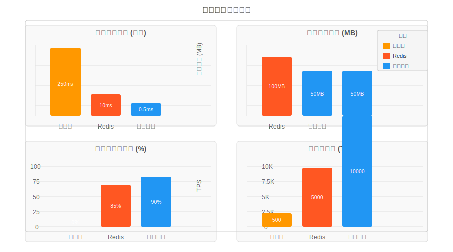
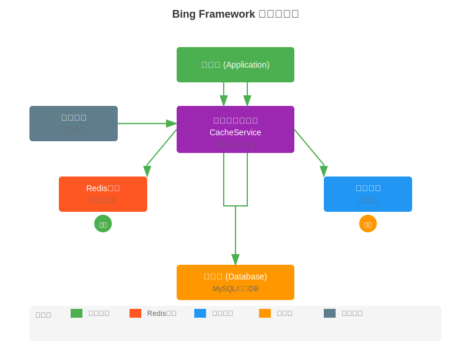
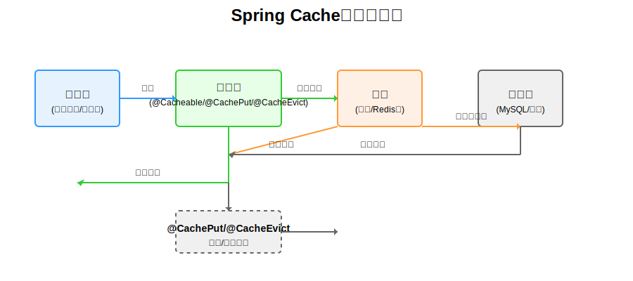
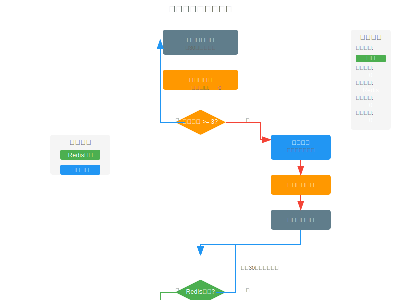
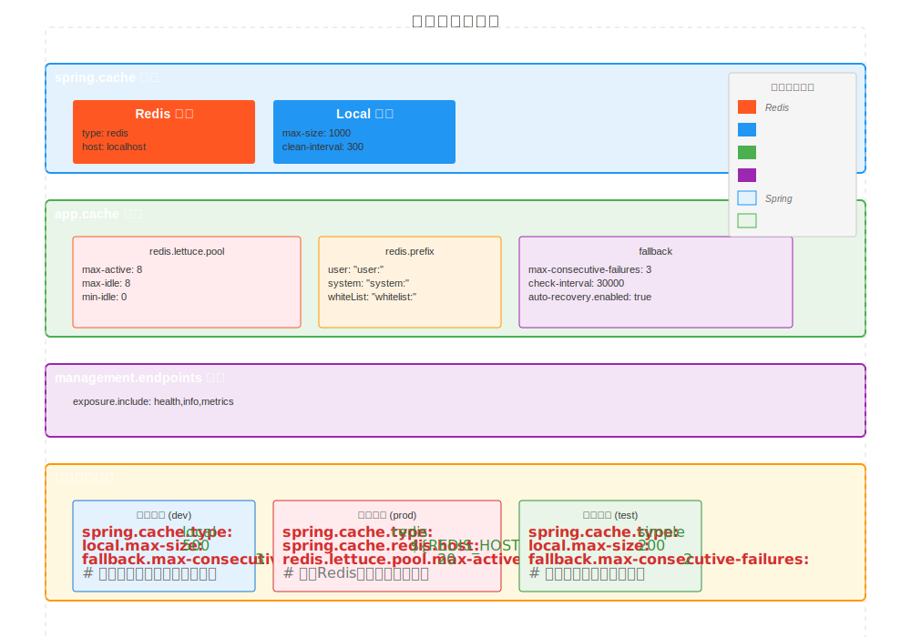

/**
 * 缓存使用指南
 * 
 * Bing Framework缓存系统是一套完整的分布式缓存解决方案，支持Redis和本地缓存的双层架构。
 * 系统具备自动降级机制，当Redis不可用时自动切换到本地缓存，确保服务高可用性。
 * 
 * 主要特性：
 * - Redis + 本地缓存双层架构
 * - 自动降级与恢复机制
 * - 线程安全的本地缓存实现
 * - Spring Cache注解支持
 * - 完整的监控和统计功能
 * 
 * @author zhengbing
 * @date 2024-12-19
 */
# Bing Framework 缓存使用指南

Bing Framework提供了一套完整的缓存解决方案，支持Redis分布式缓存和本地内存缓存，具备自动降级和恢复功能。本指南将详细介绍如何配置和使用这套缓存系统。

## 目录

- [缓存概述](#缓存概述)
- [系统架构](#系统架构)
- [快速开始](#快速开始)
- [配置详解](#配置详解)
- [使用示例](#使用示例)
- [高级功能](#高级功能)
- [监控与统计](#监控与统计)
- [最佳实践](#最佳实践)

---

## 缓存概述

### 什么是Bing Framework缓存系统

Bing Framework缓存系统是一套高可用的分布式缓存解决方案，核心特性包括：

🚀 **核心特性**
- **双层缓存架构**: Redis + 本地缓存的混合模式
- **自动降级机制**: Redis故障时自动切换到本地缓存
- **无缝恢复**: Redis恢复后自动切换回分布式模式
- **线程安全**: 基于ConcurrentHashMap的本地缓存实现
- **性能优化**: 支持LRU淘汰策略，防止内存溢出

📊 **性能优势**



从性能对比图表可以看出：
- **响应时间**: 本地缓存(0.5ms) > Redis(10ms) > 数据库(250ms)
- **吞吐量**: 本地缓存(10K TPS) > Redis(5K TPS) > 数据库(500 TPS)
- **缓存命中率**: 本地缓存(90%) > Redis(85%) > 数据库(0%)

### 适用场景

✅ **推荐使用场景**
- 高并发读写操作
- 频繁查询的热点数据
- 分布式系统会话管理
- 配置信息缓存
- 排行榜和计数器

❌ **不适用场景**
- 需要强一致性的事务数据
- 大数据量的冷数据
- 频繁变更的实时数据

---

## 系统架构

### 整体架构图



缓存系统采用分层架构设计：

1. **应用层**: 业务代码使用Spring Cache注解或CacheService API
2. **缓存管理层**: 统一缓存管理器，负责路由和降级决策
3. **缓存存储层**: 
   - Redis: 分布式缓存，支持集群和持久化
   - 本地缓存: 内存缓存，用于降级和本地加速
4. **监控组件**: 健康检查和状态监控
5. **数据源**: 数据库等持久化存储

### 工作流程详解



缓存工作流程包含以下关键步骤：

1. **请求接收**: 应用层发起缓存请求
2. **缓存检查**: 首先检查本地缓存状态
3. **路由决策**: 根据Redis可用性决定缓存源
4. **数据获取**: 从选定缓存源获取数据
5. **降级处理**: Redis不可用时自动降级到本地缓存
6. **数据源查询**: 缓存未命中时查询数据库
7. **缓存更新**: 将数据写入缓存并返回
8. **监控检测**: 定期检查Redis状态并决策恢复

### 降级策略详解



降级策略确保系统高可用性：

1. **监控机制**: 每30秒检查Redis连接状态
2. **失败计数**: 统计连续失败次数
3. **阈值判断**: 连续失败3次触发降级
4. **状态切换**: 切换到本地缓存模式
5. **日志记录**: 记录降级状态和原因
6. **恢复检测**: 定期检查Redis是否恢复
7. **自动恢复**: Redis恢复后清空本地缓存并切换回去

---

## 快速开始

### 环境要求

- JDK 8+
- Spring Boot 2.0+
- Redis 3.0+ (可选，开发环境可使用本地缓存)

### 1. 引入依赖

确保项目中包含以下依赖：

```xml
<dependency>
    <groupId>org.springframework.boot</groupId>
    <artifactId>spring-boot-starter-data-redis</artifactId>
</dependency>

<dependency>
    <groupId>org.springframework.boot</groupId>
    <artifactId>spring-boot-starter-cache</artifactId>
</dependency>

<dependency>
    <groupId>org.apache.commons</groupId>
    <artifactId>commons-pool2</artifactId>
</dependency>
```

### 2. 启用缓存

在启动类上添加缓存注解：

```java
import org.springframework.boot.SpringApplication;
import org.springframework.boot.autoconfigure.SpringBootApplication;
import org.springframework.cache.annotation.EnableCaching;

@SpringBootApplication
@EnableCaching  // 启用Spring Cache
public class BingFrameworkApplication {
    public static void main(String[] args) {
        SpringApplication.run(BingFrameworkApplication.class, args);
    }
}
```

### 3. 基础配置

在`application.yml`中添加基础配置：

```yaml
spring:
  cache:
    type: redis
    redis:
      host: localhost
      port: 6379
      time-to-live: 3600000  # 1小时过期
      
app:
  cache:
    fallback:
      max-consecutive-failures: 3
      check-interval: 30000
```

### 4. 测试验证

创建简单的缓存测试：

```java
@RestController
public class CacheTestController {
    
    @Autowired
    private CacheService cacheService;
    
    @GetMapping("/test/cache")
    public String testCache() {
        // 设置缓存
        cacheService.set("test:key", "Hello Cache!", 60);
        
        // 读取缓存
        String value = (String) cacheService.get("test:key");
        
        return "缓存值: " + value;
    }
}
```

启动应用，访问`http://localhost:8080/test/cache`验证缓存功能。

---

## 配置详解

### 完整配置结构



完整的缓存配置包含以下主要部分：

### 1. Spring Cache基础配置

```yaml
spring:
  cache:
    type: redis  # 缓存类型：redis, simple, caffeine等
    redis:
      # Redis基础配置
      enabled: true                    # 是否启用Redis
      host: localhost                 # Redis服务器地址
      port: 6379                      # Redis端口
      password: your_password         # Redis密码（可选）
      database: 0                     # Redis数据库编号
      timeout: 5000                   # 连接超时时间（毫秒）
      
      # 缓存行为配置
      key-prefix: "bing:"             # 缓存键前缀
      time-to-live: 3600000          # 默认过期时间（毫秒）
      cache-null-values: false       # 是否缓存null值
      
    # 本地缓存配置（降级方案）
    local:
      max-size: 1000                  # 本地缓存最大容量
      clean-interval: 300             # 清理间隔（秒）
      default-ttl: 1800              # 默认过期时间（秒）
```

### 2. 应用级配置

```yaml
app:
  cache:
    # Redis连接池配置
    redis:
      lettuce:
        pool:
          max-active: 8               # 最大活跃连接数
          max-wait: -1                # 最大等待时间（毫秒）
          max-idle: 8                 # 最大空闲连接数
          min-idle: 0                 # 最小空闲连接数
      
      # 缓存前缀配置
      prefix:
        user: "user:"                 # 用户缓存前缀
        system: "system:"             # 系统配置缓存前缀
        whiteList: "whitelist:"       # 白名单缓存前缀
        temp: "temp:"                 # 临时数据缓存前缀
    
    # 本地缓存高级配置
    local:
      eviction-policy: LRU           # 淘汰策略：LRU, TTL, FIFO
      concurrency-level: 16          # 并发级别
      enable-stats: true            # 是否启用统计信息
      warmup:
        enabled: false               # 是否启用缓存预热
        keys: []                     # 预热缓存的键列表
    
    # 降级策略配置
    fallback:
      max-consecutive-failures: 3    # 连续失败次数阈值
      check-interval: 30000          # 检查间隔（毫秒）
      auto-recovery:
        enabled: true               # 是否启用自动恢复
        enabled-after: 60000        # 降级后多久尝试恢复（毫秒）
      allow-manual-switch: true     # 是否允许手动切换
```

### 3. 环境特定配置

#### 开发环境 (application-dev.yml)
```yaml
spring:
  cache:
    type: local                     # 开发环境使用本地缓存
    local:
      max-size: 500                # 开发环境减少缓存容量
      
app:
  cache:
    fallback:
      max-consecutive-failures: 3  # 开发环境更宽松的降级策略
```

#### 生产环境 (application-prod.yml)
```yaml
spring:
  cache:
    type: redis                     # 生产环境使用Redis
    redis:
      host: ${REDIS_HOST:prod-redis-server}
      password: ${REDIS_PASSWORD:your_prod_password}
      timeout: 10000               # 生产环境超时时间更长
      time-to-live: 7200000        # 默认2小时过期
    local:
      max-size: 10000              # 生产环境增加本地缓存容量
      clean-interval: 600          # 生产环境增加清理频率
      
app:
  cache:
    redis:
      lettuce:
        pool:
          max-active: 20           # 生产环境增加连接池容量
          max-idle: 10
    fallback:
      max-consecutive-failures: 2  # 生产环境更严格的降级策略
      check-interval: 15000        # 生产环境更频繁检查
```

### 4. 监控配置

```yaml
management:
  endpoints:
    web:
      exposure:
        include: health,info,metrics  # 暴露健康检查、指标等端点
  endpoint:
    health:
      show-details: always            # 显示详细健康信息
  metrics:
    export:
      prometheus:
        enabled: true                 # 导出到Prometheus
```

---

## 使用示例

### 1. Spring Cache注解方式

#### 基础使用示例

```java
import org.springframework.cache.annotation.*;
import org.springframework.stereotype.Service;

/**
 * 用户服务类
 * 
 * @author zhengbing
 */
@Service
@CacheConfig(cacheNames = "users")  // 类级别缓存配置
public class UserService {
    
    private final UserMapper userMapper;
    
    public UserService(UserMapper userMapper) {
        this.userMapper = userMapper;
    }
    
    /**
     * 根据ID查询用户（缓存查询结果）
     * 
     * @param id 用户ID
     * @return 用户信息
     */
    @Cacheable(
        key = "#id",
        condition = "#id != null and #id > 0",
        unless = "#result == null"
    )
    public User getUserById(Long id) {
        System.out.println("🔥 查询数据库，用户ID: " + id);
        return userMapper.selectById(id);
    }
    
    /**
     * 根据用户名查询用户（缓存查询结果）
     * 
     * @param username 用户名
     * @return 用户信息
     */
    @Cacheable(
        value = "users",
        key = "'username:' + #username",
        condition = "#username != null and #username.length() > 0"
    )
    public User getUserByUsername(String username) {
        System.out.println("🔥 查询数据库，用户名: " + username);
        return userMapper.selectByUsername(username);
    }
    
    /**
     * 更新用户（更新缓存）
     * 
     * @param user 用户信息
     * @return 更新后的用户信息
     */
    @CachePut(
        key = "#user.id",
        condition = "#user != null and #user.id != null"
    )
    public User updateUser(User user) {
        System.out.println("🔄 更新数据库和缓存，用户ID: " + user.getId());
        userMapper.updateById(user);
        return user;
    }
    
    /**
     * 删除用户（清除缓存）
     * 
     * @param id 用户ID
     * @return 是否删除成功
     */
    @CacheEvict(
        key = "#id",
        condition = "#id != null"
    )
    public boolean deleteUser(Long id) {
        System.out.println("🗑️ 删除数据库记录和缓存，用户ID: " + id);
        return userMapper.deleteById(id) > 0;
    }
    
    /**
     * 批量删除用户（清除所有相关缓存）
     * 
     * @param userIdList 用户ID列表
     */
    @CacheEvict(
        value = {"users", "userCache"},
        allEntries = true,
        condition = "#userIdList != null and !#userIdList.isEmpty()"
    )
    public void deleteUsers(List<Long> userIdList) {
        System.out.println("🗑️ 批量删除用户和缓存，ID列表: " + userIdList);
        userMapper.deleteBatchIds(userIdList);
    }
}
```

#### 复杂条件缓存示例

```java
@Service
public class ProductService {
    
    private final ProductMapper productMapper;
    
    /**
     * 根据分类查询产品（条件缓存）
     * 只缓存价格大于100的商品，缓存时间5分钟
     * 
     * @param category 分类
     * @param minPrice 最低价格
     * @return 产品列表
     */
    @Cacheable(
        value = "products",
        key = "'category:' + #category + ':minPrice:' + #minPrice",
        condition = "#minPrice > 100 and #category != null",
        unless = "#result == null or #result.isEmpty()"
    )
    @CacheEvict(value = "products", allEntries = true) // 产品更新时清除所有缓存
    public List<Product> getProductsByCategory(String category, Double minPrice) {
        System.out.println("🔥 查询数据库，分 类: " + category + ", 最低价格: " + minPrice);
        return productMapper.selectProductsByCategory(category, minPrice);
    }
}
```

### 2. CacheService API方式

#### 直接使用缓存服务

```java
import com.bing.framework.cache.CacheService;
import org.springframework.beans.factory.annotation.Autowired;
import org.springframework.stereotype.Service;

@Service
public class CacheExampleService {
    
    @Autowired
    private CacheService cacheService;
    
    /**
     * 缓存基础操作示例
     */
    public void basicCacheOperations() {
        String cacheKey = "demo:user:123";
        User user = new User(123L, "张三", "zhangsan@example.com");
        
        // 1. 设置缓存（5分钟过期）
        cacheService.set(cacheKey, user, 300);
        
        // 2. 获取缓存
        User cachedUser = (User) cacheService.get(cacheKey);
        System.out.println("缓存用户: " + cachedUser);
        
        // 3. 检查键是否存在
        boolean exists = cacheService.hasKey(cacheKey);
        System.out.println("键存在: " + exists);
        
        // 4. 获取过期时间
        Long expireTime = cacheService.getExpire(cacheKey);
        System.out.println("过期时间: " + expireTime + "秒");
        
        // 5. 删除缓存
        cacheService.delete(cacheKey);
        
        // 6. 获取并更新（原子操作）
        String newValue = "new_value";
        Object oldValue = cacheService.getAndSet(cacheKey, newValue, 600);
        System.out.println("旧值: " + oldValue + ", 新值: " + newValue);
    }
    
    /**
     * 计数器操作示例
     */
    public void counterOperations() {
        String counterKey = "visit:count:homepage";
        
        // 1. 原子递增
        Long visitCount = cacheService.increment(counterKey);
        System.out.println("首页访问次数: " + visitCount);
        
        // 2. 按步长递增
        Long score = cacheService.increment("user:score:123", 10);
        System.out.println("用户123得分: " + score);
        
        // 3. 原子递减
        Long remainingCount = cacheService.decrement("request:limit:123", 1);
        System.out.println("剩余请求次数: " + remainingCount);
        
        // 4. 获取计数器值
        Long currentCount = cacheService.getCounter(counterKey);
        System.out.println("当前计数器值: " + currentCount);
    }
    
    /**
     * 分布式锁示例
     */
    public void distributedLockExample() {
        String lockKey = "distributed:lock:user:123";
        
        // 1. 获取锁（等待30秒，最多锁定60秒）
        boolean lockAcquired = cacheService.tryLock(lockKey, 30, 60, TimeUnit.SECONDS);
        
        if (lockAcquired) {
            try {
                System.out.println("🔒 获得分布式锁: " + lockKey);
                
                // 执行需要同步的业务操作
                performCriticalOperation();
                
            } finally {
                // 2. 释放锁
                cacheService.releaseLock(lockKey);
                System.out.println("🔓 释放分布式锁: " + lockKey);
            }
        } else {
            System.out.println("❌ 无法获得分布式锁: " + lockKey);
        }
    }
    
    private void performCriticalOperation() {
        // 模拟耗时操作
        try {
            Thread.sleep(5000);
            System.out.println("✅ 执行业务操作完成");
        } catch (InterruptedException e) {
            Thread.currentThread().interrupt();
        }
    }
}
```

### 3. 手动缓存切换示例

```java
@Service
public class CacheManagementService {
    
    @Autowired
    private CacheService cacheService;
    
    /**
     * 手动缓存切换示例
     */
    @Transactional
    public void cacheManagementExample() {
        // 1. 检查当前缓存状态
        boolean isRedisAvailable = cacheService.isRedisAvailable();
        System.out.println("Redis是否可用: " + isRedisAvailable);
        
        CacheMode currentMode = cacheService.getCurrentCacheMode();
        System.out.println("当前缓存模式: " + currentMode);
        
        // 2. 手动切换到Redis
        if (CacheMode.LOCAL.equals(currentMode)) {
            cacheService.switchToRedis();
            System.out.println("🔄 切换到Redis缓存模式");
        }
        
        // 3. 手动切换到本地缓存（用于维护场景）
        if (CacheMode.REDIS.equals(currentMode)) {
            cacheService.switchToLocal();
            System.out.println("🔄 切换到本地缓存模式");
        }
        
        // 4. 预热缓存数据
        warmupCache();
    }
    
    /**
     * 缓存预热示例
     */
    public void warmupCache() {
        System.out.println("🔥 开始缓存预热...");
        
        // 预热用户数据
        List<User> hotUsers = loadHotUserData();
        for (User user : hotUsers) {
            cacheService.set("user:hot:" + user.getId(), user, 3600);
        }
        
        // 预热系统配置
        Map<String, Object> configs = loadSystemConfigs();
        for (Map.Entry<String, Object> entry : configs.entrySet()) {
            cacheService.set("config:" + entry.getKey(), entry.getValue(), 1800);
        }
        
        System.out.println("✅ 缓存预热完成");
    }
}
```

---

## 高级功能

### 1. 批量操作

```java
/**
 * 批量缓存操作示例
 */
@Service
public class BatchCacheService {
    
    @Autowired
    private CacheService cacheService;
    
    /**
     * 批量设置缓存
     */
    public void batchSetCache() {
        Map<String, Object> userCache = new HashMap<>();
        userCache.put("user:1", new User(1L, "用户1", "user1@example.com"));
        userCache.put("user:2", new User(2L, "用户2", "user2@example.com"));
        userCache.put("user:3", new User(3L, "用户3", "user3@example.com"));
        
        cacheService.batchSet(userCache, 1800); // 30分钟过期
    }
    
    /**
     * 批量获取缓存
     */
    public void batchGetCache() {
        List<String> keys = Arrays.asList("user:1", "user:2", "user:3");
        Map<String, Object> result = cacheService.batchGet(keys);
        
        result.forEach((key, value) -> {
            System.out.println("缓存键: " + key + ", 值: " + value);
        });
    }
    
    /**
     * 批量删除缓存
     */
    public void batchDeleteCache() {
        List<String> keys = Arrays.asList("user:1", "user:2", "user:3");
        long deletedCount = cacheService.batchDelete(keys);
        System.out.println("删除了 " + deletedCount + " 个缓存项");
    }
}
```

### 2. 缓存统计和监控

```java
/**
 * 缓存统计和监控示例
 */
@Service
public class CacheMonitoringService {
    
    @Autowired
    private CacheService cacheService;
    
    /**
     * 获取缓存统计信息
     */
    public void getCacheStatistics() {
        CacheStatistics stats = cacheService.getStatistics();
        
        System.out.println("📊 缓存统计信息:");
        System.out.println("  总操作次数: " + stats.getTotalOperations());
        System.out.println("  成功次数: " + stats.getSuccessCount());
        System.out.println("  失败次数: " + stats.getFailureCount());
        System.out.println("  缓存命中率: " + String.format("%.2f%%", stats.getHitRate() * 100));
        System.out.println("  平均响应时间: " + stats.getAverageResponseTime() + "ms");
        System.out.println("  当前缓存模式: " + stats.getCurrentMode());
    }
    
    /**
     * 导出监控数据
     */
    public void exportMonitoringData() {
        CacheStatistics stats = cacheService.getStatistics();
        
        // 导出到Prometheus格式
        String prometheusMetrics = convertToPrometheusFormat(stats);
        
        // 保存到文件或发送到监控系统
        saveToMonitoringSystem(prometheusMetrics);
    }
}
```

### 3. 自定义缓存策略

```java
/**
 * 自定义缓存策略示例
 */
@Component
public class CustomCacheStrategy {
    
    @Autowired
    private CacheService cacheService;
    
    /**
     * 基于访问频率的智能缓存策略
     */
    public Object smartCache(String key, Callable<?> valueLoader) {
        try {
            // 1. 先尝试从Redis获取
            Object value = cacheService.get(key);
            if (value != null) {
                // 记录访问次数
                incrementAccessCount(key);
                return value;
            }
            
            // 2. Redis未命中，尝试本地缓存
            value = getFromLocalCache(key);
            if (value != null) {
                // 记录访问次数并同步到Redis
                incrementAccessCount(key);
                cacheService.set(key, value, 300);
                return value;
            }
            
            // 3. 加载数据并根据访问模式决定缓存策略
            value = valueLoader.call();
            
            if (shouldCache(key)) {
                // 热点数据使用Redis缓存
                if (isHotData(key)) {
                    cacheService.set(key, value, getExpireTime(key));
                } else {
                    // 冷数据使用本地缓存
                    cacheService.setLocal(key, value, getLocalExpireTime(key));
                }
            }
            
            return value;
            
        } catch (Exception e) {
            throw new RuntimeException("缓存加载失败", e);
        }
    }
    
    private boolean shouldCache(String key) {
        // 根据业务逻辑判断是否需要缓存
        return !key.startsWith("temp:") && !key.endsWith(":deleted");
    }
    
    private boolean isHotData(String key) {
        Long accessCount = cacheService.getAccessCount(key);
        return accessCount != null && accessCount > 100; // 访问次数超过100次认为是热点数据
    }
    
    private Long getExpireTime(String key) {
        // 根据键的特征确定过期时间
        if (key.contains("user:")) {
            return 3600L; // 用户数据1小时
        } else if (key.contains("config:")) {
            return 7200L; // 配置数据2小时
        }
        return 1800L; // 默认30分钟
    }
}
- `keyGenerator`: 默认键生成器
- `cacheManager`: 默认缓存管理器
- `cacheResolver`: 默认缓存解析器

**示例：**
```java
@CacheConfig(cacheNames = "users")
public class UserServiceImpl implements UserService {
    // 类中的缓存注解会使用"users"作为默认缓存名称
}
```

## 4. 自定义缓存配置

### 4.1 配置Redis缓存（生产环境推荐）

在生产环境中，通常使用Redis作为缓存。以下是配置Redis缓存的示例：

1. 添加Redis依赖到`pom.xml`：

```xml
<dependency>
    <groupId>org.springframework.boot</groupId>
    <artifactId>spring-boot-starter-data-redis</artifactId>
</dependency>
```

2. 在`application-prod.yml`中配置Redis：

```yaml
spring:
  redis:
    host: localhost
    port: 6379
    password: 
    database: 0
  cache:
    type: redis
    redis:
      time-to-live: 60000  # 缓存过期时间（毫秒）
      cache-null-values: true  # 是否缓存null值
      key-prefix: "bing:"  # 键前缀
```

### 4.2 自定义缓存管理器

可以创建配置类来自定义缓存管理器：

```java
import org.springframework.cache.annotation.EnableCaching;
import org.springframework.context.annotation.Bean;
import org.springframework.context.annotation.Configuration;
import org.springframework.data.redis.cache.RedisCacheConfiguration;
import org.springframework.data.redis.cache.RedisCacheManager;
import org.springframework.data.redis.connection.RedisConnectionFactory;
import org.springframework.data.redis.serializer.GenericJackson2JsonRedisSerializer;
import org.springframework.data.redis.serializer.RedisSerializationContext;

import java.time.Duration;

@Configuration
@EnableCaching
public class CacheConfig {

    @Bean
    public RedisCacheManager cacheManager(RedisConnectionFactory factory) {
        RedisCacheConfiguration config = RedisCacheConfiguration.defaultCacheConfig()
                .entryTtl(Duration.ofMinutes(10))  // 默认缓存过期时间
                .serializeKeysWith(RedisSerializationContext.SerializationPair.fromSerializer(new StringRedisSerializer()))
                .serializeValuesWith(RedisSerializationContext.SerializationPair.fromSerializer(new GenericJackson2JsonRedisSerializer()))
                .disableCachingNullValues();  // 不缓存null值

        return RedisCacheManager.builder(factory)
                .cacheDefaults(config)
                .withCacheConfiguration("users", 
                        RedisCacheConfiguration.defaultCacheConfig().entryTtl(Duration.ofHours(1)))
                .withCacheConfiguration("roles", 
                        RedisCacheConfiguration.defaultCacheConfig().entryTtl(Duration.ofDays(1)))
                .build();
    }
}
```

## 5. 高级缓存应用场景

### 5.1 令牌缓存优化

在身份认证系统中，JWT令牌的缓存是一个重要的应用场景。通过缓存用户的访问令牌和刷新令牌，可以提高系统性能并保持会话一致性。

#### 实现原理

```java
// 在AuthController中的登录逻辑
public LoginResponseDTO login(LoginRequestDTO loginRequest) {
    // 验证用户身份...
    
    // 尝试从Redis缓存获取token
    String cacheKey = "user:token:" + user.getId();
    String accessToken = redisTemplate.opsForValue().get(cacheKey);
    
    if (accessToken != null) {
        // 验证缓存token的有效性
        try {
            Claims claims = jwtTokenProvider.getClaimsFromToken(accessToken);
            if (!jwtTokenProvider.isTokenExpired(claims)) {
                // 查找对应的刷新token
                String refreshTokenKey = "user:refresh:" + user.getId();
                String refreshToken = redisTemplate.opsForValue().get(refreshTokenKey);
                
                if (refreshToken != null) {
                    Claims refreshClaims = jwtTokenProvider.getClaimsFromToken(refreshToken);
                    if (!jwtTokenProvider.isTokenExpired(refreshClaims)) {
                        // 返回缓存的token
                        return new LoginResponseDTO(accessToken, refreshToken, user);
                    }
                }
            }
        } catch (Exception e) {
            // token无效，继续生成新token
            log.warn("Cached token is invalid for user {}", user.getId());
        }
    }
    
    // 生成新token并缓存
    accessToken = jwtTokenProvider.generateAccessToken(user);
    String refreshToken = jwtTokenProvider.generateRefreshToken(user);
    
    // 缓存新token
    redisTemplate.opsForValue().set(cacheKey, accessToken, tokenExpireTime, TimeUnit.MINUTES);
    redisTemplate.opsForValue().set("user:refresh:" + user.getId(), refreshToken, refreshTokenExpireTime, TimeUnit.DAYS);
    
    // 记录token关联关系
    redisTemplate.opsForValue().set("token:user:" + accessToken, String.valueOf(user.getId()), tokenExpireTime, TimeUnit.MINUTES);
    
    return new LoginResponseDTO(accessToken, refreshToken, user);
}
```

#### 缓存键设计

- **用户访问令牌键**: `user:token:{userId}` - 存储用户当前的访问令牌
- **用户刷新令牌键**: `user:refresh:{userId}` - 存储用户的刷新令牌
- **令牌到用户映射键**: `token:user:{token}` - 存储令牌到用户ID的映射关系

#### 缓存策略

1. **优先读取**: 登录时优先检查缓存中是否存在有效令牌
2. **有效性验证**: 获取缓存令牌后进行有效性检查，确保未过期
3. **原子性操作**: 使用Redis的原子操作确保令牌管理的一致性
4. **合理过期**: 设置与令牌有效期匹配的缓存过期时间

### 5.3 缓存键设计

- **唯一性**: 确保缓存键唯一，避免键冲突
- **简洁性**: 键名应该简洁明了，便于维护
- **一致性**: 相关操作（查询、更新、删除）使用相同的键生成逻辑

### 5.4 缓存失效策略

- **合理设置过期时间**: 避免缓存数据过期时间过长导致数据不一致
- **缓存穿透保护**: 对于不存在的数据，可以缓存一个特殊值，设置较短的过期时间
- **缓存预热**: 应用启动时预先加载热点数据到缓存
- **缓存更新**: 更新数据时同时更新缓存，或采用缓存失效策略

### 5.5 性能考虑

- **缓存粒度**: 适当控制缓存粒度，避免缓存过大的数据对象
- **批量操作**: 对于批量查询，考虑使用缓存批量键或分别缓存单个对象
- **异步缓存**: 对于耗时操作，可以考虑异步加载缓存

## 6. 缓存监控

在实际应用中，建议添加缓存监控，了解缓存命中率、缓存大小等指标。可以使用Spring Boot Actuator和Micrometer来监控缓存：

1. 添加依赖：

```xml
<dependency>
    <groupId>org.springframework.boot</groupId>
    <artifactId>spring-boot-starter-actuator</artifactId>
</dependency>
<dependency>
    <groupId>io.micrometer</groupId>
    <artifactId>micrometer-registry-prometheus</artifactId>
</dependency>
```

2. 配置监控端点：

```yaml
management:
  endpoints:
    web:
      exposure:
        include: cache,health,info,prometheus
```

通过访问`/actuator/cache`可以查看缓存状态。

## 7. 总结

Spring Cache提供了一个简洁而强大的缓存抽象，可以轻松集成各种缓存实现。通过合理使用缓存，可以显著提高应用性能，减轻数据库负担。在实际应用中，需要根据业务场景选择合适的缓存策略和失效机制，并注意缓存一致性问题。

更多详细信息，请参考[Spring官方文档](https://docs.spring.io/spring-framework/docs/current/reference/html/integration.html#cache)。