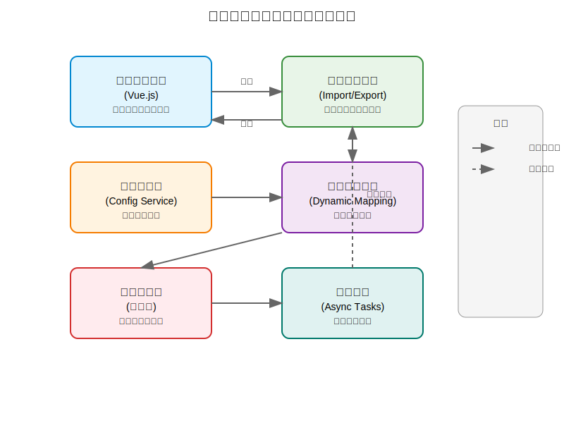
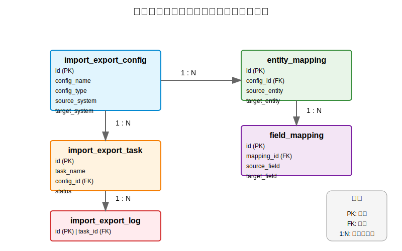
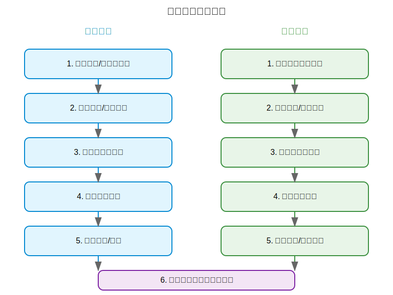

# 数据库配置导入导出系统设计文档

## 1. 系统概述

配置管理界面是导入导出系统的核心组件，提供直观可视化界面，用于管理配置的全生命周期。本文档概述主要设计思路、核心功能和示例配置数据。

### 1.1 简介

数据库配置导入导出系统是一个通用化的数据处理框架，旨在实现不同数据源间的配置信息无缝迁移和管理。系统提供统一的配置管理界面、灵活的动态实体映射能力以及高性能的导入导出处理机制，支持多种数据格式和复杂业务场景。

### 1.2 核心价值

- **统一管理**：提供统一的配置管理界面，实现配置的集中化管理和监控
- **灵活性**：支持动态实体映射，适应不同业务场景的数据结构差异
- **高性能**：异步任务处理机制，保证大数据量导入导出的效率和稳定性
- **可扩展性**：模块化设计，支持自定义处理器和数据格式扩展
- **安全可靠**：完善的权限控制、数据验证和错误处理机制

### 1.3 应用场景

- **系统迁移**：不同环境间的配置迁移（开发、测试、生产）
- **数据备份与恢复**：配置数据的定期备份和应急恢复
- **多系统集成**：异构系统间的配置数据交换
- **批量操作**：大量配置的批量导入、更新和导出

## 2. 系统架构

### 2.1 整体架构图

系统采用分层架构设计，各层之间职责明确，通过依赖注入实现松耦合。下图展示了系统的整体架构和各组件之间的交互关系：



**架构说明：**
- **表现层**：基于Vue.js实现的配置管理界面，提供用户交互和数据展示功能
- **控制层**：统一导入导出处理器，负责请求路由和处理流程控制
- **服务层**：配置服务核心业务逻辑实现，包括配置的CRUD操作
- **映射层**：动态实体映射，处理不同数据结构间的转换
- **存储层**：数据库存储配置信息，支持多种数据库类型
- **任务层**：异步任务管理，处理长时间运行的导入导出操作

### 2.2 分层设计

1. **表现层**：Vue.js实现的配置管理界面，提供用户交互和数据展示
2. **控制层**：统一导入导出处理器，负责请求路由和处理流程控制
3. **服务层**：配置服务核心业务逻辑实现，包括配置的CRUD操作
4. **映射层**：动态实体映射，处理不同数据结构间的转换
5. **存储层**：数据库存储配置信息，支持多种数据库类型
6. **任务层**：异步任务管理，处理长时间运行的导入导出操作

## 3. 数据模型设计

### 3.1 核心表结构

#### 3.1.1 导入导出配置表 (import_export_config)

| 字段名 | 数据类型 | 约束 | 描述 |
| :--- | :--- | :--- | :--- |
| id | BIGINT | PRIMARY KEY | 配置ID |
| config_name | VARCHAR(255) | NOT NULL | 配置名称 |
| config_type | VARCHAR(50) | NOT NULL | 配置类型 |
| source_system | VARCHAR(100) | NOT NULL | 源系统标识 |
| target_system | VARCHAR(100) | NOT NULL | 目标系统标识 |
| mapping_config | TEXT | NOT NULL | 字段映射配置JSON |
| format_config | TEXT | NOT NULL | 数据格式配置JSON |
| status | VARCHAR(20) | NOT NULL | 配置状态 |
| create_time | DATETIME | NOT NULL | 创建时间 |
| update_time | DATETIME | NOT NULL | 更新时间 |
| created_by | VARCHAR(100) | NOT NULL | 创建人 |

#### 3.1.2 实体映射关系表 (entity_mapping)

| 字段名 | 数据类型 | 约束 | 描述 |
| :--- | :--- | :--- | :--- |
| id | BIGINT | PRIMARY KEY | 映射ID |
| config_id | BIGINT | FOREIGN KEY | 关联配置ID |
| source_entity | VARCHAR(255) | NOT NULL | 源实体名称 |
| target_entity | VARCHAR(255) | NOT NULL | 目标实体名称 |
| mapping_rules | TEXT | NOT NULL | 映射规则JSON |
| status | VARCHAR(20) | NOT NULL | 映射状态 |

#### 3.1.3 字段映射表 (field_mapping)

| 字段名 | 数据类型 | 约束 | 描述 |
| :--- | :--- | :--- | :--- |
| id | BIGINT | PRIMARY KEY | 字段映射ID |
| mapping_id | BIGINT | FOREIGN KEY | 关联实体映射ID |
| source_field | VARCHAR(255) | NOT NULL | 源字段名 |
| target_field | VARCHAR(255) | NOT NULL | 目标字段名 |
| field_type | VARCHAR(50) | NOT NULL | 字段类型 |
| converter | VARCHAR(255) | NULL | 转换器类名 |
| validation_rules | TEXT | NULL | 验证规则JSON |

#### 3.1.4 任务记录表 (import_export_task)

| 字段名 | 数据类型 | 约束 | 描述 |
| :--- | :--- | :--- | :--- |
| id | BIGINT | PRIMARY KEY | 任务ID |
| task_name | VARCHAR(255) | NOT NULL | 任务名称 |
| task_type | VARCHAR(20) | NOT NULL | 任务类型(IMPORT/EXPORT) |
| config_id | BIGINT | FOREIGN KEY | 关联配置ID |
| status | VARCHAR(20) | NOT NULL | 任务状态 |
| total_count | INT | NULL | 总记录数 |
| success_count | INT | NULL | 成功记录数 |
| fail_count | INT | NULL | 失败记录数 |
| start_time | DATETIME | NULL | 开始时间 |
| end_time | DATETIME | NULL | 结束时间 |
| created_by | VARCHAR(100) | NOT NULL | 创建人 |

#### 3.1.5 操作日志表 (import_export_log)

| 字段名 | 数据类型 | 约束 | 描述 |
| :--- | :--- | :--- | :--- |
| id | BIGINT | PRIMARY KEY | 日志ID |
| task_id | BIGINT | FOREIGN KEY | 关联任务ID |
| operation_type | VARCHAR(20) | NOT NULL | 操作类型 |
| content | TEXT | NULL | 操作内容 |
| status | VARCHAR(20) | NOT NULL | 操作状态 |
| error_msg | TEXT | NULL | 错误信息 |
| create_time | DATETIME | NOT NULL | 操作时间 |

### 3.2 表关系图

系统核心表之间存在明确的一对多关系，下图展示了主要数据模型之间的关系：



**关系说明：**
- 一个导入导出配置可以关联多个实体映射
- 一个实体映射可以关联多个字段映射
- 一个导入导出配置可以关联多个任务记录
- 一个任务记录可以关联多个操作日志

### 3.3 索引设计

- **import_export_config**：在config_name、config_type、source_system、target_system、status上建立索引
- **entity_mapping**：在config_id、source_entity、target_entity上建立索引
- **field_mapping**：在mapping_id、source_field、target_field上建立索引
- **import_export_task**：在task_type、config_id、status、start_time上建立索引
- **import_export_log**：在task_id、operation_type、status、create_time上建立索引

## 4. 核心服务接口

### 4.1 服务架构概述

系统服务层采用分层设计，包括核心服务接口、实现类和辅助组件。服务之间通过依赖注入进行解耦，支持事务管理和异常处理。主要服务包括配置管理服务、实体映射服务、导入导出服务和任务管理服务。

### 4.2 核心服务接口定义

#### 4.2.1 配置管理服务 (ImportExportConfigService)

| 方法名 | 参数 | 返回值 | 描述 |
| :--- | :--- | :--- | :--- |
| createConfig | ImportExportConfigDTO | Long | 创建配置 |
| updateConfig | ImportExportConfigDTO | Boolean | 更新配置 |
| deleteConfig | Long | Boolean | 删除配置 |
| getConfigById | Long | ImportExportConfigDTO | 根据ID获取配置 |
| queryConfigs | ConfigQueryParam | Page<ImportExportConfigDTO> | 分页查询配置 |
| validateConfig | ImportExportConfigDTO | ValidationResult | 验证配置有效性 |
| duplicateConfig | Long | Long | 复制配置 |
| importConfig | MultipartFile | ImportResult | 导入配置 |
| exportConfig | List<Long> | FileDTO | 导出配置 |

#### 4.2.2 实体映射服务 (EntityMappingService)

| 方法名 | 参数 | 返回值 | 描述 |
| :--- | :--- | :--- | :--- |
| createMapping | EntityMappingDTO | Long | 创建实体映射 |
| updateMapping | EntityMappingDTO | Boolean | 更新实体映射 |
| deleteMapping | Long | Boolean | 删除实体映射 |
| getMappingById | Long | EntityMappingDTO | 根据ID获取映射 |
| getMappingsByConfigId | Long | List<EntityMappingDTO> | 获取配置下所有映射 |
| validateMapping | EntityMappingDTO | ValidationResult | 验证映射有效性 |

#### 4.2.3 字段映射服务 (FieldMappingService)

| 方法名 | 参数 | 返回值 | 描述 |
| :--- | :--- | :--- | :--- |
| createFieldMapping | FieldMappingDTO | Long | 创建字段映射 |
| updateFieldMapping | FieldMappingDTO | Boolean | 更新字段映射 |
| deleteFieldMapping | Long | Boolean | 删除字段映射 |
| getFieldMappingsByMappingId | Long | List<FieldMappingDTO> | 获取实体映射下所有字段映射 |
| validateFieldMapping | FieldMappingDTO | ValidationResult | 验证字段映射有效性 |

#### 4.2.4 导入导出服务 (ImportExportService)

| 方法名 | 参数 | 返回值 | 描述 |
| :--- | :--- | :--- | :--- |
| importData | ImportRequest | Long | 导入数据(异步) |
| exportData | ExportRequest | Long | 导出数据(异步) |
| getImportTemplate | Long | FileDTO | 获取导入模板 |
| validateImportData | MultipartFile, Long | ValidationResult | 验证导入数据 |

#### 4.2.5 任务管理服务 (TaskService)

| 方法名 | 参数 | 返回值 | 描述 |
| :--- | :--- | :--- | :--- |
| getTaskStatus | Long | TaskStatusDTO | 获取任务状态 |
| cancelTask | Long | Boolean | 取消任务 |
| retryTask | Long | Long | 重试任务 |
| queryTasks | TaskQueryParam | Page<TaskDTO> | 分页查询任务 |
| getTaskLog | Long | List<TaskLogDTO> | 获取任务日志 |
| cleanTasks | CleanTaskParam | Integer | 清理历史任务 |

### 4.3 缓存机制

| 缓存名称 | 缓存键 | 缓存值 | 过期时间 | 刷新策略 |
| :--- | :--- | :--- | :--- | :--- |
| configCache | config:{id} | 配置对象 | 30分钟 | 配置更新时清除 |
| mappingCache | mapping:{id} | 映射对象 | 30分钟 | 映射更新时清除 |
| entityCache | entity:{className} | 实体元数据 | 1小时 | 系统启动加载 |
| converterCache | converter:{name} | 转换器实例 | 永久 | 懒加载 |

## 5. 动态实体映射

### 5.1 设计概述

动态实体映射模块负责处理不同数据结构间的转换，支持灵活的映射规则配置、类型转换和数据验证。核心设计思想是通过元数据驱动的方式，在运行时动态构建映射关系，无需编写硬编码的转换逻辑。

### 5.2 核心组件

#### 5.2.1 动态实体服务 (DynamicEntityService)

负责实体类的动态加载、元数据提取和缓存管理，支持根据配置动态扫描和识别实体类。主要功能包括：

- 实体类扫描与加载
- 字段元数据提取
- 实体关系分析
- 实体实例创建

#### 5.2.2 类型转换工具类 (TypeConverter)

提供不同数据类型间的转换功能，支持基本类型、复杂对象和集合类型的转换。内置常用转换器，同时支持自定义转换器扩展。

#### 5.2.3 验证服务 (ValidationService)

根据配置的验证规则对数据进行校验，支持必填验证、格式验证、范围验证等多种验证类型。验证结果包含详细的错误信息和位置信息。

#### 5.2.4 映射器 (ObjectMapper)

核心映射引擎，负责根据映射规则将源对象转换为目标对象。支持：

- 字段级映射
- 嵌套对象映射
- 集合映射
- 条件映射
- 表达式映射

### 5.3 动态查询服务

支持根据配置动态构建查询条件，执行数据库查询操作，返回符合条件的实体列表。主要功能包括：

- 动态条件构建
- 排序和分页支持
- 关联查询
- 结果转换

## 6. 统一导入导出处理器

### 6.1 设计概述

统一导入导出处理器是系统的核心处理组件，负责协调各模块完成数据的导入导出操作。采用责任链模式设计，支持多种文件格式和处理策略，同时提供异步任务处理能力。

### 6.2 导入导出流程

下图展示了系统的导入导出处理流程，包括导入和导出两条并行的处理路径，以及公共的任务日志生成环节：



**流程说明：**
- **导入流程**：从文件上传或数据源选择开始，经过配置选择、数据解析验证、实体映射转换，最终完成数据入库或更新
- **导出流程**：从选择导出数据范围开始，经过配置选择、数据查询过滤、实体映射转换，最终生成文件或输出结果
- **公共环节**：无论是导入还是导出操作，系统都会生成详细的任务日志和统计信息，用于跟踪和审计

### 6.3 系统架构

- **控制器层**：接收用户请求，参数验证，任务创建
- **服务层**：业务逻辑处理，状态管理，结果汇总
- **处理器链**：责任链模式，依次执行数据解析、验证、转换、存储/输出
- **任务管理器**：异步任务调度和执行
- **监听器**：事件监听和回调处理

### 6.3 核心组件详细设计

#### 6.3.1 导入控制器 (ImportController)

处理导入相关的HTTP请求，包括导入请求提交、任务状态查询、导入模板下载等功能。

#### 6.3.2 导出控制器 (ExportController)

处理导出相关的HTTP请求，包括导出请求提交、任务状态查询、导出文件下载等功能。

#### 6.3.3 导入服务 (ImportService)

实现导入业务逻辑，包括任务创建、数据验证、错误处理和结果统计。

#### 6.3.4 导出服务 (ExportService)

实现导出业务逻辑，包括数据查询、格式转换和文件生成。

#### 6.3.5 处理器链

- **数据解析器**：解析不同格式的输入数据（Excel、CSV、JSON等）
- **数据验证器**：验证数据格式和业务规则
- **数据转换器**：根据映射规则转换数据
- **数据处理器**：执行数据的存储或输出操作
- **结果处理器**：处理和汇总操作结果

### 6.4 异步任务管理

采用线程池执行异步任务，提供任务状态跟踪、进度监控和错误重试机制。线程池配置参数包括核心线程数、最大线程数、队列容量和线程存活时间，支持不同类型任务的隔离执行。

### 6.5 统一异常处理

建立完整的异常体系，包括业务异常、系统异常和技术异常，提供统一的异常处理策略和错误响应格式。全局异常处理器捕获并处理所有异常，记录详细日志，并返回友好的错误信息。

### 6.6 日志与监控

- **操作日志**：记录用户操作和系统行为
- **性能监控**：记录关键操作的性能指标
- **错误日志**：详细记录错误信息和上下文
- **审计日志**：记录敏感操作的审计信息

## 7. 配置管理界面

### 7.1 设计概述

配置管理界面采用Vue.js框架开发，提供直观、易用的用户界面，支持配置的创建、编辑、删除、查询等操作，以及导入导出任务的管理和监控。

### 7.2 核心页面设计

#### 7.2.1 配置列表页

展示所有导入导出配置，支持搜索、筛选、排序和分页功能，提供配置的基本操作入口。

| 功能 | 描述 |
| :--- | :--- |
| 配置搜索 | 根据配置名称、类型、状态等条件搜索 |
| 配置筛选 | 按系统、类型、状态等进行筛选 |
| 批量操作 | 支持批量删除、批量导出 |
| 分页展示 | 分页显示配置列表，支持自定义每页条数 |

#### 7.2.2 配置详情页

展示和编辑单个配置的详细信息，包括基本信息、实体映射和字段映射配置。

| 功能 | 描述 |
| :--- | :--- |
| 基本信息编辑 | 编辑配置名称、类型、源系统、目标系统等 |
| 实体映射管理 | 添加、编辑、删除实体映射关系 |
| 字段映射配置 | 配置字段映射关系、转换器和验证规则 |
| 配置验证 | 实时验证配置有效性 |

#### 7.2.3 任务管理页面

展示所有导入导出任务，提供任务状态查询、进度监控和日志查看功能。

| 功能 | 描述 |
| :--- | :--- |
| 任务列表 | 展示任务名称、类型、状态、时间等信息 |
| 任务详情 | 查看任务执行详情和统计信息 |
| 任务操作 | 支持取消、重试等操作 |
| 进度监控 | 实时显示任务执行进度 |

#### 7.2.4 日志查询页面

提供详细的操作日志和错误日志查询功能，支持多维度筛选和导出。

| 功能 | 描述 |
| :--- | :--- |
| 日志搜索 | 根据关键词搜索日志 |
| 时间筛选 | 按时间范围筛选日志 |
| 类型筛选 | 按日志类型筛选 |
| 导出日志 | 支持日志导出功能 |

### 7.3 前端技术选型

- **框架**：Vue.js 3 + Vite
- **UI组件库**：Element Plus
- **状态管理**：Pinia
- **路由**：Vue Router
- **HTTP客户端**：Axios
- **Excel处理**：SheetJS

## 8. 扩展性设计

### 8.1 自定义处理器支持

系统支持自定义数据处理器，用户可以实现特定的接口来处理特殊格式的数据或业务逻辑。自定义处理器通过SPI机制加载，支持热插拔。

### 8.2 文件格式扩展

除了默认支持的Excel、CSV、JSON格式外，系统还支持通过扩展接口添加对其他格式的支持，如XML、PDF、Word等。

### 8.3 事件机制

系统提供完整的事件机制，包括导入前、导入中、导入后、导出前、导出中、导出后等事件，用户可以通过实现监听器接口来响应这些事件，执行自定义逻辑。

### 8.4 扩展点说明

| 扩展点名称 | 接口名称 | 描述 |
| :--- | :--- | :--- |
| 数据解析器 | DataParser | 解析不同格式的输入数据 |
| 数据验证器 | DataValidator | 自定义数据验证逻辑 |
| 数据转换器 | TypeConverter | 自定义类型转换逻辑 |
| 数据处理器 | DataProcessor | 自定义数据处理逻辑 |
| 事件监听器 | EventListener | 响应系统事件 |
| 权限验证器 | PermissionValidator | 自定义权限验证 |

## 9. 性能优化

### 9.1 批量操作优化

- **批量插入**：使用JDBC批处理优化数据库写入性能
- **批量查询**：减少数据库查询次数，提高查询效率
- **流式处理**：对大数据量采用流式处理，避免内存溢出

### 9.2 缓存策略

- **多级缓存**：结合本地缓存和分布式缓存
- **缓存预热**：系统启动时预热热点数据
- **缓存更新**：采用失效模式更新缓存，保证数据一致性

### 9.3 并发处理

- **线程池隔离**：不同类型任务使用独立线程池
- **并行处理**：CPU密集型任务采用并行处理
- **异步处理**：IO密集型任务采用异步处理

### 9.4 内存管理

- **对象池**：复用频繁创建的对象
- **内存限制**：设置合理的内存使用限制
- **垃圾回收**：合理配置JVM参数，优化垃圾回收

## 10. 安全设计

### 10.1 访问控制

- **认证授权**：集成RBAC权限管理系统
- **操作审计**：记录所有敏感操作的审计日志
- **权限检查**：在关键操作前进行权限验证

### 10.2 数据安全

- **数据脱敏**：敏感数据脱敏处理
- **数据验证**：严格的数据输入验证
- **SQL注入防护**：使用参数化查询
- **XSS防护**：前端输入过滤和后端验证

### 10.3 传输安全

- **HTTPS**：使用HTTPS加密传输
- **请求签名**：API请求签名验证
- **防重放攻击**：使用时间戳和随机数防重放

## 11. 部署与集成

### 11.1 部署方式

- **独立部署**：作为独立服务部署
- **容器化部署**：支持Docker容器化部署
- **集群部署**：支持多实例集群部署

### 11.2 集成方式

- **API集成**：提供RESTful API接口
- **SDK集成**：提供Java SDK便于集成
- **消息队列集成**：支持通过消息队列进行系统间通信

### 11.3 依赖要求

- **JDK**：JDK 1.8+
- **数据库**：MySQL 5.7+/Oracle 11g+
- **缓存**：Redis 5.0+
- **消息队列**：可选，Kafka/RabbitMQ

## 12. 典型应用场景

### 12.1 系统配置迁移

**功能说明**：在不同环境间迁移系统配置，如从测试环境迁移到生产环境。

**配置示例**：

```json
{
  "configName": "生产环境配置迁移",
  "configType": "SYSTEM_CONFIG",
  "sourceSystem": "TEST",
  "targetSystem": "PROD",
  "mappingConfig": {
    "preserveId": false,
    "override": true
  },
  "formatConfig": {
    "format": "JSON",
    "compress": true
  }
}
```

### 12.2 批量数据导入

**功能说明**：批量导入业务数据，如客户信息、产品信息等。

**配置示例**：

```json
{
  "configName": "客户信息批量导入",
  "configType": "BUSINESS_DATA",
  "sourceSystem": "EXCEL_FILE",
  "targetSystem": "DATABASE",
  "mappingConfig": {
    "sheetName": "客户信息",
    "startRow": 2,
    "headerRow": 1
  },
  "formatConfig": {
    "format": "EXCEL",
    "dateFormat": "yyyy-MM-dd"
  }
}
```

### 12.3 数据备份与恢复

**功能说明**：定期备份系统配置数据，并在需要时进行恢复。

**配置示例**：

```json
{
  "configName": "配置数据备份",
  "configType": "BACKUP_RESTORE",
  "sourceSystem": "DATABASE",
  "targetSystem": "FILE_SYSTEM",
  "mappingConfig": {
    "includeTables": ["system_config", "user_setting"],
    "excludeTables": ["log_table"]
  },
  "formatConfig": {
    "format": "SQL",
    "compress": true
  }
}
```

## 13. 总结

数据库配置导入导出系统通过统一的配置管理界面、灵活的动态实体映射和高性能的导入导出处理机制，为用户提供了一个强大而灵活的数据迁移和管理工具。系统采用模块化设计，支持多种数据格式和复杂业务场景，同时具备良好的扩展性和安全性。通过本系统，用户可以大幅降低开发成本和维护难度，提高数据迁移和管理的效率和可靠性。