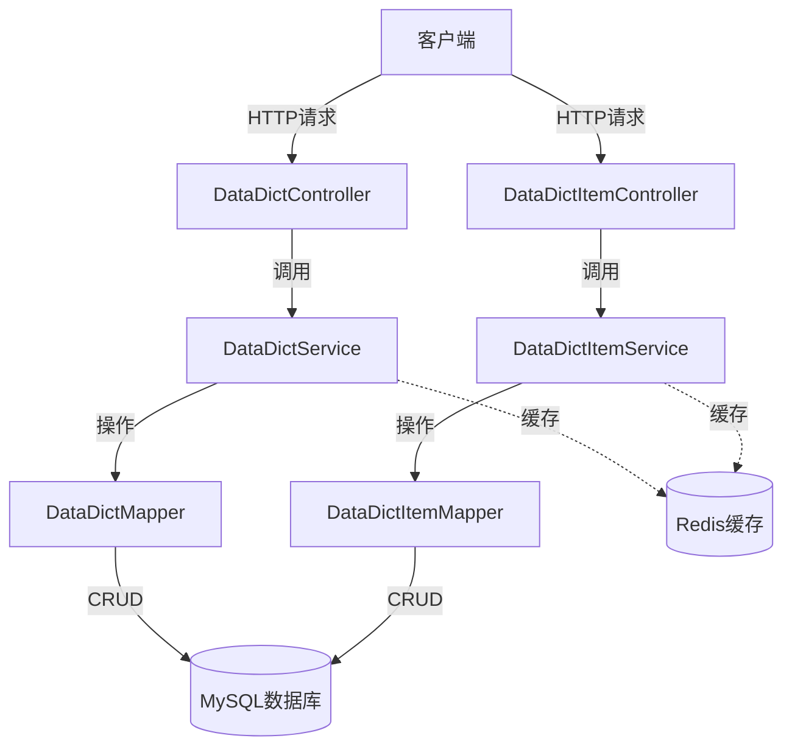
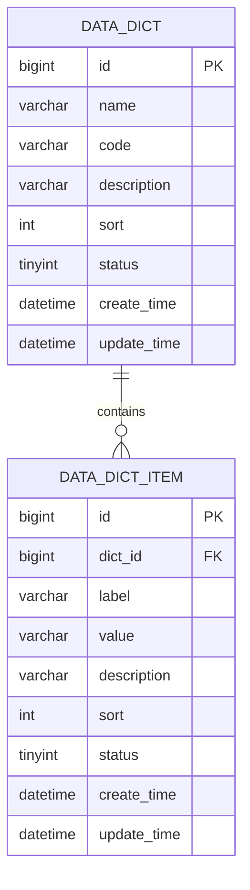
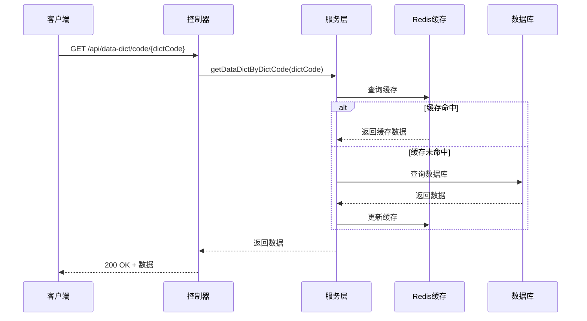

# 数据字典管理系统设计文档

## 1. 功能概述

数据字典管理系统是一个集中管理系统中各种静态数据配置的模块，通过统一的接口和管理方式，实现数据的标准化、规范化管理，提高系统的可维护性和扩展性。

### 1.1 核心功能
- **字典管理**：支持数据字典的增删改查、启用/禁用操作
- **字典项管理**：支持字典项的增删改查、启用/禁用操作
- **缓存优化**：实现字典数据的缓存机制，提高查询性能
- **事务管理**：确保数据操作的原子性和一致性
- **接口标准化**：提供RESTful API接口，方便系统集成

### 1.2 应用场景
- 系统配置项管理
- 业务状态码管理
- 枚举类型数据管理
- 系统参数配置

## 2. 系统架构

### 2.1 架构图



### 2.2 分层设计

1. **表示层（Controller）**：提供RESTful API接口，处理HTTP请求和响应
2. **服务层（Service）**：实现业务逻辑，包括缓存处理、事务管理和数据验证
3. **数据访问层（Mapper）**：负责数据库操作，继承MyBatis-Plus的BaseMapper
4. **实体层（Entity）**：定义数据模型，对应数据库表结构
5. **传输层（DTO/VO）**：封装数据传输对象，隔离内部模型和外部接口

## 3. 数据库设计

### 3.1 表结构关系



### 3.2 表结构详情

#### 3.2.1 数据字典表（data_dict）

| 字段名 | 数据类型 | 约束 | 描述 |
| :--- | :--- | :--- | :--- |
| id | bigint(20) | PRIMARY KEY, AUTO_INCREMENT | 主键ID |
| name | varchar(100) | NOT NULL | 字典名称 |
| code | varchar(100) | NOT NULL, UNIQUE | 字典编码 |
| description | varchar(255) | DEFAULT NULL | 字典描述 |
| sort | int(11) | DEFAULT 0 | 排序 |
| status | tinyint(4) | NOT NULL DEFAULT 1 | 状态：0-禁用，1-启用 |
| create_time | datetime | NOT NULL DEFAULT CURRENT_TIMESTAMP | 创建时间 |
| update_time | datetime | NOT NULL DEFAULT CURRENT_TIMESTAMP ON UPDATE CURRENT_TIMESTAMP | 更新时间 |

#### 3.2.2 数据字典项表（data_dict_item）

| 字段名 | 数据类型 | 约束 | 描述 |
| :--- | :--- | :--- | :--- |
| id | bigint(20) | PRIMARY KEY, AUTO_INCREMENT | 主键ID |
| dict_id | bigint(20) | NOT NULL, FOREIGN KEY | 所属字典ID |
| label | varchar(100) | NOT NULL | 显示文本 |
| value | varchar(100) | NOT NULL | 值 |
| description | varchar(255) | DEFAULT NULL | 描述 |
| sort | int(11) | DEFAULT 0 | 排序 |
| status | tinyint(4) | NOT NULL DEFAULT 1 | 状态：0-禁用，1-启用 |
| create_time | datetime | NOT NULL DEFAULT CURRENT_TIMESTAMP | 创建时间 |
| update_time | datetime | NOT NULL DEFAULT CURRENT_TIMESTAMP ON UPDATE CURRENT_TIMESTAMP | 更新时间 |

## 4. 核心功能设计

### 4.1 数据字典管理

#### 4.1.1 字典查询
- 根据ID查询字典详情
- 根据编码查询字典详情
- 查询所有字典列表
- 分页查询字典列表

#### 4.1.2 字典维护
- 新增字典（包含编码唯一性校验）
- 更新字典信息
- 删除字典（支持级联删除字典项）
- 启用/禁用字典
- 批量删除字典

### 4.2 数据字典项管理

#### 4.2.1 字典项查询
- 根据ID查询字典项详情
- 根据字典ID查询字典项列表
- 根据字典编码查询字典项列表
- 根据字典ID和状态查询有效字典项

#### 4.2.2 字典项维护
- 新增字典项（包含值唯一性校验）
- 更新字典项信息
- 删除字典项
- 启用/禁用字典项
- 批量删除字典项

### 4.3 缓存机制



## 5. API接口设计

### 5.1 数据字典接口

#### 5.1.1 根据ID查询字典

- **URL**: `/api/data-dict/{id}`
- **方法**: `GET`
- **功能**: 根据ID查询字典详情
- **响应**: `DataDictResponse`对象

#### 5.1.2 根据编码查询字典

- **URL**: `/api/data-dict/code/{dictCode}`
- **方法**: `GET`
- **功能**: 根据字典编码查询字典详情
- **响应**: `DataDictResponse`对象

#### 5.1.3 查询所有字典

- **URL**: `/api/data-dict/list`
- **方法**: `GET`
- **功能**: 查询所有启用状态的字典列表
- **响应**: `List<DataDictResponse>`对象

#### 5.1.4 分页查询字典

- **URL**: `/api/data-dict/page`
- **方法**: `GET`
- **参数**: `page`, `size`, `name`, `code`, `status`
- **功能**: 分页查询字典列表
- **响应**: `Page<DataDictResponse>`对象

#### 5.1.5 新增字典

- **URL**: `/api/data-dict`
- **方法**: `POST`
- **请求体**: `DataDictRequest`对象
- **功能**: 新增数据字典
- **响应**: `DataDictResponse`对象

#### 5.1.6 更新字典

- **URL**: `/api/data-dict`
- **方法**: `PUT`
- **请求体**: `DataDictRequest`对象
- **功能**: 更新数据字典
- **响应**: `DataDictResponse`对象

#### 5.1.7 删除字典

- **URL**: `/api/data-dict/{id}`
- **方法**: `DELETE`
- **功能**: 删除数据字典
- **响应**: `boolean`

#### 5.1.8 批量删除字典

- **URL**: `/api/data-dict/batch`
- **方法**: `DELETE`
- **请求体**: `List<Long>`对象
- **功能**: 批量删除数据字典
- **响应**: `boolean`

#### 5.1.9 启用/禁用字典

- **URL**: `/api/data-dict/{id}/status`
- **方法**: `PUT`
- **参数**: `status`
- **功能**: 启用或禁用字典
- **响应**: `boolean`

### 5.2 数据字典项接口

#### 5.2.1 根据ID查询字典项

- **URL**: `/api/data-dict-item/{id}`
- **方法**: `GET`
- **功能**: 根据ID查询字典项详情
- **响应**: `DataDictItemResponse`对象

#### 5.2.2 根据字典ID查询字典项列表

- **URL**: `/api/data-dict-item/dict/{dictId}`
- **方法**: `GET`
- **参数**: `status`（可选）
- **功能**: 根据字典ID查询字典项列表
- **响应**: `List<DataDictItemResponse>`对象

#### 5.2.3 根据字典编码查询字典项列表

- **URL**: `/api/data-dict-item/dict-code/{dictCode}`
- **方法**: `GET`
- **参数**: `status`（可选）
- **功能**: 根据字典编码查询字典项列表
- **响应**: `List<DataDictItemResponse>`对象

#### 5.2.4 新增字典项

- **URL**: `/api/data-dict-item`
- **方法**: `POST`
- **请求体**: `DataDictItemRequest`对象
- **功能**: 新增数据字典项
- **响应**: `DataDictItemResponse`对象

#### 5.2.5 更新字典项

- **URL**: `/api/data-dict-item`
- **方法**: `PUT`
- **请求体**: `DataDictItemRequest`对象
- **功能**: 更新数据字典项
- **响应**: `DataDictItemResponse`对象

#### 5.2.6 删除字典项

- **URL**: `/api/data-dict-item/{id}`
- **方法**: `DELETE`
- **功能**: 删除数据字典项
- **响应**: `boolean`

#### 5.2.7 批量删除字典项

- **URL**: `/api/data-dict-item/batch`
- **方法**: `DELETE`
- **请求体**: `List<Long>`对象
- **功能**: 批量删除数据字典项
- **响应**: `boolean`

#### 5.2.8 启用/禁用字典项

- **URL**: `/api/data-dict-item/{id}/status`
- **方法**: `PUT`
- **参数**: `status`
- **功能**: 启用或禁用字典项
- **响应**: `boolean`

## 6. 安全配置

### 6.1 白名单配置

数据字典相关接口已添加到系统白名单中，确保可以正常访问：

- `/api/data-dict/**`：数据字典管理接口
- `/api/data-dict-item/**`：数据字典项管理接口

## 7. 部署说明

### 7.1 数据库初始化

执行`data_dict_init.sql`脚本创建数据字典相关表结构并初始化基础数据：

```bash
mysql -u root -p bing < src/main/resources/sql/data_dict_init.sql
```

### 7.2 项目构建

```bash
mvn clean package -DskipTests
```

### 7.3 启动应用

```bash
java -jar target/bing-framework-0.0.1-SNAPSHOT.jar
```

## 8. 测试与验证

### 8.1 单元测试覆盖

已编写单元测试覆盖以下核心功能：

- 字典CRUD操作测试
- 字典项CRUD操作测试
- 状态管理测试
- 缓存功能测试
- 异常处理测试

### 8.2 接口测试示例

**查询所有字典项示例**：

```bash
curl -X GET http://localhost:8081/api/data-dict/list
```

**根据字典编码查询字典项示例**：

```bash
curl -X GET http://localhost:8081/api/data-dict-item/dict-code/USER_STATUS?status=1
```

## 9. 总结

数据字典管理系统提供了统一、规范的数据配置管理解决方案，通过标准化的接口设计和完善的业务逻辑处理，确保系统中静态数据的一致性和可维护性。系统集成了缓存机制，有效提高了数据查询性能，同时通过事务管理保证了数据操作的安全性。