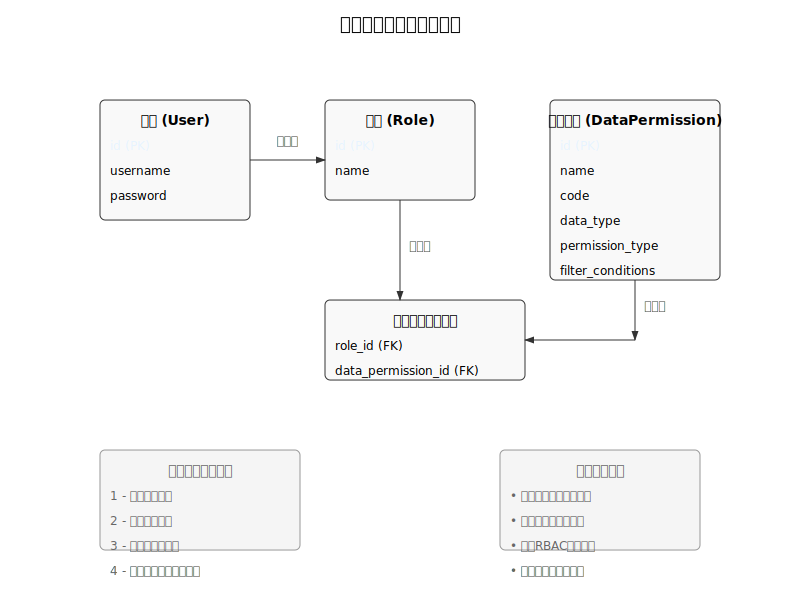
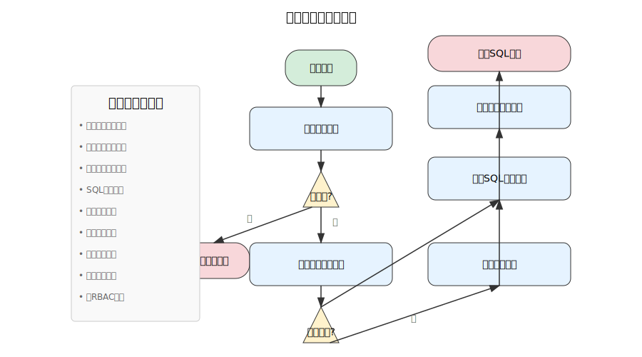
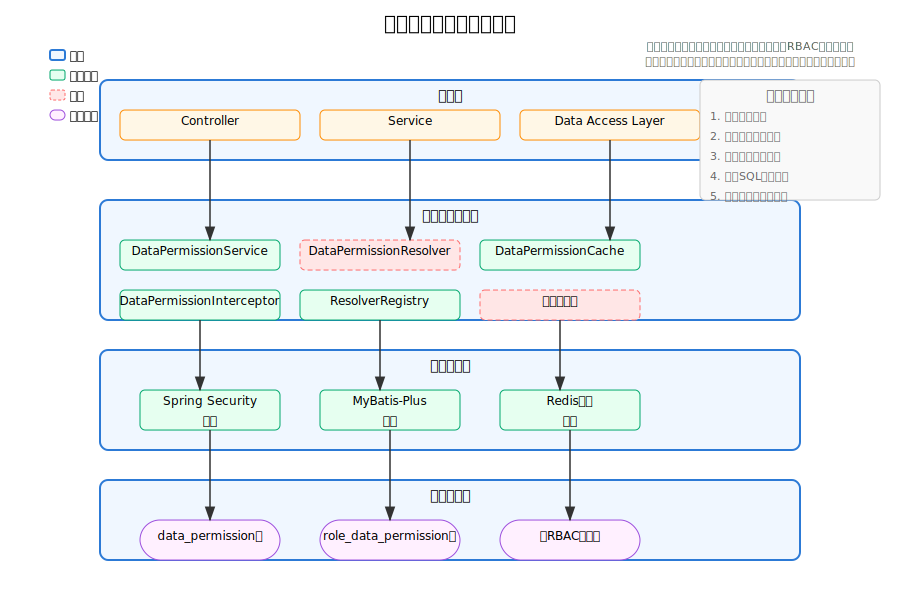

# 数据权限管理体系设计文档

## 1. 概述

数据权限管理是对系统中数据访问范围的控制，确保用户只能访问到其被授权的数据资源。本设计基于现有的RBAC功能权限体系和组织管理模块，构建一套灵活、可扩展、高性能的数据权限管理体系。

### 1.1 设计目标

- **精细化控制**：支持多维度、细粒度的数据访问控制
- **灵活性**：提供多种数据权限策略，满足不同业务场景需求
- **高性能**：在保证安全的前提下，最小化对系统性能的影响
- **可扩展**：易于扩展新的数据源和权限策略
- **用户友好**：提供直观的权限配置界面和使用体验

## 2. 数据权限模型设计

### 2.1 核心概念

#### 2.1.1 数据权限定义

数据权限是指对特定数据资源的访问范围限制，通过数据过滤条件实现。

#### 2.1.2 数据权限类型

| 权限类型 | 描述 | 应用场景 |
| :--- | :--- | :--- |
| 全部数据 | 无限制访问所有数据 | 系统管理员 |
| 本人数据 | 只能访问自己创建的数据 | 普通用户 |
| 本部门数据 | 只能访问本部门数据 | 部门主管 |
| 本部门及以下数据 | 可访问本部门及所有子部门数据 | 高级管理者 |
| 自定义数据 | 通过自定义条件限制数据访问范围 | 特定业务场景 |

### 2.1.3 示例数据

以下是数据权限相关的示例数据，展示如何在系统中配置不同类型的数据权限：

#### 2.1.3.1 数据权限表示例数据

```sql
INSERT INTO data_permission (name, code, data_type, permission_type, filter_conditions, description, status) VALUES
-- 全部数据权限示例
('用户管理-全部数据', 'user_all', 'user', 1, NULL, '可查看和管理所有用户数据', 1),
('订单管理-全部数据', 'order_all', 'order', 1, NULL, '可查看和管理所有订单数据', 1),

-- 本人数据权限示例
('用户管理-本人数据', 'user_self', 'user', 2, NULL, '只能查看自己创建的用户数据', 1),
('订单管理-本人数据', 'order_self', 'order', 2, NULL, '只能查看自己创建的订单数据', 1),

-- 本部门数据权限示例
('用户管理-本部门数据', 'user_dept', 'user', 3, NULL, '只能查看本部门的用户数据', 1),
('订单管理-本部门数据', 'order_dept', 'order', 3, NULL, '只能查看本部门的订单数据', 1),

-- 本部门及以下数据权限示例
('用户管理-部门及以下数据', 'user_dept_tree', 'user', 4, NULL, '可查看本部门及所有子部门的用户数据', 1),
('订单管理-部门及以下数据', 'order_dept_tree', 'order', 4, NULL, '可查看本部门及所有子部门的订单数据', 1),

-- 自定义数据权限示例
('用户管理-自定义状态权限', 'user_custom_status', 'user', 5, '{"status": [1, 2, 3], "level": "manager"}', '只能查看特定状态和级别的用户数据', 1),
('订单管理-自定义金额权限', 'order_custom_amount', 'order', 5, '{"amount": {"min": 1000, "max": 10000}}', '只能查看特定金额范围的订单数据', 1);
```

#### 2.1.3.2 角色数据权限关联表示例数据

```sql
-- 系统管理员角色分配全部数据权限
INSERT INTO role_data_permission (role_id, data_permission_id) VALUES
(1, 1),  -- 系统管理员-用户管理全部数据
(1, 2);  -- 系统管理员-订单管理全部数据

-- 部门经理角色分配本部门及以下数据权限
INSERT INTO role_data_permission (role_id, data_permission_id) VALUES
(2, 7),  -- 部门经理-用户管理部门及以下数据
(2, 8);  -- 部门经理-订单管理部门及以下数据

-- 普通员工角色分配本人数据权限
INSERT INTO role_data_permission (role_id, data_permission_id) VALUES
(3, 3),  -- 普通员工-用户管理本人数据
(3, 4);  -- 普通员工-订单管理本人数据

-- 财务主管角色分配自定义数据权限
INSERT INTO role_data_permission (role_id, data_permission_id) VALUES
(4, 10); -- 财务主管-订单管理自定义金额权限
```

### 2.2 数据模型设计

数据权限管理系统的核心数据模型关系如下：



#### 2.2.1 数据权限表（data_permission）

| 字段名 | 数据类型 | 约束 | 描述 |
| :--- | :--- | :--- | :--- |
| `id` | `bigint(20)` | `PRIMARY KEY` | 权限ID |
| `name` | `varchar(255)` | `NOT NULL` | 权限名称 |
| `code` | `varchar(100)` | `UNIQUE NOT NULL` | 权限标识 |
| `data_type` | `varchar(50)` | `NOT NULL` | 数据类型（如user, order等） |
| `permission_type` | `tinyint(1)` | `NOT NULL` | 权限类型（1-全部，2-本人，3-本部门，4-本部门及以下，5-自定义） |
| `filter_conditions` | `json` | | 自定义过滤条件JSON |
| `description` | `varchar(500)` | | 权限描述 |
| `status` | `tinyint(1)` | `DEFAULT 1` | 状态（0-禁用，1-启用） |
| `create_time` | `datetime` | `DEFAULT CURRENT_TIMESTAMP` | 创建时间 |
| `update_time` | `datetime` | `DEFAULT CURRENT_TIMESTAMP ON UPDATE CURRENT_TIMESTAMP` | 更新时间 |

**索引**：
- `idx_code` ON `code`
- `idx_data_type` ON `data_type`

#### 2.2.2 角色数据权限关联表（role_data_permission）

| 字段名 | 数据类型 | 约束 | 描述 |
| :--- | :--- | :--- | :--- |
| `id` | `bigint(20)` | `PRIMARY KEY` | 关联ID |
| `role_id` | `bigint(20)` | `NOT NULL` | 角色ID |
| `data_permission_id` | `bigint(20)` | `NOT NULL` | 数据权限ID |
| `create_time` | `datetime` | `DEFAULT CURRENT_TIMESTAMP` | 创建时间 |

**索引**：
- `idx_role_id` ON `role_id`
- `idx_data_permission_id` ON `data_permission_id`
- `idx_role_data` ON `(role_id, data_permission_id)` UNIQUE

**外键约束**：
- `fk_role_id` FOREIGN KEY (`role_id`) REFERENCES `role` (`id`) ON DELETE CASCADE
- `fk_data_permission_id` FOREIGN KEY (`data_permission_id`) REFERENCES `data_permission` (`id`) ON DELETE CASCADE

### 2.3 实体类设计

#### 2.3.1 DataPermission 实体类

```java
/**
 * 数据权限实体类
 * 用于定义系统中的数据访问权限规则
 * 
 * @author zhengbing
 * @date 2025-11-15
 */
@Data
@TableName("data_permission")
@ApiModel(value = "DataPermission对象", description = "数据权限实体类")
public class DataPermission implements Serializable {

    private static final long serialVersionUID = 1L;

    /**
     * 权限ID
     */
    @TableId(value = "id", type = IdType.AUTO)
    @ApiModelProperty(value = "权限ID")
    private Long id;

    /**
     * 权限名称
     */
    @ApiModelProperty(value = "权限名称", required = true)
    private String name;

    /**
     * 权限标识
     */
    @ApiModelProperty(value = "权限标识", required = true)
    private String code;

    /**
     * 数据类型
     */
    @ApiModelProperty(value = "数据类型", required = true)
    private String dataType;

    /**
     * 权限类型：1-全部数据，2-本人数据，3-本部门数据，4-本部门及以下数据，5-自定义数据
     */
    @ApiModelProperty(value = "权限类型", required = true)
    private Integer permissionType;

    /**
     * 自定义过滤条件JSON
     */
    @ApiModelProperty(value = "自定义过滤条件")
    private String filterConditions;

    /**
     * 权限描述
     */
    @ApiModelProperty(value = "权限描述")
    private String description;

    /**
     * 状态：0-禁用，1-启用
     */
    @ApiModelProperty(value = "状态")
    private Integer status;

    /**
     * 创建时间
     */
    @ApiModelProperty(value = "创建时间")
    private Date createTime;

    /**
     * 更新时间
     */
    @ApiModelProperty(value = "更新时间")
    private Date updateTime;
}
```

#### 2.3.2 RoleDataPermission 实体类

```java
/**
 * 角色数据权限关联实体类
 * 用于存储角色与数据权限之间的多对多关系
 * 
 * @author zhengbing
 * @date 2025-11-15
 */
@Data
@TableName("role_data_permission")
@ApiModel(value = "RoleDataPermission对象", description = "角色数据权限关联")
public class RoleDataPermission implements Serializable {

    private static final long serialVersionUID = 1L;

    /**
     * 主键ID
     */
    @TableId(value = "id", type = IdType.AUTO)
    @ApiModelProperty(value = "主键ID")
    private Long id;

    /**
     * 角色ID
     */
    @ApiModelProperty(value = "角色ID", required = true)
    private Long roleId;

    /**
     * 数据权限ID
     */
    @ApiModelProperty(value = "数据权限ID", required = true)
    private Long dataPermissionId;

    /**
     * 创建时间
     */
    @ApiModelProperty(value = "创建时间")
    private Date createTime;
}
```

## 3. 数据权限与功能权限集成设计

### 3.1 权限验证流程

数据权限验证的完整流程如下所示：



1. **功能权限验证**：首先验证用户是否有执行该操作的功能权限
2. **数据权限过滤**：在执行数据操作前，根据用户的数据权限生成过滤条件
3. **数据查询执行**：将过滤条件应用到SQL查询中，限制数据访问范围

### 3.2 权限优先级规则

当用户拥有多个角色时，数据权限的合并规则：

1. **向上兼容原则**：更高级别的数据权限会覆盖低级别权限（如"全部数据"权限覆盖其他权限）
2. **类型合并原则**：相同类型的数据权限，其过滤条件会进行逻辑或（OR）合并
3. **类型优先原则**：不同类型的数据权限按权限级别从高到低优先级排序

## 4. 数据权限实现方案

### 4.1 核心组件设计

#### 4.1.1 数据权限解析器（DataPermissionResolver）

```java
/**
 * 数据权限解析器接口
 * 负责解析不同类型的数据权限，生成对应的SQL过滤条件
 * 
 * @author zhengbing
 * @date 2025-11-15
 */
public interface DataPermissionResolver {
    
    /**
     * 解析数据权限，生成SQL过滤条件
     * 
     * @param permission 数据权限对象
     * @param userId 当前用户ID
     * @return SQL过滤条件
     */
    String resolve(DataPermission permission, Long userId);
    
    /**
     * 获取支持的权限类型
     * 
     * @return 权限类型
     */
    Integer getPermissionType();
}
```

#### 4.1.2 数据权限服务（DataPermissionService）

```java
/**
 * 数据权限服务接口
 * 提供数据权限的管理和验证功能
 * 
 * @author zhengbing
 * @date 2025-11-15
 */
public interface DataPermissionService extends IService<DataPermission> {
    
    /**
     * 获取用户在指定数据类型上的数据权限
     * 
     * @param userId 用户ID
     * @param dataType 数据类型
     * @return 数据权限列表
     */
    List<DataPermission> getUserDataPermissions(Long userId, String dataType);
    
    /**
     * 获取用户在指定数据类型上的合并过滤条件
     * 
     * @param userId 用户ID
     * @param dataType 数据类型
     * @return 合并后的SQL过滤条件
     */
    String getUserFilterCondition(Long userId, String dataType);
    
    /**
     * 为角色分配数据权限
     * 
     * @param roleId 角色ID
     * @param dataPermissionIds 数据权限ID列表
     * @return 是否分配成功
     */
    boolean assignDataPermissionsToRole(Long roleId, List<Long> dataPermissionIds);
    
    /**
     * 获取角色的数据权限列表
     * 
     * @param roleId 角色ID
     * @return 数据权限列表
     */
    List<DataPermission> getRoleDataPermissions(Long roleId);
    
    /**
     * 创建自定义数据权限
     * 
     * @param dataPermission 数据权限对象
     * @return 创建的数据权限ID
     */
    Long createCustomDataPermission(DataPermission dataPermission);
}
```

### 4.2 数据权限拦截器设计

```java
/**
 * 数据权限拦截器
 * 用于拦截SQL查询并应用数据权限过滤条件
 * 
 * @author zhengbing
 * @date 2025-11-15
 */
@Component
public class DataPermissionInterceptor implements InnerInterceptor {
    
    @Autowired
    private DataPermissionService dataPermissionService;
    
    @Override
    public void beforeQuery(Executor executor, MappedStatement ms, Object parameter, RowBounds rowBounds,
                          ResultHandler resultHandler, BoundSql boundSql) throws SQLException {
        // 获取当前用户ID
        Long userId = UserContext.getUserId();
        if (userId == null) {
            return;
        }
        
        // 获取MappedStatement对应的实体类，用于确定数据类型
        String mappedStatementId = ms.getId();
        String entityClassName = extractEntityClassName(mappedStatementId);
        String dataType = getDataTypeByEntityClass(entityClassName);
        
        if (dataType == null) {
            return;
        }
        
        // 获取用户的数据权限过滤条件
        String filterCondition = dataPermissionService.getUserFilterCondition(userId, dataType);
        if (filterCondition == null || filterCondition.isEmpty()) {
            return;
        }
        
        // 应用过滤条件到SQL中
        String originalSql = boundSql.getSql();
        String enhancedSql = applyFilterCondition(originalSql, filterCondition);
        
        // 修改BoundSql的SQL语句
        ReflectUtil.setFieldValue(boundSql, "sql", enhancedSql);
    }
    
    /**
     * 从MappedStatement ID中提取实体类名
     */
    private String extractEntityClassName(String mappedStatementId) {
        // 实现从MappedStatement ID提取实体类名的逻辑
        // ...
        return null;
    }
    
    /**
     * 根据实体类名获取数据类型
     */
    private String getDataTypeByEntityClass(String entityClassName) {
        // 实现从实体类名获取数据类型的逻辑
        // ...
        return null;
    }
    
    /**
     * 应用过滤条件到SQL中
     */
    private String applyFilterCondition(String originalSql, String filterCondition) {
        // 实现将过滤条件应用到SQL的逻辑
        // ...
        return enhancedSql;
    }
}
```

### 4.3 不同类型数据权限的解析器实现

#### 4.3.1 本人数据权限解析器

```java
/**
 * 本人数据权限解析器
 * 负责解析"只能访问自己创建的数据"类型的权限
 * 
 * @author zhengbing
 * @date 2025-11-15
 */
@Component
public class SelfDataPermissionResolver implements DataPermissionResolver {
    
    @Override
    public String resolve(DataPermission permission, Long userId) {
        String dataType = permission.getDataType();
        String createUserIdField = getCreateUserIdField(dataType);
        
        if (createUserIdField != null) {
            return createUserIdField + " = " + userId;
        }
        
        return null;
    }
    
    @Override
    public Integer getPermissionType() {
        return 2; // 本人数据
    }
    
    /**
     * 获取指定数据类型的创建者ID字段名
     */
    private String getCreateUserIdField(String dataType) {
        // 这里可以维护一个数据类型到创建者ID字段的映射
        // ...
        return "create_user_id"; // 默认字段名
    }
}
```

#### 4.3.2 本部门数据权限解析器

```java
/**
 * 本部门数据权限解析器
 * 负责解析"只能访问本部门数据"类型的权限
 * 
 * @author zhengbing
 * @date 2025-11-15
 */
@Component
public class DepartmentDataPermissionResolver implements DataPermissionResolver {
    
    @Autowired
    private UserOrganizationService userOrganizationService;
    
    @Override
    public String resolve(DataPermission permission, Long userId) {
        // 获取用户的主组织
        Organization mainOrg = userOrganizationService.getUserMainOrganization(userId);
        if (mainOrg == null) {
            return "1=0"; // 无组织关联，返回无数据权限
        }
        
        String dataType = permission.getDataType();
        String organizationIdField = getOrganizationIdField(dataType);
        
        if (organizationIdField != null) {
            return organizationIdField + " = " + mainOrg.getId();
        }
        
        return null;
    }
    
    @Override
    public Integer getPermissionType() {
        return 3; // 本部门数据
    }
    
    /**
     * 获取指定数据类型的组织ID字段名
     */
    private String getOrganizationIdField(String dataType) {
        // 这里可以维护一个数据类型到组织ID字段的映射
        // ...
        return "organization_id"; // 默认字段名
    }
}
```

#### 4.3.3 本部门及以下数据权限解析器

```java
/**
 * 本部门及以下数据权限解析器
 * 负责解析"可访问本部门及所有子部门数据"类型的权限
 * 
 * @author zhengbing
 * @date 2025-11-15
 */
@Component
public class DepartmentAndChildrenDataPermissionResolver implements DataPermissionResolver {
    
    @Autowired
    private UserOrganizationService userOrganizationService;
    
    @Autowired
    private OrganizationService organizationService;
    
    @Override
    public String resolve(DataPermission permission, Long userId) {
        // 获取用户的主组织
        Organization mainOrg = userOrganizationService.getUserMainOrganization(userId);
        if (mainOrg == null) {
            return "1=0"; // 无组织关联，返回无数据权限
        }
        
        // 获取主组织及其所有子组织
        List<Organization> organizations = organizationService.getOrganizationTreeByParentId(mainOrg.getId());
        Set<Long> orgIds = new HashSet<>();
        collectOrganizationIds(organizations, orgIds);
        orgIds.add(mainOrg.getId()); // 添加主组织自己
        
        String dataType = permission.getDataType();
        String organizationIdField = getOrganizationIdField(dataType);
        
        if (organizationIdField != null) {
            return organizationIdField + " IN (" + StringUtils.join(orgIds, ",") + ")";
        }
        
        return null;
    }
    
    @Override
    public Integer getPermissionType() {
        return 4; // 本部门及以下数据
    }
    
    /**
     * 递归收集组织ID
     */
    private void collectOrganizationIds(List<Organization> organizations, Set<Long> orgIds) {
        if (organizations == null || organizations.isEmpty()) {
            return;
        }
        
        for (Organization org : organizations) {
            orgIds.add(org.getId());
            collectOrganizationIds(org.getChildren(), orgIds);
        }
    }
    
    /**
     * 获取指定数据类型的组织ID字段名
     */
    private String getOrganizationIdField(String dataType) {
        // 这里可以维护一个数据类型到组织ID字段的映射
        // ...
        return "organization_id"; // 默认字段名
    }
}
```

### 4.4 数据权限注解设计

```java
/**
 * 数据权限注解
 * 用于标记需要进行数据权限控制的方法
 * 
 * @author zhengbing
 * @date 2025-11-15
 */
@Target({ElementType.METHOD, ElementType.TYPE})
@Retention(RetentionPolicy.RUNTIME)
@Documented
public @interface DataPermission {
    
    /**
     * 数据类型
     */
    String value();
    
    /**
     * 是否启用数据权限过滤
     */
    boolean enabled() default true;
    
    /**
     * 数据权限字段映射，格式：表别名.字段名:数据类型
     */
    String[] mappings() default {};
}
```

## 5. 数据权限管理功能实现

### 5.1 数据权限管理API接口

| API路径 | 方法 | 描述 | 参数 |
| :--- | :--- | :--- | :--- |
| `/api/data-permissions` | `GET` | 获取数据权限列表 | page: 页码<br>limit: 每页数量<br>dataType: 数据类型(可选) |
| `/api/data-permissions/{id}` | `GET` | 获取数据权限详情 | id: 权限ID |
| `/api/data-permissions` | `POST` | 创建数据权限 | DataPermission对象 |
| `/api/data-permissions/{id}` | `PUT` | 更新数据权限 | id: 权限ID<br>DataPermission对象 |
| `/api/data-permissions/{id}` | `DELETE` | 删除数据权限 | id: 权限ID |
| `/api/data-permissions/data-types` | `GET` | 获取系统支持的数据类型列表 | 无 |
| `/api/roles/{roleId}/data-permissions` | `GET` | 获取角色的数据权限列表 | roleId: 角色ID |
| `/api/roles/{roleId}/data-permissions` | `POST` | 为角色分配数据权限 | roleId: 角色ID<br>permissionIds: 权限ID列表 |

### 5.2 数据权限管理Controller示例

```java
/**
 * 数据权限管理控制器
 * 提供数据权限的CRUD操作和角色数据权限分配功能
 * 
 * @author zhengbing
 * @date 2025-11-15
 */
@RestController
@RequestMapping("/api/data-permissions")
@Api(tags = "数据权限管理")
public class DataPermissionController {
    
    @Autowired
    private DataPermissionService dataPermissionService;
    
    /**
     * 获取数据权限列表
     */
    @GetMapping
    @ApiOperation(value = "获取数据权限列表")
    public Result<Page<DataPermission>> listDataPermissions(
            @RequestParam(defaultValue = "1") int page,
            @RequestParam(defaultValue = "10") int limit,
            @RequestParam(required = false) String dataType) {
        Page<DataPermission> pageInfo = new Page<>(page, limit);
        QueryWrapper<DataPermission> queryWrapper = new QueryWrapper<>();
        if (StringUtils.isNotEmpty(dataType)) {
            queryWrapper.eq("data_type", dataType);
        }
        Page<DataPermission> result = dataPermissionService.page(pageInfo, queryWrapper);
        return Result.success(result);
    }
    
    /**
     * 获取数据权限详情
     */
    @GetMapping("/{id}")
    @ApiOperation(value = "获取数据权限详情")
    public Result<DataPermission> getDataPermission(@PathVariable Long id) {
        DataPermission dataPermission = dataPermissionService.getById(id);
        if (dataPermission == null) {
            return Result.error(ErrorCode.NOT_FOUND);
        }
        return Result.success(dataPermission);
    }
    
    /**
     * 创建数据权限
     */
    @PostMapping
    @ApiOperation(value = "创建数据权限")
    public Result<Long> createDataPermission(@RequestBody DataPermission dataPermission) {
        boolean saved = dataPermissionService.save(dataPermission);
        if (saved) {
            return Result.success(dataPermission.getId());
        }
        return Result.error(ErrorCode.BUSINESS_ERROR);
    }
    
    /**
     * 更新数据权限
     */
    @PutMapping("/{id}")
    @ApiOperation(value = "更新数据权限")
    public Result<Boolean> updateDataPermission(@PathVariable Long id, @RequestBody DataPermission dataPermission) {
        dataPermission.setId(id);
        boolean updated = dataPermissionService.updateById(dataPermission);
        return Result.success(updated);
    }
    
    /**
     * 删除数据权限
     */
    @DeleteMapping("/{id}")
    @ApiOperation(value = "删除数据权限")
    public Result<Boolean> deleteDataPermission(@PathVariable Long id) {
        boolean deleted = dataPermissionService.removeById(id);
        return Result.success(deleted);
    }
    
    /**
     * 获取系统支持的数据类型列表
     */
    @GetMapping("/data-types")
    @ApiOperation(value = "获取系统支持的数据类型列表")
    public Result<List<String>> getDataTypes() {
        // 这里返回系统支持的数据类型列表
        List<String> dataTypes = Arrays.asList("user", "order", "product", "customer");
        return Result.success(dataTypes);
    }
}
```

```java
/**
 * 角色数据权限管理控制器
 * 提供角色数据权限分配功能
 * 
 * @author zhengbing
 * @date 2025-11-15
 */
@RestController
@RequestMapping("/api/roles")
@Api(tags = "角色数据权限管理")
public class RoleDataPermissionController {
    
    @Autowired
    private DataPermissionService dataPermissionService;
    
    /**
     * 获取角色的数据权限列表
     */
    @GetMapping("/{roleId}/data-permissions")
    @ApiOperation(value = "获取角色的数据权限列表")
    public Result<List<DataPermission>> getRoleDataPermissions(@PathVariable Long roleId) {
        List<DataPermission> permissions = dataPermissionService.getRoleDataPermissions(roleId);
        return Result.success(permissions);
    }
    
    /**
     * 为角色分配数据权限
     */
    @PostMapping("/{roleId}/data-permissions")
    @ApiOperation(value = "为角色分配数据权限")
    public Result<Boolean> assignDataPermissionsToRole(
            @PathVariable Long roleId,
            @RequestBody List<Long> permissionIds) {
        boolean assigned = dataPermissionService.assignDataPermissionsToRole(roleId, permissionIds);
        return Result.success(assigned);
    }
}
```

### 5.3 数据权限注解使用示例

```java
/**
 * 用户管理控制器
 * 使用数据权限注解进行数据访问控制
 * 
 * @author zhengbing
 * @date 2025-11-15
 */
@RestController
@RequestMapping("/api/users")
@Api(tags = "用户管理")
public class UserController {
    
    @Autowired
    private UserService userService;
    
    /**
     * 获取用户列表，应用数据权限过滤
     */
    @GetMapping
    @ApiOperation(value = "获取用户列表")
    @DataPermission("user") // 应用user类型的数据权限过滤
    public Result<Page<User>> listUsers(
            @RequestParam(defaultValue = "1") int page,
            @RequestParam(defaultValue = "10") int limit) {
        Page<User> pageInfo = new Page<>(page, limit);
        Page<User> result = userService.page(pageInfo);
        return Result.success(result);
    }
    
    /**
     * 获取用户详情，自动应用数据权限过滤
     */
    @GetMapping("/{id}")
    @ApiOperation(value = "获取用户详情")
    public Result<User> getUser(@PathVariable Long id) {
        // 此处可以通过AOP或其他方式自动应用数据权限验证
        User user = userService.getById(id);
        if (user == null) {
            return Result.error(ErrorCode.NOT_FOUND);
        }
        return Result.success(user);
    }
}
```

## 6. 性能优化设计

### 6.1 数据权限缓存

为提高数据权限验证性能，设计三级缓存策略：

1. **本地缓存**：在应用内存中缓存用户的数据权限信息
2. **Redis缓存**：分布式缓存，适合多实例部署场景
3. **权限预热**：系统启动时预热常用权限数据

```java
/**
 * 数据权限缓存管理器
 * 负责缓存用户数据权限信息，提高性能
 * 
 * @author zhengbing
 * @date 2025-11-15
 */
@Service
public class DataPermissionCacheManager {
    
    @Autowired
    private RedisTemplate<String, Object> redisTemplate;
    
    private final LoadingCache<String, String> localCache = CacheBuilder.newBuilder()
            .maximumSize(1000)
            .expireAfterWrite(5, TimeUnit.MINUTES)
            .build(new CacheLoader<String, String>() {
                @Override
                public String load(String key) throws Exception {
                    return loadFromRedis(key);
                }
            });
    
    /**
     * 获取用户的数据权限缓存键
     */
    private String getUserPermissionKey(Long userId, String dataType) {
        return "data_permission:" + userId + ":" + dataType;
    }
    
    /**
     * 从Redis加载缓存
     */
    private String loadFromRedis(String key) {
        Object value = redisTemplate.opsForValue().get(key);
        return value != null ? value.toString() : null;
    }
    
    /**
     * 获取缓存的用户数据权限过滤条件
     */
    public String getFilterCondition(Long userId, String dataType) {
        String key = getUserPermissionKey(userId, dataType);
        try {
            return localCache.get(key);
        } catch (ExecutionException e) {
            log.error("获取数据权限缓存失败: {}", e.getMessage());
            return null;
        }
    }
    
    /**
     * 设置用户数据权限过滤条件缓存
     */
    public void setFilterCondition(Long userId, String dataType, String filterCondition) {
        String key = getUserPermissionKey(userId, dataType);
        redisTemplate.opsForValue().set(key, filterCondition, 30, TimeUnit.MINUTES);
        localCache.invalidate(key); // 清除本地缓存，下次会重新加载
    }
    
    /**
     * 清除用户的数据权限缓存
     */
    public void clearUserCache(Long userId) {
        String pattern = "data_permission:" + userId + ":*";
        Set<String> keys = redisTemplate.keys(pattern);
        if (keys != null && !keys.isEmpty()) {
            redisTemplate.delete(keys);
            // 清除本地缓存
            for (String key : keys) {
                localCache.invalidate(key);
            }
        }
    }
}
```

### 6.2 SQL优化策略

1. **索引优化**：为常用的数据权限过滤字段创建索引
2. **预编译SQL**：使用预编译SQL减少SQL解析开销
3. **条件合并**：合并多个数据权限过滤条件，减少SQL复杂度
4. **查询优化**：避免在大数据量场景下使用复杂的权限过滤逻辑

## 7. 扩展性设计

### 7.1 自定义数据权限策略

系统支持通过实现自定义数据权限解析器扩展新的数据权限类型：

```java
/**
 * 自定义数据权限解析器注册中心
 * 管理和注册所有数据权限解析器
 * 
 * @author zhengbing
 * @date 2025-11-15
 */
@Component
public class DataPermissionResolverRegistry {
    
    private Map<Integer, DataPermissionResolver> resolvers = new HashMap<>();
    
    @Autowired
    public DataPermissionResolverRegistry(List<DataPermissionResolver> resolverList) {
        for (DataPermissionResolver resolver : resolverList) {
            resolvers.put(resolver.getPermissionType(), resolver);
        }
    }
    
    /**
     * 获取指定类型的数据权限解析器
     */
    public DataPermissionResolver getResolver(Integer permissionType) {
        return resolvers.get(permissionType);
    }
    
    /**
     * 注册新的数据权限解析器
     */
    public void registerResolver(DataPermissionResolver resolver) {
        resolvers.put(resolver.getPermissionType(), resolver);
    }
    
    /**
     * 获取所有数据权限解析器
     */
    public Map<Integer, DataPermissionResolver> getAllResolvers() {
        return Collections.unmodifiableMap(resolvers);
    }
}
```

### 7.2 数据权限扩展点

系统提供多个扩展点，允许开发者自定义数据权限行为：

1. **数据权限过滤钩子**：允许在应用过滤条件前进行自定义处理
2. **权限合并策略扩展**：允许自定义多个数据权限的合并规则
3. **数据类型注册机制**：允许动态注册新的数据类型

## 8. 系统集成方案

数据权限管理系统的整体架构设计如下：



### 8.1 与Spring Security集成

### 8.1 与Spring Security集成

```java
/**
 * 数据权限表达式处理器
 * 扩展Spring Security表达式，支持数据权限验证
 * 
 * @author zhengbing
 * @date 2025-11-15
 */
@Component("dataPermissionExpressionHandler")
public class DataPermissionExpressionHandler {
    
    @Autowired
    private DataPermissionService dataPermissionService;
    
    /**
     * 验证用户是否有权限访问指定ID的数据
     */
    public boolean hasDataPermission(String dataType, Long dataId) {
        Long userId = UserContext.getUserId();
        if (userId == null) {
            return false;
        }
        
        // 这里简化实现，实际应该根据具体数据类型和ID查询并验证权限
        // ...
        
        return true;
    }
    
    /**
     * 获取用户的数据权限过滤条件
     */
    public String getDataFilterCondition(String dataType) {
        Long userId = UserContext.getUserId();
        if (userId == null) {
            return "1=0"; // 未登录用户无数据权限
        }
        
        return dataPermissionService.getUserFilterCondition(userId, dataType);
    }
}
```

### 8.2 与MyBatis-Plus集成

通过配置MyBatis-Plus插件，自动应用数据权限过滤：

```java
/**
 * MyBatis配置类
 * 注册数据权限插件
 * 
 * @author zhengbing
 * @date 2025-11-15
 */
@Configuration
@MapperScan("com.bing.framework.mapper")
public class MyBatisConfig {
    
    @Autowired
    private DataPermissionInterceptor dataPermissionInterceptor;
    
    /**
     * 配置MyBatis-Plus插件
     */
    @Bean
    public MybatisPlusInterceptor mybatisPlusInterceptor() {
        MybatisPlusInterceptor interceptor = new MybatisPlusInterceptor();
        
        // 添加数据权限拦截器
        interceptor.addInnerInterceptor(dataPermissionInterceptor);
        
        // 其他插件配置...
        
        return interceptor;
    }
}
```

## 9. 优缺点分析

### 9.1 优点

1. **灵活性**：支持多种数据权限类型，适应不同业务场景
2. **细粒度控制**：可以精确控制用户对数据的访问范围
3. **高性能**：采用多级缓存和SQL优化策略，保证系统性能
4. **可扩展**：提供多种扩展点，方便自定义和扩展
5. **与现有体系无缝集成**：与RBAC权限体系和组织架构有机结合

### 9.2 缺点

1. **复杂度增加**：数据权限的引入增加了系统的复杂度
2. **配置工作量**：需要为每个角色和数据类型配置数据权限
3. **性能影响**：在复杂数据权限场景下可能对查询性能产生影响
4. **维护成本**：需要定期审查和维护数据权限配置

## 10. 实施建议

### 10.1 分步实施策略

1. **第一阶段**：实现基础数据权限功能（全部数据、本人数据、本部门数据）
2. **第二阶段**：添加复杂数据权限类型（本部门及以下、自定义数据权限）
3. **第三阶段**：优化性能和用户体验，添加高级功能（权限模板、批量配置等）

### 10.1 分步实施策略

1. **第一阶段**：实现基础数据权限功能（全部数据、本人数据、本部门数据）
2. **第二阶段**：添加复杂数据权限类型（本部门及以下、自定义数据权限）
3. **第三阶段**：优化性能和用户体验，添加高级功能（权限模板、批量配置等）

### 10.2 性能监控与优化

1. **监控SQL执行性能**：使用慢查询日志监控数据权限过滤对查询性能的影响
2. **缓存命中率监控**：监控数据权限缓存的命中率，优化缓存策略
3. **定期优化**：根据实际使用情况，定期优化数据权限规则和实现

### 10.3 安全建议

1. **权限审查**：定期审查用户的数据权限配置，确保符合最小权限原则
2. **敏感数据保护**：对敏感数据实施更严格的数据权限控制
3. **权限变更审计**：记录所有数据权限变更操作，便于追踪和审计

## 11. 数据权限操作流程示例

### 11.1 数据权限配置流程

以下是系统管理员为角色配置数据权限的典型操作流程：

1. **进入数据权限管理页面**
   - 登录系统，导航至「系统管理」→「权限管理」→「数据权限」

2. **创建新的数据权限**
   - 点击「创建数据权限」按钮
   - 填写权限名称、权限标识、数据类型
   - 选择权限类型（全部数据、本人数据、本部门数据、本部门及以下数据、自定义数据）
   - 如果选择「自定义数据」，则通过JSON编辑器配置过滤条件
   - 填写权限描述，设置状态为「启用」
   - 点击「保存」按钮

3. **为角色分配数据权限**
   - 导航至「角色管理」页面，选择目标角色
   - 点击「分配数据权限」按钮
   - 在弹出的权限选择对话框中，为每个数据类型选择相应的数据权限
   - 点击「确认分配」按钮

4. **验证数据权限效果**
   - 以拥有该角色的用户身份登录系统
   - 访问相关业务模块，验证只能看到被授权的数据范围

### 11.2 常见数据权限使用场景示例

#### 11.2.1 场景一：用户管理

**管理员视角**：
- 拥有「用户管理-全部数据」权限
- 可以查看和管理系统中所有用户的数据
- SQL过滤条件：无

**部门经理视角**：
- 拥有「用户管理-部门及以下数据」权限
- 可以查看和管理本部门及所有子部门的用户数据
- SQL过滤条件：`organization_id IN (1, 2, 3, 4, 5)`（假设部门ID层级为1->2,3->4,5）

**普通员工视角**：
- 拥有「用户管理-本人数据」权限
- 只能查看自己创建或与自己相关的用户数据
- SQL过滤条件：`create_user_id = 1001`（假设用户ID为1001）

#### 11.2.2 场景二：订单管理

**财务主管视角**：
- 拥有「订单管理-自定义金额权限」权限
- 只能查看特定金额范围的订单数据
- SQL过滤条件：`amount BETWEEN 1000 AND 10000`

**销售经理视角**：
- 拥有「订单管理-本部门数据」权限
- 只能查看本部门的订单数据
- SQL过滤条件：`department_id = 2`（假设部门ID为2）

## 12. 页面设计

### 12.1 数据权限管理页面

#### 12.1.1 数据权限列表页

**设计要点**：
- 表格形式展示所有数据权限
- 支持按权限名称、数据类型、权限类型进行搜索和筛选
- 支持批量启用/禁用、批量删除操作
- 每个权限项显示权限名称、权限标识、数据类型、权限类型、状态等信息
- 提供创建、编辑、删除操作按钮

**界面原型**：

下图展示了数据权限列表页面的布局和功能元素：


*图1：数据权限列表页面示例*

#### 12.1.2 数据权限创建/编辑页面

**设计要点**：
- 表单形式填写数据权限信息
- 根据选择的权限类型，动态显示相应的配置项
- 自定义数据权限类型提供JSON编辑器
- 表单验证确保必填项完整
- 提供保存和取消操作按钮

**界面原型**：

下图展示了数据权限创建/编辑页面的表单设计和交互元素：


*图2：数据权限创建/编辑页面示例*

### 12.2 角色数据权限分配页面

**设计要点**：
- 按数据类型分组显示可分配的数据权限
- 每个数据类型提供单选或多选权限的方式
- 清晰展示当前已分配的权限
- 提供全选、清除选择等快捷操作
- 提供确认分配和取消操作按钮

**界面原型**：

下图展示了角色数据权限分配页面的布局和交互方式：


*图3：角色数据权限分配页面示例*

### 12.3 数据权限效果示例页面

#### 12.3.1 用户数据列表页面（不同权限视角）

下图展示了不同权限视角下用户数据列表页面的显示效果对比：


*图4：不同权限视角下的用户数据列表对比*

**关键差异说明**：

1. **系统管理员视角**：
   - 可查看所有250条用户记录
   - 包含所有部门的用户数据
   - 分页显示为25页

2. **技术部经理视角**：
   - 仅可查看45条技术部及其子部门的用户记录
   - 数据范围限制在技术部组织架构内
   - 分页显示为5页

3. **普通员工视角**：
   - 仅可查看3条与自己相关的用户记录
   - 数据范围严格限制在个人创建或相关的数据
   - 无需分页显示

这种可视化对比清晰地展示了数据权限控制如何有效地限制不同角色用户的数据访问范围，确保了数据安全性和隐私保护。

1. **权限审查**：定期审查用户的数据权限配置，确保符合最小权限原则
2. **敏感数据保护**：对敏感数据实施更严格的数据权限控制
3. **权限变更审计**：记录所有数据权限变更操作，便于追踪和审计

## 13. 未来扩展方向

1. **数据权限模板**：创建常用数据权限模板，简化权限配置
2. **动态数据权限**：支持基于业务规则动态计算数据权限
3. **跨系统数据权限**：实现多系统间的数据权限协同管理
4. **数据权限分析**：提供数据权限使用分析和优化建议
5. **可视化配置工具**：提供图形化的数据权限配置界面

## 12. 总结

本设计方案提供了一套完整的数据权限管理体系，与现有的RBAC功能权限和组织管理模块紧密集成，支持多种数据权限策略，可以满足企业级应用对数据访问控制的需求。方案具有良好的扩展性和灵活性，同时通过多级缓存和SQL优化策略保证了系统性能。实施时建议采用分步策略，逐步完善功能，并持续监控和优化性能。