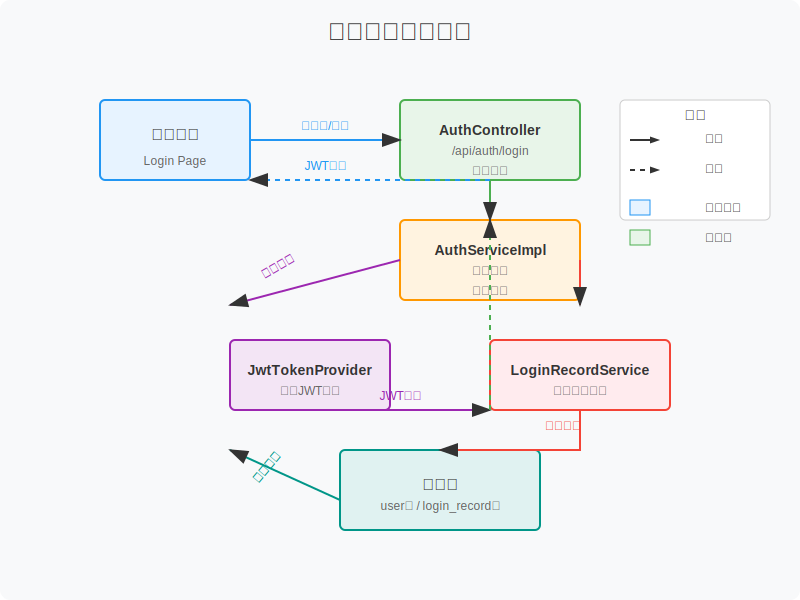

# 登录系统详细文档

本文档详细说明系统的登录处理流程、数据流转过程以及相关组件的工作机制。

## 目录
- [1. 系统概述](#1-系统概述)
- [2. 登录架构设计](#2-登录架构设计)
- [3. 登录流程详解](#3-登录流程详解)
  - [3.1 前端请求流程](#31-前端请求流程)
  - [3.2 后端处理流程](#32-后端处理流程)
  - [3.3 认证与授权流程](#33-认证与授权流程)
  - [3.4 登录记录保存](#34-登录记录保存)
- [4. 数据流转过程](#4-数据流转过程)
  - [4.1 数据模型](#41-数据模型)
  - [4.2 数据传输对象](#42-数据传输对象)
  - [4.3 数据流图](#43-数据流图)
- [5. 安全机制](#5-安全机制)
  - [5.1 密码加密](#51-密码加密)
  - [5.2 JWT令牌](#52-jwt令牌)
  - [5.3 防暴力破解](#53-防暴力破解)
  - [5.4 会话管理](#54-会话管理)
- [6. 接口说明](#6-接口说明)
- [7. 异常处理](#7-异常处理)
- [8. 最佳实践](#8-最佳实践)
- [9. 多客户端登录支持](#9-多客户端登录支持)
  - [9.1 多客户端架构设计](#91-多客户端架构设计)
  - [9.2 多认证方式支持](#92-多认证方式支持)
  - [9.3 设备管理与安全](#93-设备管理与安全)
  - [9.4 令牌优化设计](#94-令牌优化设计)
  - [9.5 跨平台单点登录](#95-跨平台单点登录)
  - [9.6 客户端适配建议](#96-客户端适配建议)
  - [9.7 多端数据同步](#97-多端数据同步)
  - [9.8 监控与分析](#98-监控与分析)

## 1. 系统概述

登录系统是整个框架的安全基础，负责用户身份认证和会话管理。系统采用基于JWT的无状态认证机制，结合Spring Security提供完整的身份验证和授权功能。登录过程中同时生成审计日志和登录记录，提供完整的安全审计能力。

### 核心功能

- 用户身份验证（用户名密码）
- JWT令牌生成与验证
- 权限控制与授权
- 登录记录保存与查询
- 安全审计日志
- 防暴力破解机制

## 2. 登录架构设计

登录系统采用分层架构设计，包括：

- **表现层**：处理HTTP请求，接收登录参数，返回认证结果
- **服务层**：实现核心业务逻辑，包括用户验证、令牌生成等
- **数据访问层**：负责与数据库交互，查询用户信息和保存登录记录
- **安全层**：提供认证和授权相关功能

### 核心组件

| 组件名称 | 职责 | 文件位置 |
|---------|------|----------|
| `AuthController` | 处理登录请求，提供登录API | `com.bing.framework.controller.AuthController` |
| `AuthServiceImpl` | 实现认证业务逻辑 | `com.bing.framework.service.impl.AuthServiceImpl` |
| `UserDetailsServiceImpl` | 加载用户信息，实现Spring Security接口 | `com.bing.framework.service.impl.UserDetailsServiceImpl` |
| `JwtTokenProvider` | JWT令牌生成与验证 | `com.bing.framework.security.JwtTokenProvider` |
| `LoginRecordServiceImpl` | 登录记录服务 | `com.bing.framework.service.impl.LoginRecordServiceImpl` |
| `AuditLogAspect` | 审计日志AOP切面 | `com.bing.framework.aspect.AuditLogAspect` |

## 3. 登录流程详解

### 3.1 前端请求流程

1. 用户在登录页面输入用户名和密码
2. 前端应用收集表单数据，进行基本验证（非空检查等）
3. 调用登录API，发送POST请求到`/api/auth/login`
4. 请求包含用户凭证：用户名和密码
5. 接收响应，根据响应结果进行后续处理：
   - 成功：存储JWT令牌，跳转到首页
   - 失败：显示错误信息，允许用户重试

### 3.2 后端处理流程

1. **请求接收与参数验证**
   - `AuthController`接收登录请求
   - 验证请求参数格式和有效性
   - 使用`@Valid`注解进行参数校验

2. **身份认证**
   - 调用`AuthService`进行身份验证
   - `AuthenticationManager`尝试认证用户
   - `UserDetailsServiceImpl`加载用户信息

3. **令牌生成**
   - 认证成功后，`JwtTokenProvider`生成JWT令牌
   - 令牌包含用户ID、用户名、角色信息等
   - 设置令牌过期时间（默认24小时）

4. **登录记录保存**
   - 调用`LoginRecordService`保存登录信息
   - 记录IP地址、UserAgent、登录时间、状态等

5. **审计日志生成**
   - `AuditLogAspect`拦截登录操作
   - 自动生成审计日志记录

6. **响应返回**
   - 构建包含令牌和用户信息的响应
   - 返回成功状态码和数据

### 3.3 认证与授权流程

```
用户请求 → Spring Security Filter Chain → UsernamePasswordAuthenticationFilter → 
AuthenticationManager → UserDetailsService → 数据库 → JWT Token生成 → 响应返回
```

### 3.4 登录记录保存

登录操作会触发以下记录保存：

1. **登录记录表**：存储在`login_record`表中，包含详细的登录信息
2. **审计日志表**：存储在`audit_log`表中，记录操作过程

## 4. 数据流转过程

### 4.1 数据模型

#### 核心实体类

1. **用户实体（User）**
   - 存储用户基本信息和认证信息
   - 包含用户名、密码（加密）、角色等字段

2. **登录记录实体（LoginRecord）**
   - 记录用户登录行为
   - 包含用户ID、用户名、IP地址、登录时间、状态等

### 4.2 数据传输对象

1. **登录请求DTO（LoginRequestDTO）**
   ```java
   public class LoginRequestDTO {
       @NotBlank(message = "用户名不能为空")
       private String username;
       
       @NotBlank(message = "密码不能为空")
       private String password;
       
       // getter and setter
   }
   ```

2. **登录响应DTO（LoginResponseDTO）**
   ```java
   public class LoginResponseDTO {
       private String token;
       private UserDTO user;
       private Date expireTime;
       
       // getter and setter
   }
   ```

### 4.3 数据流图

登录系统的数据流转过程如下图所示：



## 5. 安全机制

### 5.1 密码加密

系统使用BCrypt算法对用户密码进行加密存储：

- 每次加密生成不同的盐值
- 工作因子可配置（默认12轮）
- 不可逆加密，提高安全性

### 5.2 JWT令牌

- **组成结构**：Header.Payload.Signature
- **存储内容**：用户ID、用户名、角色、过期时间等
- **签名算法**：HS512
- **令牌刷新**：支持令牌刷新机制，避免频繁登录

### 5.3 防暴力破解

- 登录失败次数限制（默认5次）
- IP地址黑名单机制
- 登录失败后延迟响应

### 5.4 会话管理

- 无状态会话设计
- 基于令牌的身份验证
- 支持令牌吊销机制

## 6. 接口说明

### 6.1 登录接口

- **URL**: `/api/auth/login`
- **方法**: `POST`
- **请求体**:
  ```json
  {
    "username": "admin",
    "password": "password123"
  }
  ```
- **响应体**:
  ```json
  {
    "code": 200,
    "message": "success",
    "data": {
      "token": "eyJhbGciOiJIUzUxMiJ9...",
      "user": {
        "id": 1,
        "username": "admin",
        "nickname": "管理员",
        "roles": ["ADMIN"]
      },
      "expireTime": "2024-01-01T00:00:00Z"
    }
  }
  ```

### 6.2 登出接口

- **URL**: `/api/auth/logout`
- **方法**: `POST`
- **请求头**: `Authorization: Bearer {token}`

## 7. 异常处理

登录过程中可能遇到的异常：

| 异常类型 | 错误码 | 错误信息 | 处理方式 |
|---------|-------|---------|----------|
| 用户名或密码错误 | 401 | 用户名或密码错误 | 返回错误信息，记录失败尝试 |
| 账户被锁定 | 403 | 账户已被锁定，请联系管理员 | 返回锁定状态和锁定时间 |
| 验证码错误 | 400 | 验证码错误或已过期 | 提示用户重新输入验证码 |
| 令牌过期 | 401 | 登录已过期，请重新登录 | 前端跳转到登录页面 |
| 系统异常 | 500 | 系统内部错误 | 记录错误日志，返回友好提示 |

## 8. 最佳实践

1. **前端安全**
   - 不在本地存储敏感信息
   - 使用HTTPS传输数据
   - 实现自动登出机制
   - 定期刷新令牌

2. **后端安全**
   - 使用参数化查询防止SQL注入
   - 实施CSRF防护
   - 定期清理过期的登录记录
   - 监控异常登录行为

3. **运维建议**
   - 定期更新JWT密钥
   - 配置适当的令牌过期时间
   - 监控登录相关日志
   - 实施IP访问限制

通过以上设计，系统提供了安全可靠的登录认证机制，保护用户数据和系统安全。

## 9. 多客户端登录支持

为支持PC端、移动端（微信、小程序、APP、鸿蒙系统、元空间等）多场景的登录需求，系统需要进行以下优化和增强：

### 9.1 多客户端架构设计

#### 9.1.1 统一认证中心

构建统一的认证中心，采用OAuth 2.0 + OIDC协议：

- **认证服务**：负责用户身份验证和令牌颁发
- **授权服务**：管理客户端授权和权限控制
- **用户管理**：统一的用户信息管理
- **令牌服务**：集中的令牌生成、验证和刷新

#### 9.1.2 分层架构升级

```
客户端 → API网关 → 认证服务 → 用户服务 → 数据存储
```

- **API网关**：统一入口，路由分发，跨域处理
- **认证服务**：独立部署的认证微服务
- **用户服务**：管理用户信息和权限
- **数据存储**：分布式缓存和关系型数据库

#### 9.1.3 多客户端数据流图

多客户端登录系统的数据流如下所示：


### 9.2 多认证方式支持

#### 9.2.1 扩展登录请求DTO

```java
public class MultiClientLoginRequestDTO {
    @NotBlank(message = "用户名不能为空")
    private String username;
    
    private String password; // 密码登录时必填
    private String code;     // 验证码登录时必填
    private String openId;   // 第三方登录时必填
    
    @NotBlank(message = "客户端类型不能为空")
    private String clientType; // WEB, APP, WECHAT, MINIPROGRAM, HARMONY, META
    
    private String deviceId;   // 设备标识
    private String deviceInfo; // 设备信息
    private String version;    // 客户端版本
    
    // getter and setter
}
```

#### 9.2.2 认证方式实现

| 认证方式 | 适用场景 | 实现方式 |
|---------|---------|----------|
| **密码认证** | PC端管理后台 | 用户名+密码+验证码 |
| **手机验证码** | 移动端APP | 手机号+短信验证码 |
| **微信登录** | 微信小程序/公众号 | OAuth2 + 微信开放平台 |
| **生物识别** | 移动端APP | 指纹/面容识别 + 令牌 |
| **扫码登录** | PC端/元空间 | 二维码+手机确认 |
| **设备绑定** | 受信任设备 | 设备指纹+长效令牌 |

### 9.3 设备管理与安全

#### 9.3.1 设备注册表结构

```sql
CREATE TABLE IF NOT EXISTS user_device (
    id BIGINT AUTO_INCREMENT PRIMARY KEY COMMENT '主键ID',
    user_id BIGINT NOT NULL COMMENT '用户ID',
    device_id VARCHAR(100) NOT NULL COMMENT '设备唯一标识',
    client_type VARCHAR(50) NOT NULL COMMENT '客户端类型',
    device_name VARCHAR(200) COMMENT '设备名称',
    device_info TEXT COMMENT '设备详细信息',
    last_login_time DATETIME COMMENT '最后登录时间',
    status INT DEFAULT 1 COMMENT '状态：0-禁用，1-启用',
    created_at DATETIME DEFAULT CURRENT_TIMESTAMP COMMENT '创建时间',
    INDEX idx_user_id (user_id),
    INDEX idx_device_id (device_id)
) ENGINE=InnoDB DEFAULT CHARSET=utf8mb4 COMMENT='用户设备表';
```

#### 9.3.2 设备安全策略

- **设备绑定**：首次登录时提示用户绑定设备
- **异常检测**：识别异常登录位置和设备
- **设备管理**：用户可在管理端查看和管理已绑定设备
- **远程下线**：支持强制下线指定设备的登录会话

### 9.4 令牌优化设计

#### 9.4.1 多令牌策略

- **访问令牌（Access Token）**：短期有效（15分钟-2小时），用于API访问
- **刷新令牌（Refresh Token）**：长期有效（7-30天），用于刷新访问令牌
- **设备令牌（Device Token）**：设备级别令牌，支持离线推送

#### 9.4.2 令牌存储优化

```java
public class EnhancedJwtTokenProvider {
    // 为不同客户端生成不同配置的令牌
    public String generateToken(Authentication authentication, String clientType) {
        // 根据客户端类型设置不同的过期时间
        long expirationTime = getExpirationTimeByClientType(clientType);
        
        // 在令牌中添加客户端信息
        Claims claims = Jwts.claims().setSubject(authentication.getName());
        claims.put("client_type", clientType);
        claims.put("device_id", getCurrentDeviceId());
        
        return Jwts.builder()
            .setClaims(claims)
            .setIssuedAt(new Date())
            .setExpiration(new Date(System.currentTimeMillis() + expirationTime))
            .signWith(getSignInKey(), SignatureAlgorithm.HS512)
            .compact();
    }
    
    // 根据客户端类型获取过期时间
    private long getExpirationTimeByClientType(String clientType) {
        switch (clientType) {
            case "WEB": return 2 * 60 * 60 * 1000; // PC端2小时
            case "APP": return 24 * 60 * 60 * 1000; // APP端24小时
            case "WECHAT": return 7 * 24 * 60 * 60 * 1000; // 微信7天
            default: return 60 * 60 * 1000; // 默认1小时
        }
    }
}
```

### 9.5 跨平台单点登录

#### 9.5.1 实现原理

- 使用统一的会话管理服务
- 基于Redis存储共享会话信息
- 支持会话状态同步

#### 9.5.2 单点登录流程

1. 用户在任意客户端登录成功
2. 服务端生成全局会话ID
3. 在Redis中存储会话信息
4. 其他客户端登录时，检测是否已有活跃会话
5. 存在活跃会话时，自动关联登录状态

### 9.6 客户端适配建议

#### 9.6.1 PC管理端

- 支持多标签页登录状态同步
- 实现自动登出和会话超时提醒
- 提供双因素认证选项
- 适配不同浏览器环境

#### 9.6.2 移动端APP

- 实现指纹/面容识别快速登录
- 支持离线模式下的身份验证
- 优化令牌存储和刷新机制
- 添加设备绑定和安全验证

#### 9.6.3 微信生态

- 微信小程序登录适配
- 公众号H5一键登录
- 企业微信单点登录
- 微信支付与登录集成

#### 9.6.4 鸿蒙系统

- 鸿蒙原生认证API适配
- 分布式身份认证支持
- 鸿蒙安全能力集成

#### 9.6.5 元空间客户端

- 多模态生物识别认证
- 空间交互下的身份验证
- 隐私保护增强措施
- 沉浸式登录体验设计

### 9.7 多端数据同步

#### 9.7.1 登录状态同步机制

- 基于WebSocket的实时状态推送
- Redis发布订阅模式
- 定期心跳检测和状态刷新

#### 9.7.2 数据一致性保障

- 分布式锁保护关键操作
- 乐观锁机制避免数据冲突
- 事务保证数据完整性

### 9.8 监控与分析

#### 9.8.1 多维度监控指标

- 客户端类型分布统计
- 登录成功率监控
- 平均登录耗时分析
- 异常登录行为检测

#### 9.8.2 可视化监控面板

- 实时登录热力图
- 客户端使用趋势图
- 安全事件告警机制
- 性能瓶颈分析工具

通过以上优化和增强措施，系统可以为多客户端场景提供安全、高效、统一的登录体验，同时保持良好的扩展性以适应未来可能出现的新客户端类型。