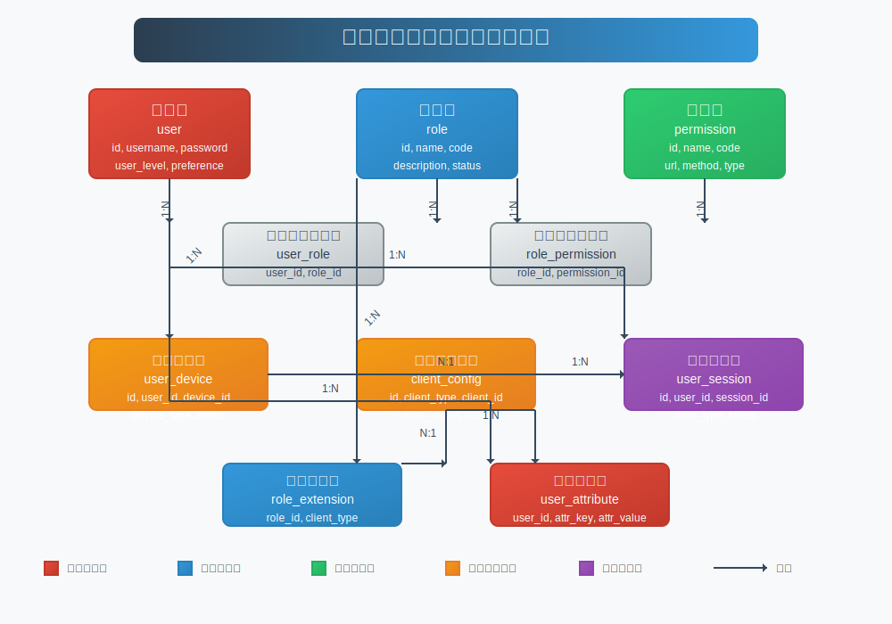

# 多客户端用户体系设计文档

## 目录
- [1. 概述](#1-概述)
- [2. 架构设计](#2-架构设计)
- [3. 用户体系扩展](#3-用户体系扩展)
- [4. 认证与授权增强](#4-认证与授权增强)
- [5. 数据模型设计](#5-数据模型设计)
- [6. API接口设计](#6-api接口设计)
- [7. 安全机制](#7-安全机制)
- [8. 多端适配策略](#8-多端适配策略)
- [9. 实施建议](#9-实施建议)

## 1. 概述

本设计文档针对多客户端环境（PC管理端、移动端App、微信/小程序、鸿蒙系统、元空间等），提供一套完整的用户体系解决方案。该方案在现有RBAC权限模型的基础上进行扩展，实现统一用户管理、多端身份识别、差异化权限控制和数据同步机制。

核心目标：
- 统一的用户身份管理
- 多客户端无缝切换
- 基于设备和客户端类型的差异化权限
- 安全可靠的认证授权
- 高效的数据同步策略

## 2. 架构设计

### 2.1 整体架构

多客户端用户体系采用微服务架构，主要包含以下核心组件：

1. **统一身份认证服务**：处理所有客户端的认证请求，提供统一的身份验证入口
2. **用户管理服务**：负责用户信息的CRUD操作和用户数据管理
3. **权限管理服务**：基于扩展的RBAC模型，处理用户权限和角色分配
4. **设备管理服务**：管理用户的设备信息和登录状态
5. **令牌服务**：生成、刷新和验证不同类型的令牌
6. **数据同步服务**：确保多端数据一致性

### 2.2 服务交互流程

## 3. 用户体系扩展

### 3.1 统一用户模型

在原有用户模型基础上，扩展支持多客户端特性：

- **用户基础信息**：保留现有用户名、密码、状态等核心字段
- **用户扩展信息**：根据不同客户端需求，设计可扩展的用户属性
- **用户偏好设置**：存储不同客户端的个性化设置
- **用户安全信息**：增强密码策略和安全问题

### 3.2 用户分层体系

将用户分为多个层级，实现差异化管理：

1. **系统管理员**：具有最高权限，可管理所有用户和配置
2. **业务管理员**：负责特定业务域的用户和角色管理
3. **普通用户**：根据不同客户端类型和角色拥有相应权限
4. **访客用户**：临时访问用户，权限受限

## 4. 认证与授权增强

### 4.1 多因素认证

支持多种认证方式组合，提高安全性：

- 密码认证
- 短信验证码认证
- 邮箱验证码认证
- 生物识别认证（指纹、面部识别）
- 第三方OAuth2认证（微信、支付宝等）

### 4.2 基于客户端类型的授权

根据客户端类型动态调整权限：

| 客户端类型 | 权限特点 | 安全策略 |
|---------|--------|--------|
| PC管理端 | 完整管理权限 | 强制双因素认证 |
| 移动端App | 核心业务权限 | 设备绑定 + 会话超时 |
| 微信/小程序 | 轻量级权限 | 微信OAuth2 + 会话短 |
| 鸿蒙系统 | 标准化权限 | 华为账号集成 |
| 元空间 | 特殊交互权限 | 强身份验证 |

### 4.3 令牌策略优化

实现多级令牌机制：

- **访问令牌(Access Token)**：短期有效，用于API访问
- **刷新令牌(Refresh Token)**：长期有效，用于刷新访问令牌
- **设备令牌(Device Token)**：设备唯一标识，用于设备识别
- **会话令牌(Session Token)**：维护用户会话状态

## 5. 数据模型设计

### 5.1 核心数据表

#### 5.1.1 用户表（user）
扩展现有用户表，新增字段：
- `user_level`：用户级别（0-系统管理员，1-业务管理员，2-普通用户，3-访客用户）
- `last_login_ip`：最后登录IP
- `last_login_time`：最后登录时间
- `preference`：用户偏好设置（JSON格式）
- `security_level`：安全等级

#### 5.1.2 用户设备表（user_device）
- `id`：主键ID
- `user_id`：用户ID
- `device_id`：设备唯一标识
- `device_type`：设备类型（PC/Android/iOS/Harmony/Wechat/Meta）
- `device_name`：设备名称
- `browser_info`：浏览器信息
- `os_info`：操作系统信息
- `status`：状态（0-未绑定，1-已绑定，2-已禁用）
- `last_login_time`：最后登录时间
- `token_version`：令牌版本号

#### 5.1.3 客户端配置表（client_config）
- `id`：主键ID
- `client_type`：客户端类型
- `client_name`：客户端名称
- `client_id`：客户端标识
- `client_secret`：客户端密钥
- `redirect_uri`：回调地址
- `grant_types`：授权类型（逗号分隔）
- `access_token_validity`：访问令牌有效期（秒）
- `refresh_token_validity`：刷新令牌有效期（秒）
- `status`：状态

#### 5.1.4 用户会话表（user_session）
- `id`：主键ID
- `user_id`：用户ID
- `session_id`：会话ID
- `client_type`：客户端类型
- `device_id`：设备ID
- `login_ip`：登录IP
- `login_time`：登录时间
- `last_activity_time`：最后活动时间
- `status`：状态（0-活跃，1-过期，2-强制下线）

#### 5.1.5 扩展角色表（role_extension）
- `id`：主键ID
- `role_id`：角色ID
- `client_type`：客户端类型（支持*通配符）
- `description`：扩展描述
- `is_active`：是否激活

#### 5.1.6 用户属性表（user_attribute）
- `id`：主键ID
- `user_id`：用户ID
- `attr_key`：属性键
- `attr_value`：属性值
- `client_type`：客户端类型（可为空表示通用）
- `create_time`：创建时间
- `update_time`：更新时间

### 5.2 数据关系图

## 6. API接口设计

### 6.1 认证管理接口

- `POST /api/auth/multi/login` - 多客户端登录
  - 参数：
    - `username`: 用户名
    - `password`: 密码
    - `client_type`: 客户端类型
    - `device_id`: 设备ID
    - `auth_type`: 认证类型（password/sms/email/bio/oauth）
    - `verification_code`: 验证码（可选）
    - `third_party_token`: 第三方令牌（可选）
  - 返回：访问令牌、刷新令牌、用户信息

- `POST /api/auth/multi/logout` - 多客户端登出
  - 参数：
    - `client_type`: 客户端类型
    - `device_id`: 设备ID（可选，不传则退出所有设备）

- `POST /api/auth/token/refresh` - 刷新令牌
  - 参数：
    - `refresh_token`: 刷新令牌
    - `client_type`: 客户端类型

- `GET /api/auth/sessions` - 获取当前用户会话列表
  - 返回：所有活跃会话信息

- `DELETE /api/auth/sessions/{sessionId}` - 强制下线指定会话

### 6.2 用户管理接口

- `GET /api/users/extended` - 获取扩展用户列表
  - 支持按客户端类型和用户级别过滤

- `PUT /api/users/{id}/attributes` - 更新用户扩展属性
  - 参数：
    - `attributes`: 属性列表（JSON数组）
    - `client_type`: 客户端类型（可选）

- `GET /api/users/{id}/devices` - 获取用户绑定设备

- `DELETE /api/users/{id}/devices/{deviceId}` - 解绑用户设备

### 6.3 角色权限接口

- `POST /api/roles/{id}/extensions` - 创建角色客户端扩展
  - 参数：
    - `client_type`: 客户端类型
    - `description`: 描述

- `GET /api/roles/by-client/{clientType}` - 获取客户端可用角色

- `POST /api/permissions/client-specific` - 创建客户端特定权限
  - 参数：
    - `permission_info`: 权限基本信息
    - `client_type`: 客户端类型
    - `client_specific_config`: 客户端特定配置

## 7. 安全机制

### 7.1 设备安全

- 设备指纹采集和验证
- 设备白名单机制
- 异常设备登录提醒
- 设备使用频率限制

### 7.2 会话安全

- 基于客户端的会话隔离
- 会话超时策略差异化配置
- 多端同时在线管理
- 会话劫持防护

### 7.3 传输安全

- 全站HTTPS
- 针对不同客户端的加密策略
- API请求签名验证
- 敏感操作二次认证

### 7.4 监控与审计

- 登录行为实时监控
- 异常操作检测和告警
- 完整的操作审计日志
- 安全事件响应机制

## 8. 多端适配策略

### 8.1 PC管理端适配

- 完整的RBAC权限控制
- 基于角色的界面元素显示控制
- 精细化的数据权限
- 双因素认证强制开启

### 8.2 移动端App适配

- 轻量级权限模型
- 生物识别集成
- 离线授权缓存
- 推送通知权限管理

### 8.3 微信生态适配

- 微信OAuth2授权集成
- 小程序用户信息获取
- 微信支付权限管理
- 社交分享权限控制

### 8.4 鸿蒙系统适配

- 华为账号体系集成
- 鸿蒙分布式能力支持
- 统一的权限申请机制
- 设备协同认证

### 8.5 元空间适配

- 3D交互权限控制
- 虚拟身份与真实身份映射
- 沉浸式体验的权限管理
- 隐私保护增强策略

## 9. 实施建议

### 9.1 阶段性实施计划

1. **第一阶段**：核心用户体系扩展
   - 扩展数据模型
   - 实现基础认证服务
   - 设备管理功能

2. **第二阶段**：多客户端适配
   - 各客户端认证集成
   - 差异化权限控制
   - 会话管理机制

3. **第三阶段**：高级功能实现
   - 实时监控系统
   - 高级安全策略
   - 数据分析功能

### 9.2 技术选型建议

- **认证框架**：Spring Security + OAuth2
- **令牌管理**：JWT + Redis
- **数据存储**：MySQL + Redis
- **消息队列**：Kafka（用于多端数据同步）
- **监控告警**：Prometheus + Grafana

### 9.3 迁移策略

- 设计兼容现有系统的用户扩展表
- 分批迁移现有用户数据
- 提供无缝的用户体验过渡
- 保留回滚机制

### 9.4 性能优化建议

- 合理缓存热点用户数据
- 优化令牌验证性能
- 数据库索引优化
- 异步处理非关键路径操作

通过以上设计，系统将能够灵活支持多客户端环境下的用户管理需求，提供安全、高效、一致的用户体验。