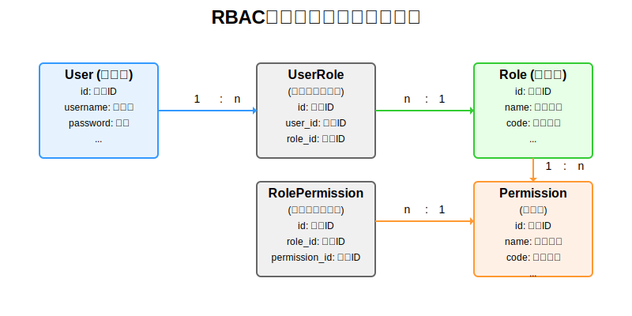

# RBAC权限管理系统设计文档

## 1. 概述

RBAC（Role-Based Access Control，基于角色的访问控制）是一种广泛使用的权限管理模型，本系统采用RBAC模型实现了完整的用户-角色-权限三层权限控制体系。

## 2. 数据模型设计

### 2.1 实体关系图

系统采用用户-角色-权限三层结构，通过关联表实现多对多关系。以下是详细的实体关系图：



图中展示了以下核心关系：
- 用户(User)与用户角色关联表(UserRole)是1:n关系：一个用户可以拥有多个角色
- 用户角色关联表(UserRole)与角色(Role)是n:1关系：多个用户可以拥有同一个角色
- 角色(Role)与角色权限关联表(RolePermission)是1:n关系：一个角色可以拥有多个权限
- 角色权限关联表(RolePermission)与权限(Permission)是n:1关系：多个角色可以拥有同一个权限

### 2.2 核心实体

#### 2.2.1 用户表（user）
- id: 用户ID
- username: 用户名
- password: 密码（加密存储）
- real_name: 真实姓名
- email: 邮箱
- phone: 手机号
- status: 状态（0-禁用，1-启用）
- create_time: 创建时间
- update_time: 更新时间

#### 2.2.2 角色表（role）
- id: 角色ID
- name: 角色名称
- code: 角色标识
- description: 角色描述
- status: 状态（0-禁用，1-启用）
- create_time: 创建时间
- update_time: 更新时间

#### 2.2.3 权限表（permission）
- id: 权限ID
- name: 权限名称
- code: 权限标识
- description: 权限描述
- url: 权限URL
- method: 请求方法
- parent_id: 父级权限ID
- sort: 排序
- type: 类型（0-菜单，1-按钮，2-API）
- icon: 图标
- status: 状态（0-禁用，1-启用）
- create_time: 创建时间
- update_time: 更新时间

#### 2.2.4 用户角色关联表（user_role）
- id: 主键ID
- user_id: 用户ID
- role_id: 角色ID

#### 2.2.5 角色权限关联表（role_permission）
- id: 主键ID
- role_id: 角色ID
- permission_id: 权限ID

## 3. 功能模块设计

### 3.1 用户管理
- 用户创建、修改、删除
- 用户查询和分页
- 用户角色分配
- 用户状态管理

### 3.2 角色管理
- 角色创建、修改、删除
- 角色查询和分页
- 角色用户分配
- 角色权限分配

### 3.3 权限管理
- 权限创建、修改、删除
- 权限查询和树形展示
- 权限状态管理
- 父子权限关系管理

## 4. API接口设计

### 4.0 认证管理接口
- `POST /api/auth/login` - 用户登录
- `POST /api/auth/register` - 用户注册
- `GET /api/auth/current` - 获取当前登录用户信息
- `POST /api/auth/logout` - 用户注销（新增）

### 4.1 用户管理接口
- `GET /api/users` - 获取用户列表
- `GET /api/users/{id}` - 获取用户详情
- `POST /api/users` - 创建用户
- `PUT /api/users/{id}` - 更新用户
- `DELETE /api/users/{id}` - 删除用户
- `POST /api/users/assign-roles/{userId}` - 为用户分配角色

### 4.2 角色管理接口
- `GET /api/roles` - 获取角色列表
- `GET /api/roles/{id}` - 获取角色详情
- `POST /api/roles` - 创建角色
- `PUT /api/roles/{id}` - 更新角色
- `DELETE /api/roles/{id}` - 删除角色
- `POST /api/roles/assign-users/{roleId}` - 为角色分配用户

### 4.3 权限管理接口
- `GET /api/permissions` - 获取权限列表
- `GET /api/permissions/tree` - 获取权限树
- `GET /api/permissions/{id}` - 获取权限详情
- `POST /api/permissions` - 创建权限
- `PUT /api/permissions/{id}` - 更新权限
- `DELETE /api/permissions/{id}` - 删除权限
- `GET /api/permissions/by-role/{roleId}` - 根据角色ID获取权限列表
- `POST /api/permissions/assign-to-role/{roleId}` - 为角色分配权限

## 5. 权限验证实现

### 5.1 基于注解的权限验证
```java
@PreAuthorize("hasPermission('sys:user:query')")
public List<User> listUsers() {
    // 业务逻辑
}
```

### 5.2 基于URL的权限拦截
通过拦截器或过滤器实现对URL的权限控制，根据用户的权限列表验证是否可以访问特定URL。

## 6. 初始化数据

系统初始化时会创建基本的管理员角色和默认权限，SQL脚本位于：
- `src/main/resources/sql/permission_init.sql` - 权限表和角色权限关联表初始化
- `src/main/resources/sql/role_init.sql` - 角色表初始化

## 7. 使用说明

### 7.1 角色权限分配
1. 登录系统管理后台
2. 进入角色管理页面
3. 选择需要分配权限的角色
4. 在权限分配界面选择要分配的权限
5. 保存分配结果

### 7.2 用户角色分配
1. 登录系统管理后台
2. 进入用户管理页面
3. 选择需要分配角色的用户
4. 在角色分配界面选择要分配的角色
5. 保存分配结果

## 8. 注意事项

1. 权限编码必须唯一，用于权限验证
2. 删除角色或权限时要注意关联数据的级联删除
3. 为确保系统安全，敏感操作应进行权限验证
4. 定期审查用户权限，确保符合最小权限原则

## 9. 扩展建议

1. 增加数据权限控制，实现更细粒度的权限管理
2. 添加权限变更日志，记录所有权限相关操作
3. 实现权限模板功能，方便快速创建角色
4. 增加权限统计和分析功能，监控权限使用情况