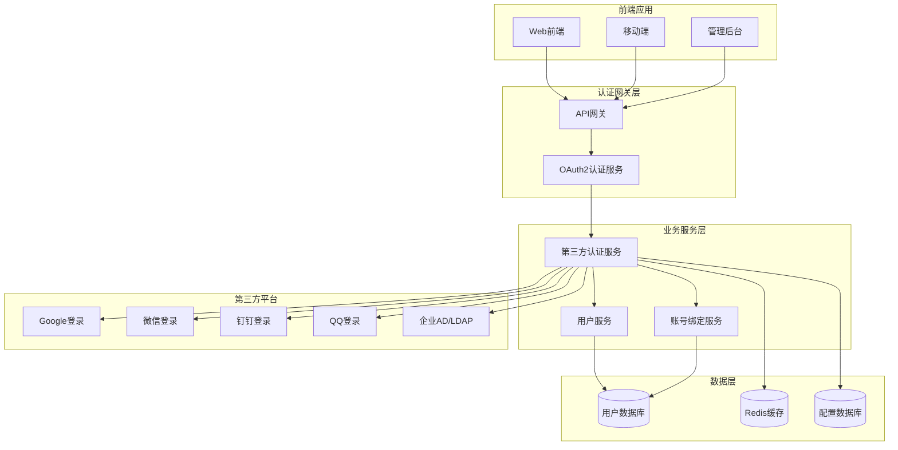

# 第三方登录集成方案设计文档

## 概述

本文档详细说明如何在现有Bing Framework框架中集成第三方登录功能，支持互联网平台和企业内部系统的OAuth 2.0认证。

**创建时间**：2025-11-17  
**作者**：zhengbing  
**文档版本**：v1.0

## 目录

1. [方案概述](#1-方案概述)
2. [架构设计](#2-架构设计)
3. [支持的第三方平台](#3-支持的第三方平台)
4. [技术实现方案](#4-技术实现方案)
5. [数据库设计](#5-数据库设计)
6. [API接口设计](#6-api接口设计)
7. [前端集成方案](#7-前端集成方案)
8. [安全性考虑](#8-安全性考虑)
9. [配置管理](#9-配置管理)
10. [部署实施](#10-部署实施)
11. [测试方案](#11-测试方案)
12. [运维监控](#12-运维监控)

## 1. 方案概述

### 1.1 目标

- 集成主流第三方登录平台（Google、微信、QQ、钉钉等）
- 支持企业内部AD/LDAP系统对接
- 与现有双Token认证机制无缝集成
- 提供统一的第三方登录管理界面
- 确保用户数据安全和隐私保护

### 1.2 设计原则

1. **统一认证**：所有第三方登录统一通过OAuth 2.0标准
2. **无缝集成**：与现有JWT双Token机制完美结合
3. **安全可靠**：多重验证，确保用户身份真实可靠
4. **易于扩展**：支持新平台快速接入
5. **用户体验**：简化登录流程，提升用户体验

### 1.3 技术栈

- **OAuth 2.0**：标准化认证协议
- **Spring Security OAuth2**：OAuth2客户端实现
- **Spring Boot**：应用框架
- **Redis**：令牌存储和缓存
- **MySQL**：用户数据存储
- **RestTemplate/WebClient**：HTTP客户端

## 2. 架构设计

### 2.1 整体架构



### 2.2 核心组件

#### 2.2.1 OAuth2认证服务
- 统一处理第三方登录请求
- 管理OAuth2客户端配置
- 处理授权码交换
- 生成统一的JWT令牌

#### 2.2.2 第三方认证适配器
- 针对不同平台提供适配器
- 统一用户信息格式
- 处理平台特性差异

#### 2.2.3 账号绑定服务
- 管理用户与第三方账号的绑定关系
- 支持多种绑定方式
- 处理账号解绑和重新绑定

#### 2.2.4 配置管理服务
- 统一管理第三方平台配置
- 动态配置更新
- 配置验证和回滚

## 3. 支持的第三方平台

### 3.1 互联网平台

| 平台名称 | OAuth2版本 | 用户信息接口 | 特殊要求 |
|---------|------------|--------------|----------|
| Google | 2.0 | https://www.googleapis.com/oauth2/v2/userinfo | 需要启用Google+ API |
| 微信 | 2.0 | https://api.weixin.qq.com/sns/userinfo | 需要微信开放平台账号 |
| QQ | 2.0 | https://graph.qq.com/user/get_user_info | 需要腾讯开放平台账号 |
| 支付宝 | 2.0 | https://openapi.alipay.com/gateway.do | 需要支付宝开放平台账号 |
| 微博 | 2.0 | https://api.weibo.com/2/users/show.json | 需要微博开放平台账号 |
| GitHub | 2.0 | https://api.github.com/user | 需要注册OAuth App |

### 3.2 企业内部系统

| 系统类型 | 协议 | 适配器 | 说明 |
|---------|------|--------|------|
| Active Directory | LDAP | LdapOAuthAdapter | Windows AD集成 |
| LDAP目录 | LDAP | LdapOAuthAdapter | 开源LDAP系统 |
| SAML 2.0 | SAML | SamlOAuthAdapter | 企业SSO系统 |
| OAuth 2.0 | OAuth2 | StandardOAuthAdapter | 内部OAuth2系统 |
| CAS | CAS | CasOAuthAdapter | 中央认证服务 |

### 3.3 扩展性设计

系统采用插件化设计，支持新平台快速接入：

```java
@Component
public class CustomOAuthAdapter implements OAuthProvider {
    
    @Override
    public String getProviderName() {
        return "custom-platform";
    }
    
    @Override
    public OAuthUserInfo getUserInfo(String accessToken) {
        // 实现平台特定的API调用
    }
    
    @Override
    public String getAuthorizeUrl(String state) {
        // 生成授权URL
    }
    
    @Override
    public String exchangeCodeForToken(String code) {
        // 交换授权码为访问令牌
    }
}
```

## 4. 技术实现方案

### 4.1 核心配置类

#### 4.1.1 OAuth2配置属性

```java
@Data
@ConfigurationProperties(prefix = "oauth2")
public class OAuth2Properties {
    
    private Map<String, OAuthProviderConfig> providers = new HashMap<>();
    
    @Data
    public static class OAuthProviderConfig {
        private String clientId;
        private String clientSecret;
        private String authorizeUrl;
        private String tokenUrl;
        private String userInfoUrl;
        private String redirectUri;
        private String scope;
        private Map<String, String> customParams;
    }
}
```

#### 4.1.2 应用配置

```yaml
# OAuth2 配置
oauth2:
  # Google 配置
  providers:
    google:
      client-id: ${GOOGLE_CLIENT_ID}
      client-secret: ${GOOGLE_CLIENT_SECRET}
      authorize-url: https://accounts.google.com/o/oauth2/v2/auth
      token-url: https://oauth2.googleapis.com/token
      user-info-url: https://www.googleapis.com/oauth2/v2/userinfo
      redirect-uri: ${SERVER_BASE_URL}/api/oauth2/google/callback
      scope: "openid email profile"
    wechat:
      client-id: ${WECHAT_CLIENT_ID}
      client-secret: ${WECHAT_CLIENT_SECRET}
      authorize-url: https://open.weixin.qq.com/connect/qrconnect
      token-url: https://api.weixin.qq.com/sns/oauth2/access_token
      user-info-url: https://api.weixin.qq.com/sns/userinfo
      redirect-uri: ${SERVER_BASE_URL}/api/oauth2/wechat/callback
      scope: "snsapi_login"
    dingtalk:
      client-id: ${DINGTALK_CLIENT_ID}
      client-secret: ${DINGTALK_CLIENT_SECRET}
      authorize-url: https://oapi.dingtalk.com/connect/qrconnect
      token-url: https://oapi.dingtalk.com/sns/gettoken
      user-info-url: https://oapi.dingtalk.com/sns/getuserinfo
      redirect-uri: ${SERVER_BASE_URL}/api/oauth2/dingtalk/callback
      scope: "openid corpid"
```

### 4.2 核心服务类

#### 4.2.1 OAuth2认证服务

```java
@Service
@Slf4j
@Transactional
public class OAuth2Service {
    
    @Autowired
    private OAuth2Properties oAuth2Properties;
    
    @Autowired
    private UserService userService;
    
    @Autowired
    private RedisTemplate<String, String> redisTemplate;
    
    @Autowired
    private SecureJwtTokenProvider jwtTokenProvider;
    
    /**
     * 获取第三方平台授权URL
     */
    public String getAuthorizeUrl(String provider, String state) {
        OAuthProviderConfig config = oAuth2Properties.getProviders().get(provider);
        if (config == null) {
            throw new BusinessException("不支持的第三方平台: " + provider);
        }
        
        // 生成state参数防止CSRF攻击
        String stateKey = UUID.randomUUID().toString();
        redisTemplate.opsForValue().set("oauth2:state:" + stateKey, state, Duration.ofMinutes(10));
        
        Map<String, String> params = new HashMap<>();
        params.put("client_id", config.getClientId());
        params.put("redirect_uri", config.getRedirectUri());
        params.put("response_type", "code");
        params.put("scope", config.getScope());
        params.put("state", stateKey);
        
        return buildUrl(config.getAuthorizeUrl(), params);
    }
    
    /**
     * 处理第三方登录回调
     */
    @Transactional
    public OAuthLoginResult handleCallback(String provider, String code, String state) {
        // 验证state参数
        String storedState = redisTemplate.opsForValue().get("oauth2:state:" + state);
        if (storedState == null) {
            throw new BusinessException("无效的state参数");
        }
        redisTemplate.delete("oauth2:state:" + state);
        
        OAuthProviderConfig config = oAuth2Properties.getProviders().get(provider);
        if (config == null) {
            throw new BusinessException("不支持的第三方平台: " + provider);
        }
        
        try {
            // 1. 交换授权码为访问令牌
            String accessToken = exchangeCodeForToken(config, code);
            
            // 2. 获取用户信息
            OAuthUserInfo userInfo = getUserInfo(provider, accessToken);
            
            // 3. 处理用户注册/登录
            User user = handleUserAuthentication(provider, userInfo);
            
            // 4. 生成JWT令牌
            String jwtToken = jwtTokenProvider.generateAccessToken(user.getId(), user.getUsername());
            String refreshToken = jwtTokenProvider.generateRefreshToken(user.getId(), user.getUsername());
            
            // 5. 保存登录记录
            saveLoginRecord(user, provider, "第三方登录");
            
            return OAuthLoginResult.builder()
                .token(jwtToken)
                .refreshToken(refreshToken)
                .user(convertToUserDTO(user))
                .build();
                
        } catch (Exception e) {
            log.error("第三方登录失败: provider={}, code={}", provider, code, e);
            throw new BusinessException("第三方登录失败: " + e.getMessage());
        }
    }
    
    /**
     * 交换授权码为访问令牌
     */
    private String exchangeCodeForToken(OAuthProviderConfig config, String code) {
        // 根据不同平台的API规范实现
        // 这里提供通用实现示例
        try {
            MultiValueMap<String, String> params = new LinkedMultiValueMap<>();
            params.add("grant_type", "authorization_code");
            params.add("code", code);
            params.add("client_id", config.getClientId());
            params.add("client_secret", config.getClientSecret());
            params.add("redirect_uri", config.getRedirectUri());
            
            RestTemplate restTemplate = new RestTemplate();
            ResponseEntity<String> response = restTemplate.postForEntity(
                config.getTokenUrl(), 
                params, 
                String.class
            );
            
            JSONObject jsonObject = JSON.parseObject(response.getBody());
            return jsonObject.getString("access_token");
            
        } catch (Exception e) {
            throw new BusinessException("交换访问令牌失败");
        }
    }
    
    /**
     * 获取用户信息
     */
    private OAuthUserInfo getUserInfo(String provider, String accessToken) {
        OAuthProviderConfig config = oAuth2Properties.getProviders().get(provider);
        
        RestTemplate restTemplate = new RestTemplate();
        HttpHeaders headers = new HttpHeaders();
        headers.set("Authorization", "Bearer " + accessToken);
        headers.set("Accept", "application/json");
        
        ResponseEntity<String> response = restTemplate.exchange(
            config.getUserInfoUrl(),
            HttpMethod.GET,
            new HttpEntity<>(headers),
            String.class
        );
        
        JSONObject jsonObject = JSON.parseObject(response.getBody());
        
        // 统一用户信息格式
        return OAuthUserInfo.builder()
            .provider(provider)
            .openId(jsonObject.getString(getOpenIdField(provider)))
            .unionId(jsonObject.getString(getUnionIdField(provider)))
            .nickname(getNickname(jsonObject, provider))
            .avatar(getAvatar(jsonObject, provider))
            .email(jsonObject.getString(getEmailField(provider)))
            .gender(getGender(jsonObject, provider))
            .build();
    }
    
    /**
     * 处理用户认证（注册或登录）
     */
    private User handleUserAuthentication(String provider, OAuthUserInfo userInfo) {
        // 查找是否已绑定该第三方账号
        User thirdPartyUser = userService.findByThirdPartyId(provider, userInfo.getOpenId());
        
        if (thirdPartyUser != null) {
            return thirdPartyUser;
        }
        
        // 查找是否已绑定相同邮箱的用户
        User existingUser = userService.findByEmail(userInfo.getEmail());
        
        if (existingUser != null) {
            // 已有账号，绑定第三方账号
            bindThirdPartyAccount(existingUser, provider, userInfo);
            return existingUser;
        }
        
        // 创建新用户
        return createUserFromThirdParty(provider, userInfo);
    }
    
    private void bindThirdPartyAccount(User user, String provider, OAuthUserInfo userInfo) {
        ThirdPartyAccount thirdPartyAccount = new ThirdPartyAccount();
        thirdPartyAccount.setUserId(user.getId());
        thirdPartyAccount.setProvider(provider);
        thirdPartyAccount.setOpenId(userInfo.getOpenId());
        thirdPartyAccount.setUnionId(userInfo.getUnionId());
        thirdPartyAccount.setNickname(userInfo.getNickname());
        thirdPartyAccount.setAvatar(userInfo.getAvatar());
        thirdPartyAccount.setExtraInfo(JSON.toJSONString(userInfo.getExtraInfo()));
        thirdPartyAccount.setStatus(1);
        thirdPartyAccount.setCreateTime(new Date());
        thirdPartyAccount.setUpdateTime(new Date());
        
        thirdPartyAccountMapper.insert(thirdPartyAccount);
    }
    
    private User createUserFromThirdParty(String provider, OAuthUserInfo userInfo) {
        User user = new User();
        user.setUsername(generateUniqueUsername(provider, userInfo));
        user.setEmail(userInfo.getEmail());
        user.setNickname(userInfo.getNickname());
        user.setAvatar(userInfo.getAvatar());
        user.setGender(userInfo.getGender());
        user.setStatus(1);
        user.setCreateTime(new Date());
        user.setUpdateTime(new Date());
        
        // 设置默认密码（临时密码，用户首次登录后需要修改）
        user.setPassword(passwordEncoder.encode(UUID.randomUUID().toString()));
        
        userService.save(user);
        
        // 绑定第三方账号
        bindThirdPartyAccount(user, provider, userInfo);
        
        return user;
    }
}
```

#### 4.2.2 账号绑定服务

```java
@Service
@Slf4j
public class AccountBindingService {
    
    @Autowired
    private UserService userService;
    
    @Autowired
    private ThirdPartyAccountMapper thirdPartyAccountMapper;
    
    /**
     * 绑定第三方账号到现有用户
     */
    public void bindThirdPartyAccount(Long userId, String provider, String authCode) {
        // 获取用户信息
        OAuthProviderConfig config = oAuth2Properties.getProviders().get(provider);
        String accessToken = oAuth2Service.exchangeCodeForToken(config, authCode);
        OAuthUserInfo userInfo = oAuth2Service.getUserInfo(provider, accessToken);
        
        // 检查是否已被其他用户绑定
        ThirdPartyAccount existingAccount = thirdPartyAccountMapper
            .findByProviderAndOpenId(provider, userInfo.getOpenId());
            
        if (existingAccount != null && !existingAccount.getUserId().equals(userId)) {
            throw new BusinessException("该第三方账号已被其他用户绑定");
        }
        
        // 检查用户是否已绑定该平台
        ThirdPartyAccount userAccount = thirdPartyAccountMapper
            .findByUserIdAndProvider(userId, provider);
            
        if (userAccount != null) {
            throw new BusinessException("您已绑定过该平台账号");
        }
        
        // 创建绑定记录
        ThirdPartyAccount thirdPartyAccount = new ThirdPartyAccount();
        thirdPartyAccount.setUserId(userId);
        thirdPartyAccount.setProvider(provider);
        thirdPartyAccount.setOpenId(userInfo.getOpenId());
        thirdPartyAccount.setUnionId(userInfo.getUnionId());
        thirdPartyAccount.setNickname(userInfo.getNickname());
        thirdPartyAccount.setAvatar(userInfo.getAvatar());
        thirdPartyAccount.setStatus(1);
        thirdPartyAccount.setCreateTime(new Date());
        thirdPartyAccount.setUpdateTime(new Date());
        
        thirdPartyAccountMapper.insert(thirdPartyAccount);
        
        // 记录操作日志
        saveBindingLog(userId, provider, "绑定", userInfo.getNickname());
    }
    
    /**
     * 解绑第三方账号
     */
    public void unbindThirdPartyAccount(Long userId, String provider) {
        ThirdPartyAccount account = thirdPartyAccountMapper
            .findByUserIdAndProvider(userId, provider);
            
        if (account == null) {
            throw new BusinessException("未绑定该平台账号");
        }
        
        // 检查是否保留至少一种登录方式
        long bindingCount = thirdPartyAccountMapper.countActiveBindings(userId);
        if (bindingCount <= 1) {
            throw new BusinessException("必须保留至少一种登录方式");
        }
        
        account.setStatus(0);
        account.setUpdateTime(new Date());
        thirdPartyAccountMapper.updateById(account);
        
        // 记录操作日志
        saveBindingLog(userId, provider, "解绑", null);
    }
    
    /**
     * 获取用户的所有绑定账号
     */
    public List<ThirdPartyBindingVO> getUserBindings(Long userId) {
        List<ThirdPartyAccount> accounts = thirdPartyAccountMapper.findByUserId(userId);
        
        return accounts.stream()
            .map(account -> ThirdPartyBindingVO.builder()
                .provider(account.getProvider())
                .providerName(getProviderName(account.getProvider()))
                .nickname(account.getNickname())
                .avatar(account.getAvatar())
                .isActive(account.getStatus() == 1)
                .bindTime(account.getCreateTime())
                .build())
            .collect(Collectors.toList());
    }
}
```

### 4.3 控制器层

#### 4.3.1 OAuth2控制器

```java
@RestController
@RequestMapping("/api/oauth2")
@Slf4j
@Api(tags = "第三方登录接口")
public class OAuth2Controller {
    
    @Autowired
    private OAuth2Service oAuth2Service;
    
    @Autowired
    private AccountBindingService bindingService;
    
    @Autowired
    private UserDetailsService userDetailsService;
    
    /**
     * 获取第三方平台授权URL
     */
    @GetMapping("/authorize/{provider}")
    @ApiOperation("获取第三方授权URL")
    public Result<String> getAuthorizeUrl(
            @ApiParam("平台名称") @PathVariable String provider,
            @ApiParam("state参数") @RequestParam String state) {
        
        String authorizeUrl = oAuth2Service.getAuthorizeUrl(provider, state);
        return Result.success(authorizeUrl);
    }
    
    /**
     * 处理第三方登录回调
     */
    @GetMapping("/{provider}/callback")
    @ApiOperation("第三方登录回调")
    public Result<OAuthLoginResult> oauthCallback(
            @ApiParam("平台名称") @PathVariable String provider,
            @ApiParam("授权码") @RequestParam String code,
            @ApiParam("状态参数") @RequestParam String state,
            HttpServletRequest request,
            HttpServletResponse response) {
        
        OAuthLoginResult result = oAuth2Service.handleCallback(provider, code, state);
        
        // 设置Cookie（如果需要）
        CookieUtil.setCookie(response, "access_token", result.getToken(), 24 * 60 * 60);
        CookieUtil.setCookie(response, "refresh_token", result.getRefreshToken(), 7 * 24 * 60 * 60);
        
        return Result.success(result);
    }
    
    /**
     * 绑定第三方账号
     */
    @PostMapping("/bind/{provider}")
    @PreAuthorize("hasRole('USER')")
    @ApiOperation("绑定第三方账号")
    public Result<Void> bindThirdPartyAccount(
            @ApiParam("平台名称") @PathVariable String provider,
            @ApiParam("授权码") @RequestParam String code,
            @AuthenticationPrincipal UserDetails userDetails) {
        
        Long userId = Long.valueOf(userDetails.getUsername());
        bindingService.bindThirdPartyAccount(userId, provider, code);
        
        return Result.success();
    }
    
    /**
     * 解绑第三方账号
     */
    @DeleteMapping("/bind/{provider}")
    @PreAuthorize("hasRole('USER')")
    @ApiOperation("解绑第三方账号")
    public Result<Void> unbindThirdPartyAccount(
            @ApiParam("平台名称") @PathVariable String provider,
            @AuthenticationPrincipal UserDetails userDetails) {
        
        Long userId = Long.valueOf(userDetails.getUsername());
        bindingService.unbindThirdPartyAccount(userId, provider);
        
        return Result.success();
    }
    
    /**
     * 获取用户绑定信息
     */
    @GetMapping("/bindings")
    @PreAuthorize("hasRole('USER')")
    @ApiOperation("获取用户绑定信息")
    public Result<List<ThirdPartyBindingVO>> getUserBindings(
            @AuthenticationPrincipal UserDetails userDetails) {
        
        Long userId = Long.valueOf(userDetails.getUsername());
        List<ThirdPartyBindingVO> bindings = bindingService.getUserBindings(userId);
        
        return Result.success(bindings);
    }
}
```

## 5. 数据库设计

### 5.1 新增数据表

#### 5.1.1 第三方账号绑定表 (third_party_account)

```sql
CREATE TABLE `third_party_account` (
    `id` bigint NOT NULL AUTO_INCREMENT COMMENT '主键ID',
    `user_id` bigint NOT NULL COMMENT '用户ID',
    `provider` varchar(50) NOT NULL COMMENT '第三方平台标识',
    `open_id` varchar(255) NOT NULL COMMENT '平台OpenID',
    `union_id` varchar(255) DEFAULT NULL COMMENT '平台UnionID（如果有）',
    `nickname` varchar(100) DEFAULT NULL COMMENT '昵称',
    `avatar` varchar(500) DEFAULT NULL COMMENT '头像URL',
    `email` varchar(100) DEFAULT NULL COMMENT '邮箱',
    `gender` tinyint DEFAULT NULL COMMENT '性别：0-未知，1-男，2-女',
    `province` varchar(50) DEFAULT NULL COMMENT '省份',
    `city` varchar(50) DEFAULT NULL COMMENT '城市',
    `country` varchar(50) DEFAULT NULL COMMENT '国家',
    `extra_info` text COMMENT '额外信息（JSON格式）',
    `status` tinyint NOT NULL DEFAULT '1' COMMENT '状态：0-已解绑，1-已绑定',
    `last_login_time` datetime DEFAULT NULL COMMENT '最后登录时间',
    `create_time` datetime NOT NULL DEFAULT CURRENT_TIMESTAMP COMMENT '创建时间',
    `update_time` datetime NOT NULL DEFAULT CURRENT_TIMESTAMP ON UPDATE CURRENT_TIMESTAMP COMMENT '更新时间',
    PRIMARY KEY (`id`),
    UNIQUE KEY `uk_provider_openid` (`provider`, `open_id`),
    KEY `idx_user_id` (`user_id`),
    KEY `idx_provider` (`provider`),
    KEY `idx_status` (`status`)
) ENGINE=InnoDB DEFAULT CHARSET=utf8mb4 COMMENT='第三方账号绑定表';
```

#### 5.1.2 OAuth2配置表 (oauth2_config)

```sql
CREATE TABLE `oauth2_config` (
    `id` bigint NOT NULL AUTO_INCREMENT COMMENT '主键ID',
    `provider` varchar(50) NOT NULL COMMENT '平台标识',
    `provider_name` varchar(100) NOT NULL COMMENT '平台名称',
    `client_id` varchar(255) NOT NULL COMMENT '客户端ID',
    `client_secret` varchar(255) NOT NULL COMMENT '客户端密钥',
    `authorize_url` varchar(500) NOT NULL COMMENT '授权URL',
    `token_url` varchar(500) NOT NULL COMMENT '令牌交换URL',
    `user_info_url` varchar(500) NOT NULL COMMENT '用户信息URL',
    `redirect_uri` varchar(500) NOT NULL COMMENT '回调地址',
    `scope` varchar(500) DEFAULT NULL COMMENT '权限范围',
    `custom_params` text COMMENT '自定义参数（JSON格式）',
    `icon_url` varchar(500) DEFAULT NULL COMMENT '平台图标URL',
    `is_enabled` tinyint NOT NULL DEFAULT '1' COMMENT '是否启用：0-禁用，1-启用',
    `sort_order` int NOT NULL DEFAULT '0' COMMENT '排序顺序',
    `create_time` datetime NOT NULL DEFAULT CURRENT_TIMESTAMP COMMENT '创建时间',
    `update_time` datetime NOT NULL DEFAULT CURRENT_TIMESTAMP ON UPDATE CURRENT_TIMESTAMP COMMENT '更新时间',
    PRIMARY KEY (`id`),
    UNIQUE KEY `uk_provider` (`provider`),
    KEY `idx_is_enabled` (`is_enabled`)
) ENGINE=InnoDB DEFAULT CHARSET=utf8mb4 COMMENT='OAuth2平台配置表';
```

#### 5.1.3 账号绑定操作日志表 (account_binding_log)

```sql
CREATE TABLE `account_binding_log` (
    `id` bigint NOT NULL AUTO_INCREMENT COMMENT '主键ID',
    `user_id` bigint NOT NULL COMMENT '用户ID',
    `operator_id` bigint DEFAULT NULL COMMENT '操作人ID',
    `provider` varchar(50) NOT NULL COMMENT '第三方平台',
    `operation` varchar(20) NOT NULL COMMENT '操作类型：bind-绑定，unbind-解绑，update-更新',
    `third_party_nickname` varchar(100) DEFAULT NULL COMMENT '第三方账号昵称',
    `ip_address` varchar(45) DEFAULT NULL COMMENT 'IP地址',
    `user_agent` varchar(500) DEFAULT NULL COMMENT '用户代理',
    `description` varchar(500) DEFAULT NULL COMMENT '操作描述',
    `create_time` datetime NOT NULL DEFAULT CURRENT_TIMESTAMP COMMENT '创建时间',
    PRIMARY KEY (`id`),
    KEY `idx_user_id` (`user_id`),
    KEY `idx_provider` (`provider`),
    KEY `idx_operation` (`operation`),
    KEY `idx_create_time` (`create_time`)
) ENGINE=InnoDB DEFAULT CHARSET=utf8mb4 COMMENT='账号绑定操作日志表';
```

### 5.2 修改现有表

#### 5.2.1 用户表扩展 (user)

```sql
ALTER TABLE `user` 
ADD COLUMN `third_party_type` varchar(50) DEFAULT NULL COMMENT '第三方登录类型',
ADD COLUMN `third_party_id` varchar(255) DEFAULT NULL COMMENT '第三方账号ID',
ADD COLUMN `last_third_party_login` datetime DEFAULT NULL COMMENT '最后第三方登录时间';
```

#### 5.2.1 登录记录表扩展 (login_record)

```sql
ALTER TABLE `login_record` 
ADD COLUMN `login_type` varchar(20) NOT NULL DEFAULT 'username' COMMENT '登录方式：username-用户名，google-谷歌，wechat-微信等',
ADD COLUMN `third_party_info` varchar(500) DEFAULT NULL COMMENT '第三方登录额外信息';
```

## 6. API接口设计

### 6.1 第三方登录接口

#### 6.1.1 获取授权URL

```http
GET /api/oauth2/authorize/{provider}?state=xxx
```

**请求参数**：
- `provider`：平台标识（google、wechat、dingtalk等）
- `state`：防CSRF参数

**响应示例**：
```json
{
    "code": 200,
    "message": "success",
    "data": "https://accounts.google.com/o/oauth2/v2/auth?client_id=xxx&redirect_uri=xxx&response_type=code&scope=xxx&state=xxx"
}
```

#### 6.1.2 登录回调处理

```http
GET /api/oauth2/{provider}/callback?code=xxx&state=xxx
```

**请求参数**：
- `provider`：平台标识
- `code`：授权码
- `state`：防CSRF参数

**响应示例**：
```json
{
    "code": 200,
    "message": "success",
    "data": {
        "token": "eyJhbGciOiJIUzI1NiJ9...",
        "refreshToken": "eyJhbGciOiJIUzI1NiJ9...",
        "user": {
            "id": 1,
            "username": "user123",
            "nickname": "张三",
            "email": "zhangsan@example.com",
            "avatar": "https://example.com/avatar.jpg"
        },
        "expiresIn": 86400
    }
}
```

### 6.2 账号绑定接口

#### 6.2.1 获取可用平台列表

```http
GET /api/oauth2/available-platforms
```

**响应示例**：
```json
{
    "code": 200,
    "message": "success",
    "data": [
        {
            "provider": "google",
            "providerName": "Google",
            "iconUrl": "https://example.com/google.png",
            "isEnabled": true,
            "description": "使用Google账号快速登录"
        },
        {
            "provider": "wechat",
            "providerName": "微信",
            "iconUrl": "https://example.com/wechat.png",
            "isEnabled": true,
            "description": "使用微信账号快速登录"
        }
    ]
}
```

#### 6.2.2 获取用户绑定信息

```http
GET /api/oauth2/bindings
```

**响应示例**：
```json
{
    "code": 200,
    "message": "success",
    "data": [
        {
            "provider": "google",
            "providerName": "Google",
            "nickname": "张三",
            "avatar": "https://example.com/avatar.jpg",
            "isActive": true,
            "bindTime": "2025-11-17T10:30:00"
        }
    ]
}
```

#### 6.2.3 绑定第三方账号

```http
POST /api/oauth2/bind/{provider}?code=xxx
```

**请求参数**：
- `provider`：平台标识
- `code`：授权码

**响应示例**：
```json
{
    "code": 200,
    "message": "绑定成功",
    "data": null
}
```

#### 6.2.4 解绑第三方账号

```http
DELETE /api/oauth2/bind/{provider}
```

**响应示例**：
```json
{
    "code": 200,
    "message": "解绑成功",
    "data": null
}
```

### 6.3 管理接口

#### 6.3.1 获取平台配置列表

```http
GET /api/admin/oauth2/platforms
```

**响应示例**：
```json
{
    "code": 200,
    "message": "success",
    "data": [
        {
            "id": 1,
            "provider": "google",
            "providerName": "Google",
            "clientId": "xxx",
            "authorizeUrl": "https://accounts.google.com/...",
            "isEnabled": true,
            "createTime": "2025-11-17T10:00:00",
            "updateTime": "2025-11-17T10:00:00"
        }
    ]
}
```

#### 6.3.2 更新平台配置

```http
PUT /api/admin/oauth2/platforms/{provider}
```

**请求体**：
```json
{
    "clientId": "新的客户端ID",
    "clientSecret": "新的客户端密钥",
    "isEnabled": true,
    "customParams": {
        "param1": "value1"
    }
}
```

## 7. 前端集成方案

### 7.1 登录页面集成

#### 7.1.1 Vue.js集成示例

```vue
<template>
  <div class="oauth-login-container">
    <div class="login-title">选择登录方式</div>
    
    <!-- 第三方登录按钮 -->
    <div class="oauth-buttons">
      <button 
        v-for="platform in availablePlatforms" 
        :key="platform.provider"
        class="oauth-button"
        @click="handleOAuthLogin(platform.provider)"
      >
        
        {{ platform.providerName }}
      </button>
    </div>
    
    <!-- 传统登录 -->
    <div class="traditional-login">
      <el-divider>或者</el-divider>
      <el-form :model="loginForm" @submit.prevent="handleLogin">
        <el-form-item>
          <el-input v-model="loginForm.username" placeholder="用户名" />
        </el-form-item>
        <el-form-item>
          <el-input v-model="loginForm.password" placeholder="密码" type="password" />
        </el-form-item>
        <el-form-item>
          <el-button type="primary" @click="handleLogin" :loading="loginLoading">
            登录
          </el-button>
        </el-form-item>
      </el-form>
    </div>
  </div>
</template>

<script>
export default {
  name: 'OAuthLogin',
  
  data() {
    return {
      availablePlatforms: [],
      loginForm: {
        username: '',
        password: ''
      },
      loginLoading: false
    }
  },
  
  async mounted() {
    await this.loadAvailablePlatforms()
  },
  
  methods: {
    async loadAvailablePlatforms() {
      try {
        const response = await this.$api.get('/oauth2/available-platforms')
        this.availablePlatforms = response.data
      } catch (error) {
        this.$message.error('加载可用平台失败')
      }
    },
    
    async handleOAuthLogin(provider) {
      try {
        // 生成state参数
        const state = this.generateState()
        localStorage.setItem('oauth_state', state)
        
        // 获取授权URL
        const response = await this.$api.get(`/oauth2/authorize/${provider}`, {
          params: { state }
        })
        
        // 跳转到第三方授权页面
        window.location.href = response.data
      } catch (error) {
        this.$message.error('发起第三方登录失败')
      }
    },
    
    generateState() {
      return Date.now().toString(36) + Math.random().toString(36).substr(2)
    },
    
    async handleLogin() {
      if (!this.loginForm.username || !this.loginForm.password) {
        this.$message.warning('请填写用户名和密码')
        return
      }
      
      this.loginLoading = true
      try {
        const response = await this.$api.post('/auth/login', this.loginForm)
        this.handleLoginSuccess(response.data)
      } catch (error) {
        this.$message.error('登录失败')
      } finally {
        this.loginLoading = false
      }
    },
    
    handleLoginSuccess(data) {
      // 存储令牌
      localStorage.setItem('access_token', data.token)
      localStorage.setItem('refresh_token', data.refreshToken)
      
      // 跳转到首页
      this.$router.push('/dashboard')
      this.$message.success('登录成功')
    }
  }
}
</script>

<style scoped>
.oauth-login-container {
  max-width: 400px;
  margin: 50px auto;
  padding: 20px;
  border: 1px solid #ddd;
  border-radius: 8px;
}

.login-title {
  text-align: center;
  font-size: 18px;
  font-weight: bold;
  margin-bottom: 20px;
}

.oauth-buttons {
  margin-bottom: 20px;
}

.oauth-button {
  width: 100%;
  padding: 12px;
  margin-bottom: 10px;
  border: 1px solid #ddd;
  border-radius: 4px;
  background: white;
  cursor: pointer;
  display: flex;
  align-items: center;
  gap: 10px;
}

.oauth-button img {
  width: 20px;
  height: 20px;
}

.oauth-button:hover {
  background: #f5f5f5;
}
</style>
```

#### 7.1.2 React集成示例

```jsx
import React, { useState, useEffect } from 'react'
import { Button, Input, Divider, message } from 'antd'

const OAuthLogin = () => {
  const [availablePlatforms, setAvailablePlatforms] = useState([])
  const [loginForm, setLoginForm] = useState({ username: '', password: '' })
  const [loginLoading, setLoginLoading] = useState(false)

  useEffect(() => {
    loadAvailablePlatforms()
  }, [])

  const loadAvailablePlatforms = async () => {
    try {
      const response = await api.get('/oauth2/available-platforms')
      setAvailablePlatforms(response.data)
    } catch (error) {
      message.error('加载可用平台失败')
    }
  }

  const handleOAuthLogin = async (provider) => {
    try {
      const state = generateState()
      localStorage.setItem('oauth_state', state)
      
      const response = await api.get(`/oauth2/authorize/${provider}`, { params: { state } })
      window.location.href = response.data
    } catch (error) {
      message.error('发起第三方登录失败')
    }
  }

  const handleLogin = async () => {
    if (!loginForm.username || !loginForm.password) {
      message.warning('请填写用户名和密码')
      return
    }
    
    setLoginLoading(true)
    try {
      const response = await api.post('/auth/login', loginForm)
      handleLoginSuccess(response.data)
    } catch (error) {
      message.error('登录失败')
    } finally {
      setLoginLoading(false)
    }
  }

  const handleLoginSuccess = (data) => {
    localStorage.setItem('access_token', data.token)
    localStorage.setItem('refresh_token', data.refreshToken)
    window.location.href = '/dashboard'
    message.success('登录成功')
  }

  const generateState = () => {
    return Date.now().toString(36) + Math.random().toString(36).substr(2)
  }

  return (
    <div className="oauth-login-container">
      <h2 className="login-title">选择登录方式</h2>
      
      <div className="oauth-buttons">
        {availablePlatforms.map(platform => (
          <Button
            key={platform.provider}
            type="default"
            block
            style={{ marginBottom: 10, display: 'flex', alignItems: 'center', gap: 10 }}
            onClick={() => handleOAuthLogin(platform.provider)}
          >
            
            {platform.providerName}
          </Button>
        ))}
      </div>
      
      <Divider>或者</Divider>
      
      <div className="traditional-login">
        <Input
          placeholder="用户名"
          value={loginForm.username}
          onChange={(e) => setLoginForm({ ...loginForm, username: e.target.value })}
          style={{ marginBottom: 10 }}
        />
        <Input.Password
          placeholder="密码"
          value={loginForm.password}
          onChange={(e) => setLoginForm({ ...loginForm, password: e.target.value })}
          style={{ marginBottom: 10 }}
        />
        <Button
          type="primary"
          block
          loading={loginLoading}
          onClick={handleLogin}
        >
          登录
        </Button>
      </div>
    </div>
  )
}

export default OAuthLogin
```

### 7.2 个人中心集成

#### 7.2.1 账号绑定管理

```vue
<template>
  <div class="account-binding">
    <div class="section-title">第三方账号绑定</div>
    
    <!-- 已绑定的账号 -->
    <div class="bound-accounts">
      <div 
        v-for="binding in userBindings" 
        :key="binding.provider"
        class="binding-item"
      >
        
        <div class="info">
          <div class="name">{{ binding.nickname }}</div>
          <div class="provider">{{ binding.providerName }}</div>
          <div class="bind-time">绑定时间：{{ formatDate(binding.bindTime) }}</div>
        </div>
        <Button 
          type="text" 
          danger 
          @click="unbindAccount(binding.provider)"
          :disabled="userBindings.length <= 1"
        >
          解绑
        </Button>
      </div>
    </div>
    
    <!-- 可绑定的账号 -->
    <div class="available-platforms">
      <div class="section-subtitle">绑定更多账号</div>
      <div class="platform-list">
        <div
          v-for="platform in availablePlatforms.filter(p => !isBound(p.provider))"
          :key="platform.provider"
          class="platform-item"
        >
          
          <div class="platform-info">
            <div class="platform-name">{{ platform.providerName }}</div>
            <div class="platform-desc">{{ platform.description }}</div>
          </div>
          <Button type="primary" @click="bindAccount(platform.provider)">
            绑定
          </Button>
        </div>
      </div>
    </div>
    
    <!-- 绑定对话框 -->
    <el-dialog
      v-model="bindDialogVisible"
      title="绑定第三方账号"
      width="400px"
      center
    >
      <div class="bind-instructions">
        <p>即将跳转到 {{ selectedPlatform?.providerName }} 授权页面</p>
        <p>授权完成后将自动完成账号绑定</p>
      </div>
      <template #footer>
        <span class="dialog-footer">
          <el-button @click="bindDialogVisible = false">取消</el-button>
          <el-button type="primary" @click="confirmBind">
            确定
          </el-button>
        </span>
      </template>
    </el-dialog>
  </div>
</template>

<script>
export default {
  name: 'AccountBinding',
  
  data() {
    return {
      userBindings: [],
      availablePlatforms: [],
      bindDialogVisible: false,
      selectedPlatform: null,
      authCode: null
    }
  },
  
  async mounted() {
    await this.loadUserBindings()
    await this.loadAvailablePlatforms()
  },
  
  methods: {
    async loadUserBindings() {
      try {
        const response = await this.$api.get('/oauth2/bindings')
        this.userBindings = response.data
      } catch (error) {
        this.$message.error('加载绑定信息失败')
      }
    },
    
    async loadAvailablePlatforms() {
      try {
        const response = await this.$api.get('/oauth2/available-platforms')
        this.availablePlatforms = response.data.filter(p => p.isEnabled)
      } catch (error) {
        this.$message.error('加载可用平台失败')
      }
    },
    
    isBound(provider) {
      return this.userBindings.some(binding => binding.provider === provider)
    },
    
    bindAccount(provider) {
      const platform = this.availablePlatforms.find(p => p.provider === provider)
      this.selectedPlatform = platform
      this.bindDialogVisible = true
    },
    
    async confirmBind() {
      try {
        // 生成state参数
        const state = this.generateState()
        localStorage.setItem('oauth_state_bind', state)
        
        // 获取授权URL
        const response = await this.$api.get(`/oauth2/authorize/${this.selectedPlatform.provider}`, {
          params: { state }
        })
        
        // 在新窗口打开授权页面
        const authWindow = window.open(
          response.data,
          'oauth_auth',
          'width=600,height=700,scrollbars=yes,resizable=yes'
        )
        
        // 监听授权完成
        const checkAuth = setInterval(() => {
          if (authWindow.closed) {
            clearInterval(checkAuth)
            // 授权窗口关闭后检查绑定状态
            this.checkBindingStatus()
          }
        }, 1000)
        
        this.bindDialogVisible = false
      } catch (error) {
        this.$message.error('发起绑定失败')
      }
    },
    
    async checkBindingStatus() {
      try {
        await this.loadUserBindings()
        this.$message.success('账号绑定成功')
      } catch (error) {
        // 绑定可能还在处理中，等待一段时间后重试
        setTimeout(() => this.checkBindingStatus(), 2000)
      }
    },
    
    async unbindAccount(provider) {
      try {
        await this.$api.delete(`/oauth2/bind/${provider}`)
        await this.loadUserBindings()
        this.$message.success('解绑成功')
      } catch (error) {
        this.$message.error('解绑失败：' + (error.response?.data?.message || error.message))
      }
    },
    
    generateState() {
      return 'bind_' + Date.now().toString(36) + Math.random().toString(36).substr(2)
    },
    
    formatDate(dateString) {
      return new Date(dateString).toLocaleString()
    }
  }
}
</script>

<style scoped>
.account-binding {
  padding: 20px;
}

.section-title {
  font-size: 18px;
  font-weight: bold;
  margin-bottom: 20px;
}

.section-subtitle {
  font-size: 16px;
  font-weight: bold;
  margin-bottom: 15px;
  margin-top: 30px;
}

.bound-accounts {
  margin-bottom: 30px;
}

.binding-item {
  display: flex;
  align-items: center;
  padding: 15px;
  border: 1px solid #ddd;
  border-radius: 8px;
  margin-bottom: 10px;
}

.avatar {
  width: 50px;
  height: 50px;
  border-radius: 50%;
  margin-right: 15px;
}

.info {
  flex: 1;
}

.name {
  font-weight: bold;
  margin-bottom: 5px;
}

.provider {
  color: #666;
  margin-bottom: 5px;
}

.bind-time {
  color: #999;
  font-size: 14px;
}

.platform-list {
  display: grid;
  grid-template-columns: repeat(auto-fill, minmax(300px, 1fr));
  gap: 15px;
}

.platform-item {
  display: flex;
  align-items: center;
  padding: 15px;
  border: 1px solid #ddd;
  border-radius: 8px;
}

.platform-icon {
  width: 30px;
  height: 30px;
  margin-right: 15px;
}

.platform-info {
  flex: 1;
  margin-right: 15px;
}

.platform-name {
  font-weight: bold;
  margin-bottom: 5px;
}

.platform-desc {
  color: #666;
  font-size: 14px;
}

.bind-instructions {
  text-align: center;
  padding: 20px;
}
</style>
```

### 7.3 移动端集成

#### 7.3.1 微信小程序集成

```javascript
// 微信小程序第三方登录
const WeChatOAuth = {
  async login() {
    try {
      // 获取微信登录code
      const loginResult = await wx.login()
      const code = loginResult.code
      
      // 发送到后端处理微信登录
      const response = await request({
        url: '/api/oauth2/wechat/mini-program/callback',
        method: 'POST',
        data: { code }
      })
      
      if (response.success) {
        // 存储token
        wx.setStorageSync('access_token', response.data.token)
        wx.setStorageSync('refresh_token', response.data.refreshToken)
        
        // 跳转首页
        wx.switchTab({ url: '/pages/home/index' })
        wx.showToast({ title: '登录成功', icon: 'success' })
      }
    } catch (error) {
      wx.showToast({ title: '登录失败', icon: 'error' })
    }
  }
}
```

#### 7.3.2 React Native集成

```javascript
import { WebBrowser } from 'expo'
import * as AuthSession from 'expo-auth-session'

const OAuthLogin = {
  async loginWithGoogle() {
    const redirectUri = AuthSession.makeRedirectUri({
      scheme: 'yourapp'
    })
    
    const authRequest = new AuthSession.AuthRequest({
      clientId: 'YOUR_GOOGLE_CLIENT_ID',
      scopes: ['openid', 'email', 'profile'],
      redirectUri,
      usePKCE: true,
      responseType: AuthSession.ResponseType.Code,
    })
    
    await authRequest.promptAsync({ 
      authorizationEndpoint: 'https://accounts.google.com/o/oauth2/v2/auth' 
    })
    
    if (authRequest.type === 'success') {
      // 处理登录成功
      const token = authRequest.params.code
      const response = await this.exchangeCodeForToken('google', token)
      this.handleLoginSuccess(response)
    }
  }
}
```

## 8. 安全性考虑

### 8.1 CSRF攻击防护

#### 8.1.1 State参数验证
```java
// 生成唯一state参数
private String generateState() {
    String state = UUID.randomUUID().toString();
    // 存储在Redis中，设置10分钟过期
    redisTemplate.opsForValue().set("oauth2:state:" + state, "valid", Duration.ofMinutes(10));
    return state;
}

// 验证state参数
private boolean validateState(String state) {
    String storedState = redisTemplate.opsForValue().get("oauth2:state:" + state);
    if (storedState == null) {
        return false;
    }
    // 验证后删除state
    redisTemplate.delete("oauth2:state:" + state);
    return "valid".equals(storedState);
}
```

#### 8.1.2 Token存储安全
```java
// 安全的Token存储
public void storeTokens(String accessToken, String refreshToken) {
    // Access Token存储在客户端（内存或localStorage）
    // Refresh Token存储在服务端（Redis）
    
    String refreshTokenKey = "refresh_token:" + extractUserId(accessToken);
    redisTemplate.opsForValue().set(refreshTokenKey, refreshToken, Duration.ofDays(7));
    
    // 将Access Token存储在HttpOnly Cookie中（防止XSS攻击）
    cookieUtil.setHttpOnlyCookie("access_token", accessToken, 24 * 60 * 60);
}
```

### 8.2 回调地址验证

#### 8.2.1 严格的回调URL验证
```java
private boolean validateRedirectUri(String provider, String redirectUri) {
    OAuthProviderConfig config = oAuth2Properties.getProviders().get(provider);
    if (config == null) {
        return false;
    }
    
    // 验证回调URL是否与配置中的一致
    return redirectUri.equals(config.getRedirectUri());
}

private List<String> getAllowedRedirectUris() {
    return Arrays.asList(
        "https://yourdomain.com/api/oauth2/google/callback",
        "https://yourdomain.com/api/oauth2/wechat/callback",
        "https://yourdomain.com/api/oauth2/dingtalk/callback"
    );
}
```

### 8.3 用户数据验证

#### 8.3.1 OpenID唯一性验证
```java
private void validateOpenIdUniqueness(String provider, String openId, Long excludeUserId) {
    ThirdPartyAccount existingAccount = thirdPartyAccountMapper
        .findByProviderAndOpenId(provider, openId);
    
    if (existingAccount != null && !existingAccount.getUserId().equals(excludeUserId)) {
        throw new BusinessException("该第三方账号已被其他用户使用");
    }
}
```

#### 8.3.2 敏感信息过滤
```java
private OAuthUserInfo sanitizeUserInfo(OAuthUserInfo userInfo) {
    // 过滤敏感信息
    userInfo.setEmail(null); // 不存储第三方邮箱，避免隐私问题
    userInfo.setPhone(null);
    
    // 记录关键信息用于审计
    auditLogService.log("第三方登录", "provider", userInfo.getProvider(), 
                       "openId", userInfo.getOpenId());
    
    return userInfo;
}
```

### 8.4 频率限制

#### 8.4.1 登录频率限制
```java
private void checkLoginRateLimit(String ipAddress) {
    String key = "login_rate_limit:" + ipAddress;
    Long count = redisTemplate.opsForValue().increment(key);
    
    if (count == 1) {
        redisTemplate.expire(key, Duration.ofMinutes(1));
    }
    
    if (count > 10) { // 每分钟最多10次尝试
        throw new BusinessException("登录尝试过于频繁，请稍后再试");
    }
}
```

#### 8.4.2 绑定频率限制
```java
private void checkBindingRateLimit(Long userId) {
    String key = "binding_rate_limit:" + userId;
    Long count = redisTemplate.opsForValue().increment(key);
    
    if (count == 1) {
        redisTemplate.expire(key, Duration.ofHours(1));
    }
    
    if (count > 5) { // 每小时最多绑定5次
        throw new BusinessException("绑定操作过于频繁，请稍后再试");
    }
}
```

## 9. 配置管理

### 9.1 环境配置

#### 9.1.1 开发环境配置
```yaml
# application-dev.yml
oauth2:
  providers:
    google:
      client-id: ${GOOGLE_CLIENT_ID_DEV}
      client-secret: ${GOOGLE_CLIENT_SECRET_DEV}
      redirect-uri: ${SERVER_BASE_URL_DEV}/api/oauth2/google/callback
      is-enabled: true
    wechat:
      client-id: ${WECHAT_CLIENT_ID_DEV}
      client-secret: ${WECHAT_CLIENT_SECRET_DEV}
      redirect-uri: ${SERVER_BASE_URL_DEV}/api/oauth2/wechat/callback
      is-enabled: false  # 开发环境禁用微信登录
```

#### 9.1.2 生产环境配置
```yaml
# application-prod.yml
oauth2:
  providers:
    google:
      client-id: ${GOOGLE_CLIENT_ID}
      client-secret: ${GOOGLE_CLIENT_SECRET}
      redirect-uri: ${SERVER_BASE_URL}/api/oauth2/google/callback
      is-enabled: true
    wechat:
      client-id: ${WECHAT_CLIENT_ID}
      client-secret: ${WECHAT_CLIENT_SECRET}
      redirect-uri: ${SERVER_BASE_URL}/api/oauth2/wechat/callback
      is-enabled: true
    dingtalk:
      client-id: ${DINGTALK_CLIENT_ID}
      client-secret: ${DINGTALK_CLIENT_SECRET}
      redirect-uri: ${SERVER_BASE_URL}/api/oauth2/dingtalk/callback
      is-enabled: true
```

### 9.2 动态配置

#### 9.2.1 配置更新API
```java
@RestController
@RequestMapping("/api/admin/oauth2")
@Api("OAuth2管理接口")
public class OAuth2AdminController {
    
    @GetMapping("/config")
    @PreAuthorize("hasRole('ADMIN')")
    public Result<List<OAuthProviderConfigVO>> getAllConfigs() {
        List<OAuthProviderConfigVO> configs = oAuth2ConfigService.getAllConfigs();
        return Result.success(configs);
    }
    
    @PutMapping("/config/{provider}")
    @PreAuthorize("hasRole('ADMIN')")
    public Result<Void> updateConfig(
            @PathVariable String provider,
            @RequestBody @Valid OAuthProviderConfigUpdateVO updateVO) {
        
        oAuth2ConfigService.updateConfig(provider, updateVO);
        return Result.success();
    }
    
    @PostMapping("/config/{provider}/enable")
    @PreAuthorize("hasRole('ADMIN')")
    public Result<Void> enableProvider(@PathVariable String provider) {
        oAuth2ConfigService.updateConfigStatus(provider, true);
        return Result.success();
    }
    
    @PostMapping("/config/{provider}/disable")
    @PreAuthorize("hasRole('ADMIN')")
    public Result<Void> disableProvider(@PathVariable String provider) {
        oAuth2ConfigService.updateConfigStatus(provider, false);
        return Result.success();
    }
}
```

#### 9.2.2 配置缓存更新
```java
@Service
public class OAuth2ConfigService {
    
    private final Map<String, OAuthProviderConfig> configCache = new ConcurrentHashMap<>();
    
    @PostConstruct
    public void initCache() {
        loadConfigsFromDatabase();
    }
    
    @Scheduled(fixedRate = 300000) // 每5分钟刷新一次配置
    public void refreshConfigCache() {
        loadConfigsFromDatabase();
    }
    
    private void loadConfigsFromDatabase() {
        List<OAuthProviderConfig> configs = oauth2ConfigMapper.selectAll();
        
        // 清空缓存
        configCache.clear();
        
        // 重新加载配置
        configs.forEach(config -> {
            if (config.getIsEnabled()) {
                configCache.put(config.getProvider(), convertToConfig(config));
            }
        });
        
        log.info("OAuth2配置缓存已刷新，共加载{}个启用的平台", configCache.size());
    }
    
    public OAuthProviderConfig getConfig(String provider) {
        return configCache.get(provider);
    }
}
```

### 9.3 配置验证

#### 9.3.1 配置完整性验证
```java
@Component
public class OAuth2ConfigValidator {
    
    @EventListener
    public void validateConfig(OAuthConfigUpdateEvent event) {
        OAuthProviderConfig config = event.getConfig();
        
        List<String> errors = new ArrayList<>();
        
        // 验证客户端ID
        if (StringUtils.isBlank(config.getClientId())) {
            errors.add("客户端ID不能为空");
        }
        
        // 验证客户端密钥
        if (StringUtils.isBlank(config.getClientSecret())) {
            errors.add("客户端密钥不能为空");
        }
        
        // 验证授权URL
        if (!isValidUrl(config.getAuthorizeUrl())) {
            errors.add("授权URL格式不正确");
        }
        
        // 验证令牌交换URL
        if (!isValidUrl(config.getTokenUrl())) {
            errors.add("令牌交换URL格式不正确");
        }
        
        // 验证用户信息URL
        if (!isValidUrl(config.getUserInfoUrl())) {
            errors.add("用户信息URL格式不正确");
        }
        
        // 测试配置连接
        if (!testProviderConnection(config)) {
            errors.add("无法连接到第三方平台，请检查配置");
        }
        
        if (!errors.isEmpty()) {
            throw new BusinessException("配置验证失败：" + String.join("; ", errors));
        }
    }
    
    private boolean testProviderConnection(OAuthProviderConfig config) {
        try {
            RestTemplate restTemplate = new RestTemplate();
            
            // 测试授权URL可访问性
            ResponseEntity<String> response = restTemplate.getForEntity(
                config.getAuthorizeUrl().split("\\?")[0], 
                String.class
            );
            
            return response.getStatusCode().is2xxSuccessful();
        } catch (Exception e) {
            log.warn("测试平台连接失败：{}", config.getProvider(), e);
            return false;
        }
    }
}
```

## 10. 部署实施

### 10.1 数据库迁移

#### 10.1.1 创建数据表
```sql
-- 第三方账号绑定表
CREATE TABLE `third_party_account` (
    `id` bigint NOT NULL AUTO_INCREMENT COMMENT '主键ID',
    `user_id` bigint NOT NULL COMMENT '用户ID',
    `provider` varchar(50) NOT NULL COMMENT '第三方平台标识',
    `open_id` varchar(255) NOT NULL COMMENT '平台OpenID',
    `union_id` varchar(255) DEFAULT NULL COMMENT '平台UnionID（如果有）',
    `nickname` varchar(100) DEFAULT NULL COMMENT '昵称',
    `avatar` varchar(500) DEFAULT NULL COMMENT '头像URL',
    `email` varchar(100) DEFAULT NULL COMMENT '邮箱',
    `gender` tinyint DEFAULT NULL COMMENT '性别：0-未知，1-男，2-女',
    `province` varchar(50) DEFAULT NULL COMMENT '省份',
    `city` varchar(50) DEFAULT NULL COMMENT '城市',
    `country` varchar(50) DEFAULT NULL COMMENT '国家',
    `extra_info` text COMMENT '额外信息（JSON格式）',
    `status` tinyint NOT NULL DEFAULT '1' COMMENT '状态：0-已解绑，1-已绑定',
    `last_login_time` datetime DEFAULT NULL COMMENT '最后登录时间',
    `create_time` datetime NOT NULL DEFAULT CURRENT_TIMESTAMP COMMENT '创建时间',
    `update_time` datetime NOT NULL DEFAULT CURRENT_TIMESTAMP ON UPDATE CURRENT_TIMESTAMP COMMENT '更新时间',
    PRIMARY KEY (`id`),
    UNIQUE KEY `uk_provider_openid` (`provider`, `open_id`),
    KEY `idx_user_id` (`user_id`),
    KEY `idx_provider` (`provider`),
    KEY `idx_status` (`status`)
) ENGINE=InnoDB DEFAULT CHARSET=utf8mb4 COMMENT='第三方账号绑定表';

-- OAuth2配置表
CREATE TABLE `oauth2_config` (
    `id` bigint NOT NULL AUTO_INCREMENT COMMENT '主键ID',
    `provider` varchar(50) NOT NULL COMMENT '平台标识',
    `provider_name` varchar(100) NOT NULL COMMENT '平台名称',
    `client_id` varchar(255) NOT NULL COMMENT '客户端ID',
    `client_secret` varchar(255) NOT NULL COMMENT '客户端密钥',
    `authorize_url` varchar(500) NOT NULL COMMENT '授权URL',
    `token_url` varchar(500) NOT NULL COMMENT '令牌交换URL',
    `user_info_url` varchar(500) NOT NULL COMMENT '用户信息URL',
    `redirect_uri` varchar(500) NOT NULL COMMENT '回调地址',
    `scope` varchar(500) DEFAULT NULL COMMENT '权限范围',
    `custom_params` text COMMENT '自定义参数（JSON格式）',
    `icon_url` varchar(500) DEFAULT NULL COMMENT '平台图标URL',
    `is_enabled` tinyint NOT NULL DEFAULT '1' COMMENT '是否启用：0-禁用，1-启用',
    `sort_order` int NOT NULL DEFAULT '0' COMMENT '排序顺序',
    `create_time` datetime NOT NULL DEFAULT CURRENT_TIMESTAMP COMMENT '创建时间',
    `update_time` datetime NOT NULL DEFAULT CURRENT_TIMESTAMP ON UPDATE CURRENT_TIMESTAMP COMMENT '更新时间',
    PRIMARY KEY (`id`),
    UNIQUE KEY `uk_provider` (`provider`),
    KEY `idx_is_enabled` (`is_enabled`)
) ENGINE=InnoDB DEFAULT CHARSET=utf8mb4 COMMENT='OAuth2平台配置表';

-- 账号绑定操作日志表
CREATE TABLE `account_binding_log` (
    `id` bigint NOT NULL AUTO_INCREMENT COMMENT '主键ID',
    `user_id` bigint NOT NULL COMMENT '用户ID',
    `operator_id` bigint DEFAULT NULL COMMENT '操作人ID',
    `provider` varchar(50) NOT NULL COMMENT '第三方平台',
    `operation` varchar(20) NOT NULL COMMENT '操作类型：bind-绑定，unbind-解绑，update-更新',
    `third_party_nickname` varchar(100) DEFAULT NULL COMMENT '第三方账号昵称',
    `ip_address` varchar(45) DEFAULT NULL COMMENT 'IP地址',
    `user_agent` varchar(500) DEFAULT NULL COMMENT '用户代理',
    `description` varchar(500) DEFAULT NULL COMMENT '操作描述',
    `create_time` datetime NOT NULL DEFAULT CURRENT_TIMESTAMP COMMENT '创建时间',
    PRIMARY KEY (`id`),
    KEY `idx_user_id` (`user_id`),
    KEY `idx_provider` (`provider`),
    KEY `idx_operation` (`operation`),
    KEY `idx_create_time` (`create_time`)
) ENGINE=InnoDB DEFAULT CHARSET=utf8mb4 COMMENT='账号绑定操作日志表';
```

#### 10.1.2 初始化基础数据
```sql
-- 插入基础OAuth2配置
INSERT INTO `oauth2_config` (`provider`, `provider_name`, `client_id`, `client_secret`, 
    `authorize_url`, `token_url`, `user_info_url`, `redirect_uri`, `scope`, 
    `is_enabled`, `sort_order`) VALUES
('google', 'Google', 'your-google-client-id', 'your-google-client-secret',
 'https://accounts.google.com/o/oauth2/v2/auth', 
 'https://oauth2.googleapis.com/token', 
 'https://www.googleapis.com/oauth2/v2/userinfo',
 'https://yourdomain.com/api/oauth2/google/callback',
 'openid email profile', 1, 1),

('wechat', '微信', 'your-wechat-client-id', 'your-wechat-client-secret',
 'https://open.weixin.qq.com/connect/qrconnect', 
 'https://api.weixin.qq.com/sns/oauth2/access_token', 
 'https://api.weixin.qq.com/sns/userinfo',
 'https://yourdomain.com/api/oauth2/wechat/callback',
 'snsapi_login', 1, 2),

('dingtalk', '钉钉', 'your-dingtalk-client-id', 'your-dingtalk-client-secret',
 'https://oapi.dingtalk.com/connect/qrconnect', 
 'https://oapi.dingtalk.com/sns/gettoken', 
 'https://oapi.dingtalk.com/sns/getuserinfo',
 'https://yourdomain.com/api/oauth2/dingtalk/callback',
 'openid corpid', 1, 3);
```

### 10.2 依赖配置

#### 10.2.1 Maven依赖
```xml
<dependencies>
    <!-- Spring Security OAuth2 Client -->
    <dependency>
        <groupId>org.springframework.security</groupId>
        <artifactId>spring-security-oauth2-client</artifactId>
    </dependency>
    
    <!-- Spring Boot Starter Web -->
    <dependency>
        <groupId>org.springframework.boot</groupId>
        <artifactId>spring-boot-starter-web</artifactId>
    </dependency>
    
    <!-- Jackson JSON处理 -->
    <dependency>
        <groupId>com.fasterxml.jackson.core</groupId>
        <artifactId>jackson-databind</artifactId>
    </dependency>
    
    <!-- Redis -->
    <dependency>
        <groupId>org.springframework.boot</groupId>
        <artifactId>spring-boot-starter-data-redis</artifactId>
    </dependency>
    
    <!-- Validation -->
    <dependency>
        <groupId>org.springframework.boot</groupId>
        <artifactId>spring-boot-starter-validation</artifactId>
    </dependency>
    
    <!-- Swagger API文档 -->
    <dependency>
        <groupId>io.springfox</groupId>
        <artifactId>springfox-swagger2</artifactId>
    </dependency>
</dependencies>
```

#### 10.2.2 应用配置
```properties
# application.properties

# OAuth2基础配置
oauth2.enabled=true
oauth2.default-scope=openid email profile

# Redis配置
spring.redis.host=${REDIS_HOST:localhost}
spring.redis.port=${REDIS_PORT:6379}
spring.redis.password=${REDIS_PASSWORD:}
spring.redis.database=${REDIS_DATABASE:0}

# JWT配置
jwt.secret=${JWT_SECRET:default-secret-key}
jwt.expiration=24
jwt.refresh.expiration=168

# Google OAuth2配置
google.client.id=${GOOGLE_CLIENT_ID:}
google.client.secret=${GOOGLE_CLIENT_SECRET:}
google.redirect.uri=${SERVER_BASE_URL}/api/oauth2/google/callback

# 微信OAuth2配置
wechat.client.id=${WECHAT_CLIENT_ID:}
wechat.client.secret=${WECHAT_CLIENT_SECRET:}
wechat.redirect.uri=${SERVER_BASE_URL}/api/oauth2/wechat/callback

# 钉钉OAuth2配置
dingtalk.client.id=${DINGTALK_CLIENT_ID:}
dingtalk.client.secret=${DINGTALK_CLIENT_SECRET:}
dingtalk.redirect.uri=${SERVER_BASE_URL}/api/oauth2/dingtalk/callback
```

### 10.3 部署检查清单

#### 10.3.1 部署前检查
- [ ] 数据库表已创建并初始化
- [ ] OAuth2配置文件已设置
- [ ] 第三方平台应用已注册
- [ ] 回调地址已配置
- [ ] SSL证书已安装
- [ ] Redis服务已启动
- [ ] 环境变量已设置

#### 10.3.2 部署后验证
- [ ] 数据库连接正常
- [ ] Redis连接正常
- [ ] OAuth2服务启动正常
- [ ] 第三方登录功能测试通过
- [ ] 回调地址可正常访问
- [ ] 安全配置验证通过
- [ ] 监控和日志配置正常

## 11. 测试方案

### 11.1 单元测试

#### 11.1.1 OAuth2服务测试
```java
@SpringBootTest
@TestMethodOrder(OrderAnnotation.class)
class OAuth2ServiceTest {
    
    @Autowired
    private OAuth2Service oAuth2Service;
    
    @Autowired
    private TestRestTemplate restTemplate;
    
    @Test
    @Order(1)
    @DisplayName("测试生成授权URL")
    void testGenerateAuthorizeUrl() {
        String state = "test-state-123";
        String authorizeUrl = oAuth2Service.getAuthorizeUrl("google", state);
        
        assertThat(authorizeUrl).isNotNull();
        assertThat(authorizeUrl).contains("https://accounts.google.com/o/oauth2/v2/auth");
        assertThat(authorizeUrl).contains("client_id=");
        assertThat(authorizeUrl).contains("scope=");
        assertThat(authorizeUrl).contains("state=");
    }
    
    @Test
    @Order(2)
    @DisplayName("测试处理Google登录回调")
    void testHandleGoogleCallback() {
        // 模拟Google登录响应
        String mockCode = "test-auth-code";
        String mockState = "valid-state";
        
        // 设置Redis中的state值
        redisTemplate.opsForValue().set("oauth2:state:" + mockState, "valid", Duration.ofMinutes(10));
        
        // Mock OAuth2 API调用
        mockServer.expect(requestTo("https://oauth2.googleapis.com/token"))
            .andExpect(method(HttpMethod.POST))
            .andRespond(withSuccess("{\"access_token\":\"test-access-token\"}", MediaType.APPLICATION_JSON));
        
        mockServer.expect(requestTo("https://www.googleapis.com/oauth2/v2/userinfo"))
            .andExpect(method(HttpMethod.GET))
            .andRespond(withSuccess("{\"id\":\"12345\",\"name\":\"Test User\",\"email\":\"test@example.com\"}", 
                                 MediaType.APPLICATION_JSON));
        
        OAuthLoginResult result = oAuth2Service.handleCallback("google", mockCode, mockState);
        
        assertThat(result).isNotNull();
        assertThat(result.getToken()).isNotNull();
        assertThat(result.getUser()).isNotNull();
        assertThat(result.getUser().getUsername()).isNotNull();
    }
}
```

#### 11.1.2 账号绑定服务测试
```java
@SpringBootTest
@Transactional
class AccountBindingServiceTest {
    
    @Autowired
    private AccountBindingService bindingService;
    
    @Autowired
    private UserService userService;
    
    @Test
    @DisplayName("测试绑定第三方账号")
    void testBindThirdPartyAccount() {
        // 创建测试用户
        User testUser = createTestUser();
        
        // Mock第三方用户信息
        OAuthUserInfo userInfo = OAuthUserInfo.builder()
            .provider("google")
            .openId("google-12345")
            .nickname("