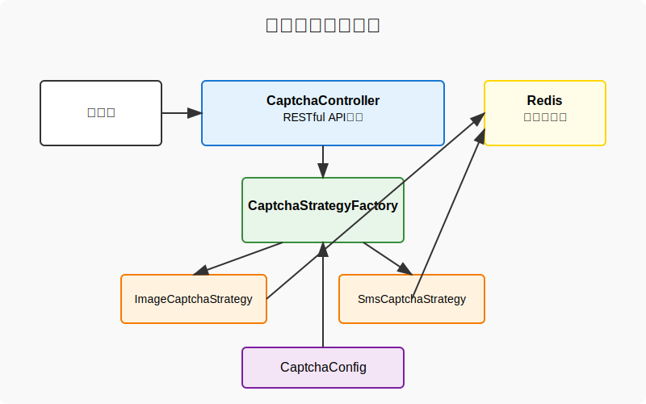
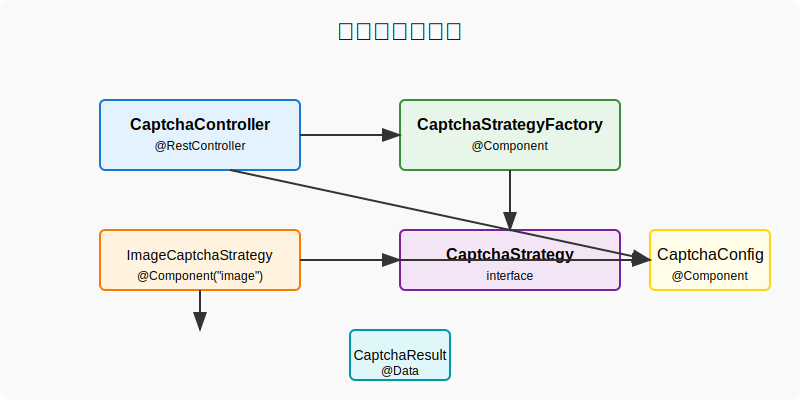
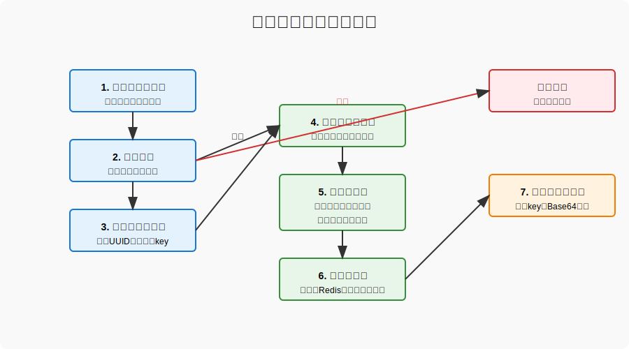

# 验证码系统使用指南

## 1. 系统概述

本验证码系统采用策略模式设计，支持多种类型的验证码（如图形验证码、短信验证码等），具有高度的可扩展性和灵活性。系统提供统一的API接口，通过策略工厂管理不同类型的验证码实现。

### 1.1 系统架构图



### 1.2 核心组件关系



## 2. 核心组件说明

### 2.1 验证码控制器 (CaptchaController)

提供验证码生成和刷新的RESTful API接口，是系统与外部交互的入口。

```java
@Api(tags = "验证码管理", description = "提供验证码生成和刷新的API接口")
@RestController
@RequestMapping("/api/captcha")
@Slf4j
public class CaptchaController {
    // 控制器实现代码
}
```

### 2.2 验证码策略工厂 (CaptchaStrategyFactory)

管理所有验证码策略实现，负责策略的注册和获取，是系统的核心管理组件。

```java
@Component
public class CaptchaStrategyFactory {
    // 策略工厂实现代码
}
```

### 2.3 验证码策略接口 (CaptchaStrategy)

定义验证码生成和验证的核心方法，所有验证码实现都需要实现此接口。

```java
public interface CaptchaStrategy {
    CaptchaResult generateCaptcha(String key);
    boolean validateCaptcha(String key, String code);
    String getType();
    void cleanCaptcha(String key);
}
```

### 2.4 图形验证码实现 (ImageCaptchaStrategy)

基于BufferedImage生成图形验证码，包含随机字符、干扰线和噪点，提高验证码的安全性。

```java
@Component("image")
public class ImageCaptchaStrategy implements CaptchaStrategy {
    // 图形验证码实现代码
}
```

### 2.5 验证码配置 (CaptchaConfig)

提供验证码相关的配置信息，支持从配置文件中读取，实现可配置化的验证码功能。

```java
@Component
@ConfigurationProperties(prefix = "bing.captcha")
public class CaptchaConfig {
    // 配置类实现代码
}
```

## 3. 验证码生成流程

### 3.1 图形验证码生成流程图



### 3.2 生成步骤说明

1. **请求接收**：客户端发送验证码生成请求，指定验证码类型
2. **参数验证**：验证验证码类型是否支持，验证码功能是否启用
3. **生成验证码标识**：使用UUID生成唯一的验证码标识
4. **选择策略**：通过策略工厂获取对应的验证码策略实现
5. **生成验证码**：调用策略实现生成验证码内容
6. **存储验证码**：将验证码信息存储到Redis中
7. **返回结果**：返回验证码生成结果，包含验证码标识和内容

## 4. 配置说明

### 4.1 配置项详解

| 配置项 | 类型 | 默认值 | 说明 |
|-------|-----|-------|------|
| bing.captcha.enabled | boolean | true | 是否启用验证码功能 |
| bing.captcha.default-type | string | "image" | 默认验证码类型 |
| bing.captcha.expire-minutes | int | 5 | 验证码有效期（分钟） |
| bing.captcha.login-failure-threshold | int | 3 | 登录失败次数阈值 |
| bing.captcha.image.width | int | 120 | 图形验证码宽度 |
| bing.captcha.image.height | int | 40 | 图形验证码高度 |
| bing.captcha.image.code-count | int | 4 | 图形验证码字符数量 |
| bing.captcha.image.line-count | int | 5 | 图形验证码干扰线数量 |

### 4.2 配置示例

```yaml
spring:
  # Spring配置...

bing:
  captcha:
    enabled: true
    default-type: "image"
    expire-minutes: 5
    login-failure-threshold: 3
    image:
      width: 120
      height: 40
      code-count: 4
      line-count: 5
```

## 5. API接口说明

### 5.1 生成验证码

- **URL**: `/api/captcha/generate/{type}`
- **方法**: `GET`
- **参数**: 
  - `type`: 验证码类型（如"image"、"sms"）
- **返回**: 验证码生成结果

**请求示例**:
```http
GET /api/captcha/generate/image
```

**响应示例**:
```json
{
  "code": 200,
  "message": "success",
  "data": {
    "captchaKey": "a1b2c3d4e5f6g7h8i9j0",
    "captchaContent": "data:image/png;base64,iVBORw0KGgoAAAANSUhEUgAAAIAAAACACAYAAADDPmHLAA...",
    "captchaType": "image",
    "expireTime": 1699876543210
  }
}
```

### 5.2 刷新验证码

- **URL**: `/api/captcha/refresh/{type}`
- **方法**: `GET`
- **参数**: 
  - `type`: 验证码类型
- **返回**: 新的验证码生成结果

### 5.3 生成默认验证码

- **URL**: `/api/captcha/generate`
- **方法**: `GET`
- **返回**: 使用默认类型的验证码生成结果

### 5.4 刷新默认验证码

- **URL**: `/api/captcha/refresh`
- **方法**: `GET`
- **返回**: 使用默认类型的新验证码生成结果

## 6. 使用示例

### 6.1 前端使用示例

```javascript
// 生成图形验证码
async function generateCaptcha() {
  try {
    const response = await fetch('/api/captcha/generate/image');
    const result = await response.json();
    
    if (result.code === 200) {
      // 显示验证码图片
      document.getElementById('captchaImage').src = result.data.captchaContent;
      // 保存验证码key用于验证
      document.getElementById('captchaKey').value = result.data.captchaKey;
    }
  } catch (error) {
    console.error('获取验证码失败:', error);
  }
}

// 验证验证码
async function validateCaptcha(captchaKey, captchaCode) {
  try {
    // 在登录或其他需要验证的请求中携带验证码信息
    const response = await fetch('/api/login', {
      method: 'POST',
      headers: {
        'Content-Type': 'application/json'
      },
      body: JSON.stringify({
        username: 'admin',
        password: 'password',
        captchaKey: captchaKey,
        captchaCode: captchaCode
      })
    });
    
    // 处理响应...
  } catch (error) {
    console.error('验证失败:', error);
  }
}
```

### 6.2 后端验证示例

```java
@Autowired
private CaptchaStrategyFactory captchaStrategyFactory;

public boolean verifyCaptcha(String captchaKey, String captchaCode, String captchaType) {
    try {
        CaptchaStrategy strategy = captchaStrategyFactory.getStrategy(captchaType);
        return strategy.validateCaptcha(captchaKey, captchaCode);
    } catch (Exception e) {
        log.error("验证码验证失败: {}", e.getMessage());
        return false;
    }
}
```

## 7. 扩展开发

### 7.1 添加新的验证码类型

1. **实现CaptchaStrategy接口**

```java
@Component("custom")
public class CustomCaptchaStrategy implements CaptchaStrategy {
    
    @Override
    public CaptchaResult generateCaptcha(String key) {
        // 实现自定义验证码生成逻辑
    }
    
    @Override
    public boolean validateCaptcha(String key, String code) {
        // 实现自定义验证码验证逻辑
    }
    
    @Override
    public String getType() {
        return "custom";
    }
    
    @Override
    public void cleanCaptcha(String key) {
        // 实现验证码清理逻辑
    }
}
```

2. **更新配置文件**（可选）

如果需要为新验证码类型添加配置项，可以扩展CaptchaConfig类。

## 8. 最佳实践

1. **合理设置验证码有效期**：过短可能影响用户体验，过长可能降低安全性
2. **验证码难度适中**：既要有一定的复杂度，又要确保用户能够正确识别
3. **添加刷新机制**：允许用户刷新难以识别的验证码
4. **使用Redis存储验证码**：提高性能并支持分布式部署
5. **记录验证码生成和验证日志**：便于问题排查和安全审计

## 9. 故障排查

### 9.1 验证码无法生成

- 检查验证码功能是否启用
- 确认Redis连接是否正常
- 查看相关日志，定位具体错误信息

### 9.2 验证码验证失败

- 检查验证码是否过期
- 确认验证码输入是否正确（注意大小写）
- 验证Redis中的验证码数据是否存在

### 9.3 图片验证码显示异常

- 检查Base64编码是否正确
- 确认前端页面是否正确解析图片数据
- 验证图形验证码配置（宽度、高度等）是否合理

---

**文档版本**: 1.0
**更新日期**: 2025-11-13
**作者**: zhengbing