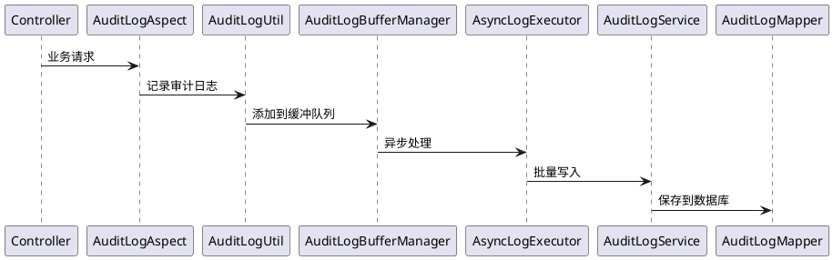

# 图片资源说明

## 概览

本文档目录包含审计日志系统优化相关的图片资源。如果您看到的文档中引用了这些图片但显示异常，请参考本说明文档。

## 图片列表

### 1. audit_system_architecture.png
**描述**: 审计日志系统整体架构图  
**用途**: 用于 `AUDIT_LOG_OPTIMIZATION_SUMMARY.md` 文档中的架构说明  
**制作建议**: 
- 使用系统架构图工具制作，如Draw.io、Lucidchart等
- 包含核心组件：Controller、Aspect、Util、BufferManager、Executor、Service、Mapper
- 显示数据流：业务请求 → 切面拦截 → 缓冲池 → 异步执行 → 数据库
- 标注死循环防护、性能优化等关键机制
- 颜色方案：缓冲池用蓝色、异步执行器用紫色、防护机制用红色

### 2. buffer_workflow.png
**描述**: 缓冲池工作流程图  
**用途**: 用于 `AUDIT_LOG_OPTIMIZATION_SUMMARY.md` 文档中的流程说明  
**制作建议**:
- 使用流程图工具制作，支持泳道图或时序图
- 展示完整的请求处理流程：Controller → Aspect → BufferManager → ThreadPool → Database
- 突出显示队列检查和分支逻辑
- 标注异常处理和死循环防护机制
- 包含定时批量处理逻辑

## 替代方案

### ASCII图表替代
如果图片暂时无法生成，可以在文档中直接引用 `VISUAL_DIAGRAMS.md` 中的ASCII图表：

```markdown


```

### 在线图表工具推荐

1. **Draw.io (推荐)**
   - 网址：https://app.diagrams.net/
   - 特点：免费、功能强大、支持导出多种格式
   - 适用：系统架构图、流程图

2. **PlantUML**
   - 特点：基于文本的图表语言，适合代码管理
   - 语法示例：见下方代码块



3. **Mermaid Live Editor**
   - 网址：https://mermaid.live/
   - 特点：在线Mermaid图表编辑器，可导出PNG/SVG
   - 适用：将原有的mermaid代码转换为图片

4. **Lucidchart**
   - 网址：https://www.lucidchart.com/
   - 特点：专业的在线图表工具，模板丰富
   - 适用：复杂的企业级架构图

### 快速制作指南

#### 系统架构图制作步骤：
1. 选择Draw.io工具，创建新的空白图表
2. 选择合适的模板（Software > System Architecture）
3. 添加以下组件：
   - 业务Controller（矩形表示）
   - AuditLogAspect（切面，表示为六边形）
   - AuditLogUtil（工具类，表示为圆形）
   - AuditLogBufferManager（缓冲池，表示为六边形）
   - AsyncLogExecutor（执行器，表示为菱形）
   - AuditLogService（服务层，表示为矩形）
   - AuditLogMapper（数据访问层，表示为矩形）
4. 添加数据源和数据库（圆柱形表示）
5. 用箭头连接各个组件，显示数据流向
6. 使用不同颜色标识不同功能模块
7. 导出为PNG格式（推荐尺寸：1600x1200）

#### 缓冲池工作流程图制作步骤：
1. 创建泳道图（Swimlane Diagram）
2. 横向创建泳道：Controller、Aspect、BufferManager、ThreadPool、Database
3. 按时间顺序添加流程步骤：
   - 业务请求进入
   - 切面拦截处理
   - 缓冲队列检查
   - 分支逻辑处理（队列未满/已满）
   - 异步处理
   - 数据库写入
   - 异常处理分支
4. 添加条件判断节点和循环节点
5. 标注关键的时间点和处理逻辑
6. 导出为PNG格式（推荐尺寸：1400x900）

## 图片规格建议

- **图片格式**：PNG（推荐）或SVG
- **分辨率**：高分辨率，确保在文档中清晰显示
- **尺寸**：
  - 架构图：1600x1200像素（4:3比例）
  - 流程图：1400x900像素（16:10比例）
  - 仪表板图：1920x1080像素（16:9比例）
- **文件大小**：建议控制在1MB以内
- **颜色方案**：使用企业级配色方案，与文档整体风格协调

## 技术说明

### 图片引用格式
```markdown

```

### 图片路径说明
- 所有图片应放在 `docs/images/` 目录下
- 文件名使用小写字母和下划线
- 包含描述性的名称，如：`audit_system_architecture.png`

### 响应式设计
如果需要在网页中展示，建议：
- 添加不同尺寸的图片（缩略图、正常尺寸）
- 使用CSS控制图片的最大宽度
- 添加图片的alt文本，提高可访问性

## 维护说明

- 图片文件应纳入版本控制
- 定期检查图片链接是否有效
- 当系统架构变更时，及时更新对应的图表
- 保持图表与代码实现的一致性

---
**创建时间**: 2025-11-19  
**文档类型**: 图片资源说明  
**维护人员**: zhengbing