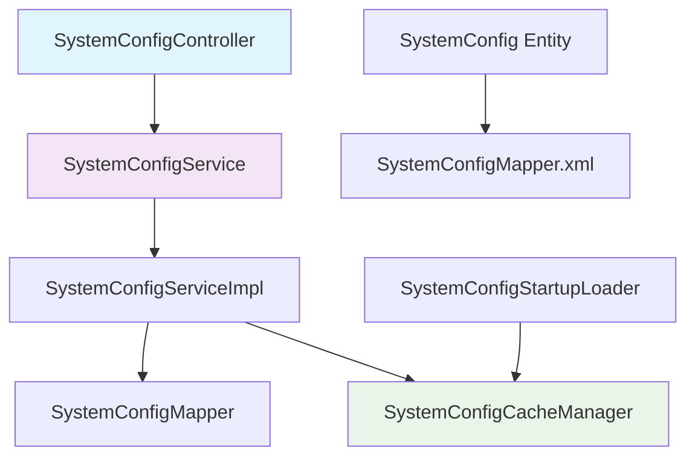

# 系统配置管理功能文档

## 概述

系统配置管理功能为Bing Framework提供了完整的系统级配置管理能力。该功能支持配置项的统一管理、动态更新、缓存加载和类型安全访问，确保系统的灵活性和可维护性。

## 功能特性

### 核心功能
- **配置统一管理**：将所有系统级配置存储在专用数据表中
- **缓存机制**：系统启动时自动加载配置到内存缓存，提高读取性能
- **类型安全**：支持多种数据类型（字符串、整数、布尔值、浮点数、JSON等）
- **动态更新**：支持运行时更新配置并同步到缓存
- **验证机制**：提供配置值格式验证和类型检查
- **敏感保护**：支持敏感配置项的脱敏处理

### 支持的配置类型
| 类型 | 说明 | 验证规则 |
|------|------|----------|
| string | 字符串 | 基础字符串验证 |
| int | 整数 | 必须是有效整数 |
| long | 长整数 | 必须是有效长整数 |
| boolean | 布尔值 | true/false/1/0 |
| double | 浮点数 | 必须是有效浮点数 |
| json | JSON格式 | 必须是有效JSON |
| email | 邮箱格式 | 必须符合邮箱格式 |
| url | URL格式 | 必须是有效URL |

## 架构设计

### 核心组件



### 数据表结构

```sql
CREATE TABLE system_config (
    id BIGINT PRIMARY KEY AUTO_INCREMENT COMMENT '主键ID',
    config_key VARCHAR(100) NOT NULL UNIQUE COMMENT '配置键',
    config_value TEXT NOT NULL COMMENT '配置值',
    config_type VARCHAR(20) NOT NULL COMMENT '配置类型',
    `description` VARCHAR(500) COMMENT '配置描述',
    config_category VARCHAR(50) COMMENT '配置分类',
    `enabled` TINYINT(1) DEFAULT 1 COMMENT '启用状态 0:禁用 1:启用',
    sort_order INT DEFAULT 0 COMMENT '排序权重',
    support_dynamic_update TINYINT(1) DEFAULT 1 COMMENT '是否支持动态更新',
    default_value TEXT COMMENT '默认值',
    min_value VARCHAR(50) COMMENT '最小值',
    max_value VARCHAR(50) COMMENT '最大值',
    validation_regex VARCHAR(500) COMMENT '正则验证',
    `sensitive` TINYINT(1) DEFAULT 0 COMMENT '是否敏感配置',
    create_time DATETIME DEFAULT CURRENT_TIMESTAMP COMMENT '创建时间',
    update_time DATETIME DEFAULT CURRENT_TIMESTAMP ON UPDATE CURRENT_TIMESTAMP COMMENT '更新时间',
    INDEX idx_config_key (config_key),
    INDEX idx_config_type (config_type),
    INDEX idx_enabled (`enabled`)
);
```

### 缓存策略

系统配置采用内存缓存策略：
- **预加载**：系统启动时自动加载所有启用的配置项
- **读写锁**：使用读写锁保证缓存的线程安全
- **按需缓存**：支持运行时添加、更新和删除缓存项
- **统计信息**：提供缓存使用统计和监控

## 使用方法

### 1. 依赖注入使用

在需要使用系统配置的服务或组件中注入配置服务：

```java
@Autowired
private SystemConfigService systemConfigService;

// 在业务代码中使用
public void someBusinessMethod() {
    // 获取字符串配置
    String systemName = systemConfigService.getStringConfigValue("system.name", "Default System");
    
    // 获取整数配置
    Integer maxUsers = systemConfigService.getIntConfigValue("system.max_users", 1000);
    
    // 获取布尔配置
    Boolean enableDebug = systemConfigService.getBooleanConfigValue("system.debug", false);
    
    // 使用默认值和类型转换
    Long sessionTimeout = systemConfigService.getConfigValue("security.session_timeout", 3600L, Long.class);
}
```

### 2. 直接使用缓存管理器

对于性能要求更高的场景，可以直接访问缓存管理器：

```java
@Autowired
private SystemConfigCacheManager cacheManager;

public void highPerformanceMethod() {
    // 从缓存直接获取配置值
    String configValue = cacheManager.getConfigFromCache("system.name");
    
    if (configValue != null) {
        // 使用配置值
        processSystemConfig(configValue);
    }
}
```

### 3. 配置动态更新

```java
// 更新配置值
boolean success = systemConfigService.updateConfigValue("system.debug", "true");
if (success) {
    System.out.println("配置更新成功");
}

// 批量更新配置状态
List<Long> configIds = Arrays.asList(1L, 2L, 3L);
systemConfigService.updateBatchStatus(configIds, 1); // 启用这些配置
```

## API接口说明

### 配置查询接口

#### 1. 获取配置值
```
GET /api/system-config/value/{configKey}
```
**参数**：
- `configKey`：配置键（必填）

**响应**：
```json
{
    "code": 200,
    "message": "success",
    "data": "配置值"
}
```

#### 2. 获取完整配置项
```
GET /api/system-config/{configKey}
```
**响应**：
```json
{
    "code": 200,
    "message": "success",
    "data": {
        "id": 1,
        "configKey": "system.name",
        "configValue": "Bing Framework",
        "configType": "string",
        "description": "系统名称",
        "enabled": 1,
        "createTime": "2025-11-15T10:00:00",
        "updateTime": "2025-11-15T10:00:00"
    }
}
```

#### 3. 获取所有启用的配置
```
GET /api/system-config/enabled
```
**响应**：返回所有启用的配置项列表

### 配置管理接口

#### 4. 更新配置值
```
PUT /api/system-config/value?configKey={configKey}&configValue={configValue}
```
**参数**：
- `configKey`：配置键（必填）
- `configValue`：配置值（必填）

**权限**：需要 `system:config:update` 权限

#### 5. 批量更新配置状态
```
PUT /api/system-config/batch-status
```
**请求体**：
```json
{
    "configIds": [1, 2, 3],
    "status": 1
}
```

#### 6. 重新加载配置缓存
```
POST /api/system-config/reload-cache
```
**描述**：重新从数据库加载所有配置到缓存

### 验证接口

#### 7. 验证配置键是否存在
```
GET /api/system-config/exists/{configKey}?excludeId={excludeId}
```

#### 8. 验证配置值格式
```
POST /api/system-config/validate-value
```
**参数**：
- `configValue`：配置值
- `configType`：配置类型

### 缓存管理接口

#### 9. 获取缓存统计信息
```
GET /api/system-config/cache-stats
```
**响应**：
```json
{
    "code": 200,
    "message": "success",
    "data": {
        "configCount": 50,
        "typeCount": 50,
        "descriptionCount": 45,
        "enabledCount": 48
    }
}
```

#### 10. 清空所有缓存
```
DELETE /api/system-config/clear-cache
```

## 常用配置项示例

### 系统基础配置

```sql
-- 系统基本信息
INSERT INTO system_config (config_key, config_value, config_type, `description`, config_category) VALUES
('system.name', 'Bing Framework', 'string', '系统名称', 'system'),
('system.version', '1.0.0', 'string', '系统版本', 'system'),
('system.debug', 'false', 'boolean', '是否开启调试模式', 'system'),
('system.timezone', 'Asia/Shanghai', 'string', '系统时区', 'system');

-- 性能配置
INSERT INTO system_config (config_key, config_value, config_type, `description`, config_category) VALUES
('performance.max_connections', '1000', 'int', '最大连接数', 'performance'),
('performance.timeout', '30', 'int', '请求超时时间（秒）', 'performance'),
('performance.cache_enabled', 'true', 'boolean', '是否启用缓存', 'performance');
```

### 安全相关配置

```sql
-- JWT配置
INSERT INTO system_config (config_key, config_value, config_type, `description`, config_category, `sensitive`) VALUES
('security.jwt.secret', 'your-secret-key-here', 'string', 'JWT密钥', 'security', true),
('security.jwt.expiration', '86400', 'int', 'JWT过期时间（秒）', 'security', false),
('security.jwt.refresh_expiration', '604800', 'int', 'JWT刷新过期时间（秒）', 'security', false);

-- 密码策略
INSERT INTO system_config (config_key, config_value, config_type, `description`, config_category) VALUES
('security.password.min_length', '8', 'int', '密码最小长度', 'security'),
('security.password.require_uppercase', 'true', 'boolean', '是否要求大写字母', 'security'),
('security.password.require_lowercase', 'true', 'boolean', '是否要求小写字母', 'security');
```

### 数据库配置

```sql
-- 数据库配置
INSERT INTO system_config (config_key, config_value, config_type, `description`, config_category) VALUES
('database.max_pool_size', '20', 'int', '数据库连接池最大大小', 'database'),
('database.min_pool_size', '5', 'int', '数据库连接池最小大小', 'database'),
('database.connection_timeout', '30000', 'int', '数据库连接超时时间（毫秒）', 'database');
```

## 最佳实践

### 1. 配置键命名规范

- **分类前缀**：使用分类前缀区分不同模块的配置
  ```
  system.*          # 系统级配置
  security.*        # 安全相关配置
  performance.*     # 性能相关配置
  database.*        # 数据库相关配置
  cache.*          # 缓存相关配置
  logging.*        # 日志相关配置
  ```

- **层次结构**：使用点号分隔的层次结构
  ```
  system.name              # 系统名称
  system.timezone          # 系统时区
  security.jwt.secret      # JWT密钥
  security.password.min_length  # 密码最小长度
  ```

### 2. 配置值设计原则

- **默认值**：每个配置都应该有合理的默认值
- **单位明确**：确保数值的单位在描述中明确说明
- **类型匹配**：配置值的类型应该与配置类型一致
- **敏感信息**：敏感配置标记为sensitive=true

### 3. 性能优化

- **缓存优先**：优先使用缓存管理器获取配置值
- **批量操作**：对于大量配置读取，考虑使用批量方法
- **监控缓存**：定期检查缓存统计信息，确保缓存命中率

### 4. 安全考虑

- **权限控制**：配置管理接口需要适当的权限验证
- **敏感处理**：敏感配置在日志和响应中进行脱敏处理
- **审计日志**：重要配置变更需要记录审计日志

### 5. 维护建议

- **版本控制**：配置变更应该纳入版本控制
- **测试验证**：配置变更后进行充分测试
- **文档更新**：配置变更后及时更新相关文档

## 注意事项

### 1. 缓存一致性
- 配置更新后需要确保缓存和数据库的一致性
- 分布式环境下需要考虑缓存同步机制

### 2. 类型转换
- 配置值读取时需要注意类型转换的安全性
- 对于无法转换的情况，使用默认值

### 3. 性能影响
- 缓存大小会影响内存使用
- 避免在高频调用的代码中大量获取配置

### 4. 错误处理
- 配置不存在时的优雅降级处理
- 数据库连接异常时的兜底方案

## 故障排查

### 常见问题

1. **配置值获取为null**
   - 检查配置键是否存在
   - 确认配置状态是否为启用
   - 检查数据库连接

2. **缓存更新失败**
   - 检查缓存管理器注入是否正确
   - 确认配置更新操作是否成功

3. **类型转换异常**
   - 检查配置值的格式是否正确
   - 确认配置类型设置是否匹配

### 日志分析

配置相关的日志包含以下关键信息：
- `SystemConfigStartupLoader` - 启动加载信息
- `SystemConfigCacheManager` - 缓存操作信息
- `SystemConfigServiceImpl` - 业务逻辑执行信息

## 更新日志

- **v1.0.0 (2025-11-15)**：
  - 初始版本发布
  - 实现基础配置管理功能
  - 支持多种数据类型
  - 实现缓存机制
  - 提供完整的API接口

---

*本文档将随着功能更新持续维护和完善。*